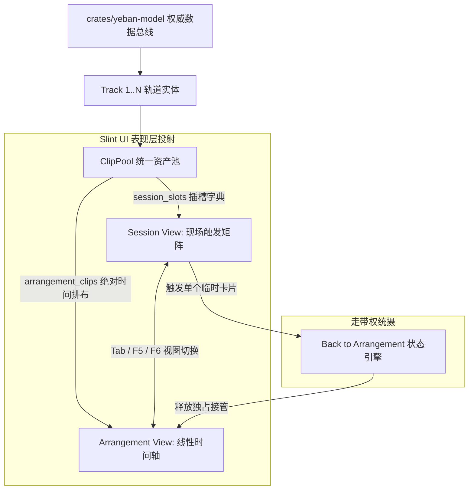

# 夜半 (Yeban) 专业桌面 DAW UI/UX 布局与交互重构设计规范 (Pure Rust + Slint 极速版)

> **项目信息**：夜半 (Yeban DAW) | 协议：GPLv3（附 CLAP 插件动态加载例外条款） | 仓库：`https://github.com/yeban/yeban`  
> **规范状态**：Normative UI/UX Specification (规范性设计文件)  
> **版本**：`v1.0.0-rev1` (2026-10-04) | 项目研发起步版本：`v0.0.1` | 原规划 v3.0 正式确立为首个正式生产基线 `v1.0.0`  
> **替代关系**：`Supersedes: GROOVE_V3_WEB_UI_UX_AND_INTERACTION_REDESIGN.md, GROOVE_V3_DESKTOP_UI_UX_AND_INTERACTION_REDESIGN.md (v3.0-rev7 及更早版本)`  
> **文档依赖**：`Depends-on: ARCHITECTURE v1.0.0, ROADMAP v1.0.0, LEGAL.md, AGENTS.md`  

> [!IMPORTANT]
> ### 🌟 夜半 (Yeban) 核心工程宪章与研发准则 (Core Mandates)
> 1. **开源与许可协议 (GPLv3)**：本项目在 GitHub 全面开源，遵循 **GNU General Public License v3.0 (GPLv3)** 协议，附带 GPLv3 §7 允许的 CLAP 专有插件动态加载例外条款。第三方基于本项目 Fork 并闭源分发须自行向 SixtyFPS GmbH 获取 Slint 商业许可；
> 2. **原生桌面技术栈 (Slint + Rust)**：纯血 **Slint 响应式矢量 GUI + 纯 Rust 低时延实时音频引擎**。坚决**不做任何 Web / Wasm / AudioWorklet 版本**，彻底摆脱浏览器沙盒与 JavaScript GC 爆音；
> 3. **AI Agent 自主研发范式 (Autonomous AI Agent Development)**：本套界面规范专供 **自主 AI Agent** 作为 Slint 声明式组件设计、无头视觉回归测试与双 MCP 自动化的交互基准；
> 4. **零人力工时评估 (Zero Human Staffing Estimation)**：**彻底废除所有传统软件工程的人工人力、人月、人天及工时评估**。以可机械化断言的控件树属性、无头截图 SSIM 及 120 FPS 响应作为唯一交互验收标准。

> **修订记录 (Revision Log)**：  

> - `v1.0.0-rev1` (2026-10-04)：**语义化版本重构 (Semantic Versioning Alignment)**。  
>   1. **版本体系从零起步**：确立全新从头研发模式，工程起步版本为 `v0.0.1`；  
>   2. **核心首发版本重定位**：原规划中的 `v3.0` 正式确立为首发生产版本 **`v1.0.0`**（工业基石与纯血原生首发版）；  
>   3. **交互特性标签对齐**：外部协同标记为 **`v1.1.0`**（原 V3.1），四维宏控与 SVS 歌词标记为 **`v1.5.0` / `v2.0.0`**（原 V3.5/V4.0），商业插件呼出标记为 **`v2.0.0`**（原 V4.0）。  
> - `v3.0-rev7` (2026-10-04)：**全量需求编号体系与自研 UI 测试抽象落地 (依据开源合规与专家终审意见)**。  
>   1. **全量注入规范需求 ID**：全面确立并注入 `UI-GRID-001`~`004`、`UI-NOTE-001`~`005`、`UI-TEST-001`~`003`、`UI-A11Y-001`~`004` 与 `UI-MCP-001`~`003` 唯一需求索引；  
>   2. **架构收敛与 Slint 自研兜底**：将 Slint 未经充分验证的内部 MCP 与特定 headless 模式收敛为基于 `yeban-ui-test-port` / `yeban-ui-mcp` 的统一自研抽象层，明确 Slint 官方特性实测验证矩阵；  
>   3. **消除按键与焦点冲突**：规范 `Tab` 键在文本输入框/重命名弹窗内的行为（禁止误触发视图切换，提供 `F5/F6` 或 `Alt+1/2` 备选视图切换），增补全键盘方向键音符编辑规范；  
>   4. **输入法 IME 候选词保护**：引入 `is_composing` 状态检测，打字重命名或输入歌词时全量阻断 DAW 快捷键触发；  
>   5. **自动化元素语义寻址**：确立自动化测试必须基于语义 Element ID 查找控件，严禁使用脆弱的绝对像素坐标；  
>   6. **外部编辑器双向监听**：将外部音频编辑集成改为基于文件系统事件监听（`notify` crate）与 SHA-256 校验，目标热重载同步延迟 ≤ 500ms；  
>   7. **Ping ADC 安全脉冲校准**：新增 MLS 声学脉冲触发时的 -12 dBFS 安全限幅器与防啸叫增益保护；  
>   8. **视觉回归基准与预滚缓冲**：初版工程 SSIM 基准目标收敛为 ≥ 0.98；走带不停 A/B 盲听增加 2048 采样预滚缓冲区（Pre-roll Buffer）说明。  
> - `v3.0-rev6` (2026-10-04)：视觉回归鲁棒性与 UI MCP 权限分层落地。引入高频刷新区域动态遮罩，确立元素树 JSON 优先断言原则，定义 ReadOnly / Interactive / Administrative 三级权限。  
> - `v3.0-rev5` (2026-10-04)：开源合规与技术纠偏升级，更名为“夜半 (Yeban)”，确立整体以 GPLv3 许可证在 GitHub 开源。  
> - `v3.0-rev4` (2026-10-04)：新增 Slint 无头运行与 AI 视觉内省交互规范，规范无头 Framebuffer 截图与远程内省协议。  
> - `v3.0-rev3` (2026-10-04)：重大技术架构转型。彻底放弃 Web/HTML5 Canvas 方案，全线重构为 Slint 原生桌面声明式矢量界面体系，交付恒定 120 FPS 响应。  
> - `v3.0-rev2` (2026-10-04)：依据设计评审完成快捷键冲突解耦与无障碍补全。  
> - `v3.0-rev1` (2026-10-04)：初始版本。

> **定位**：以 Ableton Live 12、Bitwig Studio 5 与 FL Studio 24 为工业级设计参考与架构借鉴的纯血现代化桌面音频工作站（DAW）。  
> **设计哲学**：零历史包袱、视听绝对一致（WYHIWYG）、Slint 硬件加速矢量渲染、AI Agent 与人类音乐家沉浸式协同。

---

## 目录
1. [Slint 原生桌面网格系统与窗口空间几何规范](#1-slint-原生桌面网格系统与窗口空间几何规范)
2. [双视图同构体系 (Session View & Arrangement View)](#2-双视图同构体系-session-view--arrangement-view)
3. [Slint 虚拟化钢琴卷帘交互规范 (Piano Roll UX)](#3-slint-虚拟化钢琴卷帘交互规范-piano-roll-ux)
4. [专业时间轴与波形/音频剪辑交互规范](#4-专业时间轴与波形音频剪辑交互规范)
5. [底部机架、调音台与设备链 (Device Rack & Mixer)](#5-底部机架调音台与设备链-device-rack--mixer)
6. [手势、指针捕获与视听反馈状态机 (Interaction State Machine)](#6-手势指针捕获与视听反馈状态机-interaction-state-machine)
7. [工业级全键盘快捷键与无障碍操作规范 (Keyboard & A11y)](#7-工业级全键盘快捷键与无障碍操作规范-keyboard--a11y)
8. [Slint 组件树架构与 Rust 状态绑定规范](#8-slint-组件树架构与-rust-状态绑定规范)
9. [面向未来人机共创的前端交互规范 (Future Extensible UI Interactions)](#9-面向未来人机共创的前端交互规范-future-extensible-ui-interactions)
10. [编曲时光机、AI 提案审查与视觉 Diff 交互规范 (Arrangement Time Machine & Musical PR)](#10-编曲时光机ai-提案审查与视觉-diff-交互规范-arrangement-time-machine--musical-pr)
11. [音轨外部软件与服务集成交互规范 (Track External Services UI/UX) [v1.1.0]](#11-音轨外部软件与服务集成交互规范-track-external-services-uiux-v110)
12. [Slint 无头模式运行与 AI 视觉内省交互规范 (Headless UI & MCP Introspection)](#12-slint-无头模式运行与-ai-视觉内省交互规范-headless-ui--mcp-introspection)

---

## 1. Slint 原生桌面网格系统与窗口空间几何规范

### 1.1 屏幕空间网格系统 (The Modular Slint Desktop Grid)

`[UI-GRID-001]` **网格布局拓扑 (Grid Topology)**：利用 Slint 声明式布局（`GridLayout` 与 `VerticalLayout`）构建**零溢出、零多余嵌套、全视口自适应**的专业暗黑桌面界面体系：

```
+----------------------------------------------------------------------------------------------------+
| TOP CONTROL BAR (48px) - 走带 / BPM / [Branch: main ▼] / [Commit ↺ ↻] / [🟣 AI提案 (1)] / 视图切换 |
+----------+------------------------------------------------------------------------------+----------+
| LEFT     | MAIN WORKSPACE (动态伸缩，占比 55% - 65%)                                    | RIGHT    |
| BROWSER  | ---------------------------------------------------------------------------- | MASTER / |
| & ASSET  | [模式 A] SESSION VIEW: 垂直剪辑矩阵 (Clip Matrix) + 场景触发列 (Scene Launch)  | AI CO-   |
| LIBRARY  | [模式 B] ARRANGEMENT VIEW: 轨道包头 (Headers) + 绝对时间轴 (Timeline Tracks) | PILOT    |
| (240px)  |                                                                              | (280px)  |
| 乐器采样 |                                                                              | 意图生成 |
| 预置模板 |                                                                              | 声学诊断 |
| 折叠展开 |                                                                              | 侧边折叠 |
+----------+------------------------------------------------------------------------------+----------+
| SPLITTER BAR (4px) - 可自由拖拽调节上下工作区分割线 (Min: 220px, Max: 600px)                         |
+----------------------------------------------------------------------------------------------------+
| BOTTOM CONSOLE (动态伸缩，占比 35% - 45%) - [Tab 切换]                                               |
| [Tab 1: 虚拟化钢琴卷帘 (MIDI Piano Roll)]  [Tab 2: 调音台总控 (Mixer)]  [Tab 3: 设备效果链 (Devices)]   |
+----------------------------------------------------------------------------------------------------+
| STATUS & TOOLTIP BAR (24px) - 选区信息 / 实时和弦识别 / 快捷键提示 / 硬件声卡采样率与性能状态         |
+----------------------------------------------------------------------------------------------------+
```

### 1.2 视口几何约束与响应式折叠规则

`[UI-GRID-002]` **响应式断点与自适应折叠 (Responsive Breakpoints)**：
1. **高分宽屏显示器 (≥ 1920×1080, FHD / 2K / 4K)**：全展开模式，Left Browser (固定 240px)、Main Timeline (弹性填充)、Right AI Co-pilot (固定 280px)、Bottom Console 完整就绪；
2. **笔记本屏幕 (1366×768 ～ 1919×1079)**：Main Workspace 具备最高展示优先级。AI Co-pilot 自动折叠为右侧抽屉（快捷键 `Cmd/Ctrl + \` 呼出）；Left Browser 默认收起为 36px 图标导轨；
3. **分栏拖拽与极值保护**：上下主工作区与底部控制台之间的 Splitter Bar 支持双击自动居中，拖拽范围硬限制在 Min 220px 至 Max 600px，防止极端拖拽导致任一视口退化不可见。

### 1.3 保留模式与局部脏矩形渲染机制

`[UI-GRID-003]` **保留模式渲染优化 (Retained-Mode Optimization)**：
1. **局部脏矩形更新**：彻底摒弃全屏无谓重绘，Slint 仅在走带指针移动、VU 电平跳变或用户交互时局部重绘脏矩形区域，静态编辑时 CPU 占用率趋近于 0%；
2. **硬件渲染管线接入**：底层接入 FemtoVG / Skia / OpenGL 硬件渲染管线，视网膜屏幕（Retina）与 4K 高分屏下实现无缝点对点的高清矢量图元绘制。

### 1.4 恒定 120 FPS 渲染管线与垂直同步

`[UI-GRID-004]` **帧率平稳性与 VSync 同步 (120 FPS Rendering Pipeline)**：
1. 走带光标移动、波形平移与钢琴卷帘缩放全程绑定垂直同步（VSync），在支持 120Hz / 144Hz 高刷屏的硬件上保持恒定 120 FPS 丝滑响应；
2. 主渲染线程与实时音频线程物理隔离，UI 动画与绘制负载绝不穿透阻塞音频引擎渲染回调。

---

## 2. 双视图同构体系 (Session View & Arrangement View)

在纯 Rust 原生架构下，**Session（卡片触发灵感视图）** 与 **Arrangement（线性编曲叙事视图）** 共享同一份内存 AST：



### 2.1 权威 AST 投射与同构机制
- 双视图仅为同一份不可变工程快照（`EngineSnapshot`）在表现层的不同视口投射，任意视图下的编辑（如修改音符、调节推子）均生成统一的原子 `Op` 归约至中央 AST。

### 2.2 快捷切换、双屏联动与焦点冲突消除
- **`Tab` 键焦点隔离 (MUST)**：当用户焦点位于主工作区画布时，按 `Tab` 键实现 Session 触发矩阵与 Arrangement 时间轴的毫秒级无缝切换；**若焦点位于文本输入框（如音轨重命名、搜索框、时间码数值编辑）内，`Tab` 严格保留标准文本表单焦点轮转语义，严禁触发视图切换**；
- **免冲突备选快捷键**：系统全局提供 **`F5`**（强制切换至 Session 视图）与 **`F6`**（强制切换至 Arrangement 视图），或备选快捷键 **`Alt + 1`** / **`Alt + 2`**，彻底消除快捷键歧义；
- **原生多视窗支持**：支持弹出独立的 OS 原生子视窗（如将全通道调音台或第三方插件独立放置在副屏），多窗口在同一进程内共享数据引用，零跨进程 IPC 损耗；
- **Back to Arrangement (返回编曲按钮)**：在 Session 模式下触发 Clip 产生即兴 Jam 时，线性时间轴对应轨道挂起；顶部 Transport 浮现红色 `Back to Arrangement` 按钮，点击即可让播放权平滑回归时间轴。

### 2.3 Session View (卡片矩阵与场景触发)
- **垂直轨道列 (Vertical Track Columns)**：每条轨道纵向排列 Clip 插槽（Slots），点击空白槽双击即创建新 Clip；
- **Scene Launch 列**：最右侧为场景行（如 `Intro`, `Verse`, `Chorus`, `Drop`），点击一键齐发当前行所有轨道的 Clip；
- **量化触发 (Launch Quantization)**：支持完整量化选项（`Global`, `None`, `8 Bars`, `4 Bars`, `2 Bars`, `1 Bar`, `1/2 Beat`, `1/4 Beat`, `1/8 Beat`, `1/16 Beat`），在量化边界精准对齐发声。

---

## 3. Slint 虚拟化钢琴卷帘交互规范 (Piano Roll UX)

### 3.1 Slint 硬件加速视口裁剪架构与 R-Tree 空间索引

`[UI-NOTE-001]` **大规模音符视口裁剪架构 (R-Tree Culling Pipeline)**：针对钢琴卷帘的大规模音符图元（100,000+），采用 **Slint 自定义绘图渲染组件结合 Rust 空间索引** 实现恒定 120 FPS 丝滑绘制：

```
[用户鼠标平移 / 缩放视口]
        │
        │ 1. 触发 Slint 视口属性变动: min_tick, max_tick, min_pitch, max_pitch
        ▼
[Rust 空间裁剪核心 (crates/yeban-app)]
        │
        │ 2. 调用 R-Tree locate_in_envelope_intersecting 检索相交音符
        │ 3. 极速提取可见图元 [x, y, w, h, velocity, color_idx, flags]
        ▼
[Slint FemtoVG / Skia / OpenGL 硬件绘制回调]
        │
        │ 4. 批量执行 GPU 矩形与圆角绘制，耗时 ≤ 2ms
        ▼
[屏幕 120 FPS 视网膜高清呈现]
```

### 3.2 坐标系双向转换方程与 960 PPQ 吸附对齐

`[UI-NOTE-002]` **数学坐标双向映射 (Coordinate Transformation Equations)**：
1. **音乐坐标 ➔ 屏幕像素**：
   $$\mathrm{pixelX} = (\mathrm{tick} - \mathrm{scrollX}) \times \mathrm{zoomX} + \mathrm{PianoKeyWidth}$$
   $$\mathrm{pixelY} = (\mathrm{MaxKey} - \mathrm{pitch}) \times \mathrm{zoomY} - \mathrm{scrollY}$$
2. **屏幕像素 ➔ 音乐坐标（吸附与量化）**：
   $$\mathrm{rawTick} = \frac{\mathrm{pixelX} - \mathrm{PianoKeyWidth}}{\mathrm{zoomX}} + \mathrm{scrollX}$$
   $$\mathrm{snappedTick} = \mathrm{round}\left(\frac{\mathrm{rawTick}}{\mathrm{gridStepTicks}}\right) \times \mathrm{gridStepTicks}$$
   $$\mathrm{pitch} = \mathrm{MaxKey} - \mathrm{floor}\left(\frac{\mathrm{pixelY} + \mathrm{scrollY}}{\mathrm{zoomY}}\right)$$
   *其中系统标称基准为 960 PPQ（每四分音符 960 刻度），支持自适应智能吸附与 1/4、1/8、1/16、1/32、1/64 及三连音网格。*

### 3.3 视听反馈引擎与多工具交互矩阵

`[UI-NOTE-003]` **多工具交互矩阵 (Multi-Tool Interaction Matrix)**：

| 工具模式 (按键) | 光标样式 | 左键单击 | 左键拖拽 | 双击 / 辅助键 |
| :--- | :---: | :--- | :--- | :--- |
| **选择工具 (Select / 1)** | `default` | 选中音符，发声 120ms 试听；点空白处清除选区 | 移动音符位置与音高（按住 Shift 微移，按住 Alt 复制） | 框选（Rubberband）；双击创建默认 1 拍音符 |
| **铅笔工具 (Pencil / 2)** | `crosshair` | 在吸附网格处画出音符并即时试听发声 | 保持音高，横向拖拽改变音符时值（Duration） | 右键单击直接擦除音符 |
| **剪刀工具 (Split / 3)** | `col-resize`| 沿网格竖线将穿过的音符切分为两个独立音符 | 沿时间轴连续划过（多轨切片） | - |
| **力度编辑 (Velocity / 4)**| `ns-resize` | 选中对应音符的底部力度柱 | 纵向拖拽力度线（0~127，颜色随力度冷暖渐变） | 双击恢复默认力度 100 |
| **橡皮擦 (Eraser / 5)** | `cell` | 单击删除光标下的音符 | 划动拖拽连续批量消除音符 | - |

### 3.4 融入 FL Studio 风格的高阶编曲辅助

`[UI-NOTE-004]` **高阶编曲辅助生态 (Advanced Composition Helpers)**：
1. **Ghost Notes (幽灵透视音轨，快捷键 `Alt+V`)**：在当前音轨背景以 25% 半透明灰度透视其他任意参考轨（如和弦轨）的音符轮廓；双击任意幽灵音符无缝切换编辑焦点；
2. **Quick Strum (吉他扫弦拟真器，快捷键 `Alt+S`)**：框选柱式和弦后按下，自动施加 5~25ms 的阶梯微时延与力度动态衰减曲线；
3. **Stamp Chords (和弦印章库，快捷键 `Alt+C`)**：内置九和弦、十一和弦、挂留和弦词典，单击一次精准印出专业级密集和声；
4. **Slide Notes (原生滑音音符)**：直接绑定 `MidiNote.slide` 字段；发声时不重新触发击弦，而是将正在发声的音符平滑变频滑动至目标音高。

### 3.5 全键盘音符微调与无鼠标心流

`[UI-NOTE-005]` **全键盘音符操控 (Full Keyboard Note Manipulation)**：
1. **微调与移动**：方向键 `←` / `→` 沿时间轴以网格步长平移选区音符；按住 `Alt + ←/→` 执行 1 tick 超精细微调；
2. **音高与八度移调**：方向键 `↑` / `↓` 执行半音移调；按住 `Shift + ↑/↓` 瞬时执行整八度（±12 半音）移调；
3. **时值延伸**：按住 `Shift + ←/→` 步进缩短或延长选中音符的时值（Duration）；
4. **即时试听**：按 `Space` 或 `Enter` 触发当前选中音符的即时声学试听发声。

---

## 4. 专业时间轴与波形/音频剪辑交互规范

### 4.1 多分辨率波形金字塔 (Waveform Mipmap)
- 后台专用线程利用 SIMD 并行计算 3 级峰值降采样（1:1 细节级、1:16 中等缩放级、1:256 全曲总览级）；
- 生成紧凑内存映射，Slint 缩放时间轴时直接命中对应级距，百兆音频瞬时波形呈现。

### 4.2 标尺与循环选区 (True Audio Loop Brace)
- **时间标尺 (Timeline Ruler)**：上方标注音乐小节（`1.1`, `2.1`），下方标注绝对物理时间（`00:00.000`）；
- **实时循环选区 (Loop Region)**：快捷键 `Cmd/Ctrl + L` 切换循环。循环点变动即刻通过无锁队列同步至音频引擎，底层以 64 点升余弦微窗消除爆音。

### 4.3 章节卡片层 (Song Form & Section Track)
- 常驻独立的 **Sections 泳道**。拖拽章节卡片可整段搬迁属于该章节的 Clip，全局速度标记与变拍号标记同步跟随整段位移；跨章节边界的 Clip 在搬迁前自动执行边界裁切。

---

## 5. 底部机架、调音台与设备链 (Device Rack & Mixer)

通过底部控制台 Tab 导轨（`Tab 1: 卷帘 | Tab 2: 调音台 | Tab 3: 设备链`）切换；快捷键 `Cmd/Ctrl + Alt + M` 或双击面板 Tab 标题可全屏最大化当前底部面板。

### 5.1 交互式 4 段参数均衡器 (Interactive 4-Band Parametric EQ)
- **实时频谱分析仪 (RTA Spectrum)**：背景以 60 FPS 绘制 20Hz~20kHz FFT 频谱曲线，支持可选的 +4.5dB/oct 粉红噪声听觉平衡斜率补偿；
- 支持在频响曲线上直接鼠标拖拽 4 个滤波器控制点，滚轮调节 Q 值。

### 5.2 调音台通道条 (Pro Channel Strip & Metering)
- **真峰值与 RMS 双层彩色 VU 电平表**：主母带总线提供标准的 **LUFS (Momentary / Short-term / Integrated)** 与响度范围（LRA）数值显示；
- **Solo 与 Solo Safe 语义规范**：
  - 点击 Solo 按钮：默认执行**独占 Solo（Exclusive Solo）**；
  - 按住 `Cmd/Ctrl + 点击`：执行**叠加 Solo（Additive Solo）**；
  - 右键标记 **Solo Safe（安全独奏监听）**：豁免静音（常用于 Aux Return 混响总线）。

### 5.3 商业插件卡片与原生视窗呼出 [v2.0.0]
- 在设备链插入 VST3 / CLAP 商业插件后，机架卡片顶部提供 **“打开官方原厂界面 ↗”** 按钮；
- 宿主进程直接调用 OS 原生视窗（Win32 HWND / macOS NSWindow / Linux X11）呈现官方界面；
- **沙盒防崩溃热重启**：第三方插件发生段错误时，界面弹出原地热重启提示，保障工程不闪退。

---

## 6. 手势、指针捕获与视听反馈状态机 (Interaction State Machine)

```mermaid
stateDiagram-v2
    [*] --> Idle: 光标进入工作区
    
    state Idle {
        [*] --> HoverNote: 光标停留在音符主体
        [*] --> HoverEdge: 光标停留在音符右边缘
        [*] --> HoverBlank: 光标停留在空白网格
    }
    
    HoverBlank --> MarqueeSelecting: 鼠标左键按下并移动 (距离 > 4px)
    MarqueeSelecting --> Idle: PointerUp / PointerCancel (更新选区)
    
    HoverBlank --> DrawingNote: [笔工具模式] 按下并在网格生成音符草稿
    DrawingNote --> AudioAudition: 触发 NoteOn 极速发声
    DrawingNote --> Idle: PointerUp (向核心提交 Op::AddNote)
    
    HoverNote --> MovingNotes: 按下并移动 (距离 > 4px, 捕获指针)
    MovingNotes --> AudioAudition: 跨越新音高时触发音高试听
    MovingNotes --> Idle: PointerUp (向核心提交 Op::MoveNote)
    MovingNotes --> Cancelled: 按下 Escape / PointerCancel
    Cancelled --> Idle: 放弃草稿，还原初始位置
```

### 6.1 指针捕获与草稿分离规范
- 鼠标拖拽过程（距离 > 4px）仅在 Slint 本地维护瞬态草稿与驱动实时发声，**绝不记录任何撤销记录**；
- 鼠标松开瞬间（`PointerUp`），系统比对初始值与最终值，严格仅向数据核心提交 **1 个原子 `Op`**，按一次 `Cmd+Z` 精准复位。

---

## 7. 工业级全键盘快捷键与无障碍操作规范 (Keyboard & A11y)

### 7.1 核心快捷键映射规范 (基于按键物理码匹配)

`[UI-A11Y-001]` **全键盘热键映射规范 (Physical Scancode Binding)**：基于物理扫描码（`KeyboardEvent.code`）进行绑定，避免因输入法和键盘布局切换产生键位漂移：

| 快捷键 (Mac / Win) | 功能分类 | 动作描述 | 冲突规避说明 |
| :--- | :--- | :--- | :--- |
| **Space** | 走带 Transport | 播放 / 暂停切换（暂停时播放头返回起始点） | 文本输入时由输入法捕获 |
| **Shift + Space** | 走带 Transport | 从当前光标停留处继续播放 | Pro Tools 惯例 |
| **Tab** | 视图切换 | Session 触发矩阵 与 Arrangement 时间轴切换 | 仅在主工作区聚焦时响应 |
| **F5 / F6** | 视图直达 | F5 直达 Session 视图，F6 直达 Arrangement 视图 | 全局无冲突备选快捷键 |
| **Cmd / Ctrl + Z** | 历史管理 | 撤销（Undo），基于领域操作日志逆向回滚 | 全行业标准 |
| **Cmd / Ctrl + Shift + Z**| 历史管理 | 重做（Redo） | 全行业标准 |
| **Cmd / Ctrl + Shift + H**| 时光机 | 呼出全屏可视化 DAG 编曲版本时光机图谱 | 原生专属创新 |
| **Cmd / Ctrl + D** | 片段 / 音符 | 选中内容智能原位复制（Duplicate） | Ableton 惯例 |
| **Delete / Backspace** | 编辑操作 | 删除选中的音符、选区或音轨 | 全行业标准 |
| **B** | 工具切换 | 快速切换选择箭头工具与铅笔工具 | 文本输入时屏蔽单键热键 |
| **Cmd / Ctrl + Alt + B** | 侧边栏 | 展开 / 收起左侧资源抽屉 | 与单键 B 解耦 |
| **Z** | 缩放聚焦 | 将选区或选中的 Clip 撑满当前视口 | 文本输入时屏蔽单键热键 |
| **Shift + Z** | 缩放聚焦 | 恢复全曲总览缩放比例 | Logic Pro 惯例 |
| **Cmd / Ctrl + Alt + M** | 布局控制 | 最大化 / 还原底部控制台 | 与单键 Z 解耦 |
| **1 / 2 / 3 / 4 / 5** | 卷帘工具 | 1 选择、2 铅笔、3 剪刀、4 力度、5 橡皮擦 | 逻辑数字键直通 |
| **Shift + Enter** | AI 辅助 | **原子采纳当前轨道浮现的 AI Suggestion Overlay** | 瞬时固化入轨 |
| **Esc** | 通用取消 | 放弃当前 AI 建议，或取消正在进行的拖拽手势 | 全行业标准 |
| **[ / ]** | 监听对比 | 在主线版本与 AI 提案分支之间无缝 A/B 盲听切换 | 原生专属创新 |

### 7.2 输入法 IME 候选词保护规范 (IME Composition Safety)

`[UI-A11Y-002]` **输入法候选词防护 (IME Composition Guard)**：
1. **合成态检测**：在所有文本输入框（音轨命名、歌词标注、标记备注、参数敲入）内，Slint 控件层必须严格监听输入法状态标志 `is_composing`；
2. **单键快捷键完全屏蔽 (MUST)**：当 `is_composing == true` 时，**彻底拦截并屏蔽 `Space`（空格走带）、`B`（笔刷切换）、`Z`（缩放）等全部单键快捷键的冒泡分发**，杜绝中文、日文等复杂输入法选词按空格或字母时触发 DAW 误播走带的严重事故。

### 7.3 全键盘无障碍与焦点穿透体系

`[UI-A11Y-003]` **全键盘无障碍与辅助技术集成 (Accessibility Tree & Focus)**：
1. **焦点路径无陷阱**：全界面焦点流转遵循严密的 Tab 序列，弹窗与模态对话框内自动实现焦点闭环（Focus Trap），关闭时焦点精准复位至触发控件；
2. **OS 辅助树暴露**：向操作系统无障碍服务暴露标准的 UI 控件树元数据，支持屏幕阅读器（Orca on Linux / VoiceOver on macOS / Narrator on Windows）精确朗读当前音轨名称、推子分贝值、BPM 速度与当前光标所在小节拍号。

### 7.4 色盲友好三向视觉 Diff 与高对比度规范

`[UI-A11Y-004]` **色盲友好与高对比度支持 (Color-Blind Safe & High Contrast)**：
1. 差异表现严禁仅靠红绿色相，全面引入**纹理与几何形态多维冗余编码**；
2. 提供经过 WCAG 2.1 AAA 级认证的高对比度模式，保障在强环境光或弱视条件下的清晰可读性。

---

## 8. Slint 组件树架构与 Rust 状态绑定规范

```
crates/yeban-app/ui/
├── app.slint                        # 主窗口容器 (全局网格与多标签导轨)
├── transport.slint                  # 走带控制条与时间码液晶屏
├── sidebar.slint                    # 左侧 323 款 SFZ 采样与合成器资源树
├── workspace/
│   ├── session_view.slint           # Session 触发矩阵与场景一键激发器
│   └── arrangement_view.slint       # 线性编曲时间轴与轨道包头
├── console/
│   ├── console_tabs.slint           # 底部控制台 Tab 导轨
│   ├── piano_roll.slint             # 虚拟化 MIDI 钢琴卷帘
│   ├── mixer_console.slint          # 多轨调音台与 VU 电平表
│   └── device_rack.slint            # 效果器链与 4 段 EQ 频响曲线
└── dialogs/
    ├── undo_tree_modal.slint        # 全屏可视化 DAG 时光机弹窗
    └── musical_pr_drawer.slint      # AI 编曲提案审核抽屉
```

- **数据绑定机制**：Rust 核心状态通过实现 Slint 的 `slint::Model` 接口（或封装为 `slint::VecModel`）直接暴露给 UI 模板，零数据深拷贝与无谓序列化。

---

## 9. 面向未来人机共创的前端交互规范 (Future Extensible UI Interactions)

### 9.1 AI 建议层交互规范 (Suggestion Overlay & Shift+Enter)
- **视觉特征**：AI 生成的旋律在卷帘与时间轴上呈现为 **45% 半透明、虚线霓虹紫描边** 的音符图形块，右上角标注置信度徽章（如 `Copilot 94%`）；
- **快捷键交互**：按下 **`Shift+Enter`** 原子采纳建议瞬时转为正式音符；按 `Esc` 放弃。

### 9.2 语义声学四维宏控滚轮 [v1.5.0]
- 通道条提供 Air（空气感）、Punch（打击感）、Warmth（模拟温暖度）、Nostalgia（复古）四个专业阻尼宏旋钮；拉动宏旋钮时，所有受控底层的 EQ 频点与压缩比率手柄浮现半透明幽灵联动轮廓。

### 9.3 歌词与音素轨道 [v1.5.0 / v2.0.0]
- 歌词轨道支持与音符自动对齐，底层音素集合直接绑定 SVS 引擎定义的声学集合（汉语拼音声母/韵母或 X-SAMPA 音素标准），支持音素时值边界拖拽微调。

---

## 10. 编曲时光机、AI 提案审查与视觉 Diff 交互规范 (Arrangement Time Machine & Musical PR)

### 10.1 走带不停的即时 A/B 盲听切换与 2048 采样预滚缓冲区

1. **A/B 盲听切换**：在音乐播放中按下按键 **`[`**（切到当前主线）或 **`]`**（切到 AI 提案分支）；
2. **下拍对齐与等功率交叉渐变**：音频引擎以 30ms 等功率曲线在下一音乐小节下拍对齐瞬切，音乐走带连续不卡顿，制作人可戴耳机反复盲听对比两套方案的实际听感；
3. **2048 采样预滚缓冲区 (Pre-roll Buffer, MUST)**：为消除分支瞬切时的冷启动爆音与瞬态丢失，`yeban-engine` 在收到试听准备信号时，后台预先启动目标分支的 2048 采样预滚环形缓冲区计算，确保在下拍交叉渐变触发瞬间两条数据流均已处于满载就绪状态，达到绝对平滑无爆音切换。

### 10.2 视觉化差异表现规范 (Color-Blind Safe Visual Diff)

| 差异类别 | 色彩编码 | 几何形态与纹理编码 (无障碍保障) |
| :--- | :--- | :--- |
| **新增音符/片段** | 亮绿色 (`#22c55e`) | 纯实心填充 + 右上角标注清晰 **`+`** 加号徽章 |
| **删除音符/片段** | 柔和粉红 (`#ef4444`) | **45° 斜线阴影纹理填充 + 文字/音符贯穿删除线** |
| **微调音高/力度** | 琥珀黄色 (`#f59e0b`) | **虚线黄色加粗描边 + 箭头指示位移方向 (↑/↓)** |

---

## 11. 音轨外部软件与服务集成交互规范 (Track External Services UI/UX) [v1.1.0]

### 11.1 外部音频编辑器双向集成与文件监听 (External Audio Editor Hot Reload)
1. **右键启动**：快捷键 `Alt+E` 或右键“在外部编辑器中编辑”，系统导出带时间戳的 BWF 文件并启动外部专业软件（iZotope RX / Melodyne）；
2. **文件监听与热重载 (File Watcher Integration, MUST)**：集成基于文件系统事件监听（Rust `notify` crate）监视专用工程导出目录，结合 SHA-256 内容哈希校验；一旦外部编辑器执行覆写保存，`notify` 立即捕获文件变动并完成哈希验证，自动裁去首尾对齐静音区，以新 Take 泳道热重载回时间轴；
3. **性能指标**：从外部软件保存完成到 Yeban 时间轴更新呈现的端到端同步延迟目标为 **≤ 500ms**，不再依赖用户在 DAW 内手动按 `Cmd+S` 或点击刷新。

### 11.2 模拟硬件回路、MLS Ping 延迟测距与安全限幅保护 (Hardware Insert & Ping ADC)
1. **硬件回路插入**：在效果器链插入 `External Hardware Insert` 模块卡片，点击“Ping 测延迟”；
2. **安全限幅保护 (Safety Limiter Guard, MUST)**：在发射 MLS（最大长度序列）声学脉冲前，校准路径自动串入 **-12 dBFS 硬限幅器与自激啸叫抑制模块**，严防因外部声卡物理连线回环或增益误调导致的设备过载、耳机爆音与听觉损伤；
3. **精确延迟补偿**：内核精准测算往返硬件样本延迟后，**自动超前延迟其他所有并行数字音轨（PDC 自动延迟补偿）**，确保物理模拟外设与纯数字轨道混合时绝对零相位抵消。

---

## 12. Slint 无头模式运行与 AI 视觉内省交互规范 (Headless UI & MCP Introspection)

### 12.1 无头模式启动与运行配置

`[UI-TEST-003]` **无头运行模式 (Headless Mode Execution)**：为支撑 AI Agent 在 Linux 服务器、无显示器容器或 CI/CD 流水线中进行全自主测试与视觉验收，界面系统支持完整的无头运行体系：

```bash
# 启动集成测试并在无头模式下运行
SLINT_BACKEND=headless \
cargo test -p yeban-app --test headless_ui_test

# 启动带 UI 自动化测试端口的无头实例 (使用 Skia 软件渲染后端)
SLINT_BACKEND=headless \
YEBAN_UI_TEST_PORT=9315 \
./target/debug/yeban-app --headless
```

- **Slint 官方特性实测验证与自研兜底**：遵循 `ARCHITECTURE §0.4` 与 `BENCHMARK §0`，若 Slint 内部 `slint/mcp` 或特定 headless 变种存在环境局限，系统以自研的 `crates/yeban-ui-test-port` 与 `crates/yeban-ui-mcp` 提供标准化兜底实现（基于 Framebuffer 内存捕获与标准 JSON-RPC 通信），保障无物理窗口与无 X11/Wayland 依赖下 100% 可用。

### 12.2 稳定语义元素寻址规范 (Semantic Element Addressing)

`[UI-TEST-001]` **语义元素寻址 (Semantic Element ID Addressing, MUST)**：
1. **唯一语义 ID 约定**：所有 Slint 声明式组件树关键节点必须声明稳定语义 ID，格式遵循：
   - 轨道推子：`track-{track_index}-fader`
   - 音符图元：`note-{ulid}-rect`
   - 剪辑包头：`clip-{ulid}-header`
   - 控制台标签：`tab-{tab_name}-button`
2. **严禁绝对坐标寻址**：UI MCP 与自动化测试用例**必须严格基于语义 Element ID 或组件层级选择器检索并操控控件，严禁使用脆弱的绝对像素坐标（Absolute Pixel Coordinates）硬编码**，杜绝因视口缩放或界面微调导致自动化脚本大面积失效。

### 12.3 UI 元素树远程内省协议与权限分层

`[UI-MCP-001]` **UI MCP 三级权限分层安全模型 (Permission Tiers)**：
1. **三级安全隔离**：
   - **`ReadOnly` (默认只读层)**：仅允许控件树结构检索、响应式属性读取与无头 Framebuffer 截图捕获，严禁触发状态写操作与事件模拟，适用于 CI 常态化静态健康检查；
   - **`Interactive` (用例交互层)**：允许调用模拟指针移动/点击/拖拽与键盘按键分发接口，用于驱动自动化端到端测试用例；
   - **`Administrative` (系统管理层)**：允许切换工作区主视图、强制执行工程保存与重载音频引擎，仅限受信任的自动化调度脚本通过会话 Token 显式启用。
2. **网络与接口安全**：UI MCP 严格遵循默认安全（Safe-by-Default）规范，Release 构建默认禁用，开启时仅限绑定 `127.0.0.1` 环回接口，采用系统分配的随机动态端口（端口 0）并实施凭据校验。

### 12.4 交互事件模拟注入 (Simulated User Event Injection)

`[UI-TEST-002]` **模拟事件注入 (Interactive Event Injection)**：在 `Interactive` 权限下，AI Agent 可借助 UI 测试端口发起精准的模拟用户交互：
1. **鼠标指针事件**：
   - `dispatch_pointer_down(element_id, x_offset, y_offset, button)`：在目标语义元素内指定偏移处触发鼠标按下；
   - `dispatch_pointer_move(x, y)`：模拟鼠标拖拽，精确验证滑动选择、音符框选与旋钮旋转手势；
   - `dispatch_pointer_up(button)`：模拟松手释放，触发状态提交。
2. **键盘按键事件**：
   - `dispatch_key_press(key_code)`：分发 `Tab`（视图切换）、`Shift+Enter`（采纳 AI 提案）、`Esc`（放弃草稿）等全局与局部热键。

### 12.5 无头高保真截屏与视觉回归测试 (Visual Regression Testing)

1. **帧缓冲截图转储**：UI 测试端口调用渲染后端的 Framebuffer 捕获接口，将当前渲染画面编码为 PNG 二进制流并返回；
2. `[UI-MCP-002]` **动态区域自动遮罩 (Dynamic Region Masking, MUST)**：
   - **高频刷新挑战**：实时走带光标位置、VU 电平表跳变、RTA 频谱分析柱与微秒级时间码在播放时每帧变化，若直接全屏比对会导致测试用例因时间抖动产生 100% 假阳性误报；
   - **强制遮罩规范**：图像比对算法在执行 SSIM 计算前，根据元素树元数据自动获取上述高频刷新组件的矩形包围盒，并在比对矩阵中将其坐标区域强制置为纯黑（`#000000`）或完全排除，仅比对静态界面排布与音符几何；
3. `[UI-MCP-003]` **分平台 Golden 截图基准库与 SSIM 目标**：
   - 因 Linux (FreeType)、macOS (CoreText) 与 Windows (DirectWrite) 系统的底层字体光栅化与亚像素抗锯齿算法存在微弱渲染差异，CI 视觉回归测试严禁跨平台混用同一张 Golden 图，必须按操作系统独立维护基准图集；
   - **初版工程基准目标收敛为 SSIM ≥ 0.98**（像素差异占比 < 2%），平衡跨平台字体渲染差异与视觉回归敏锐度；关键静态视觉缺陷（如元素缺失、布局错位）可 100% 灵敏检出。