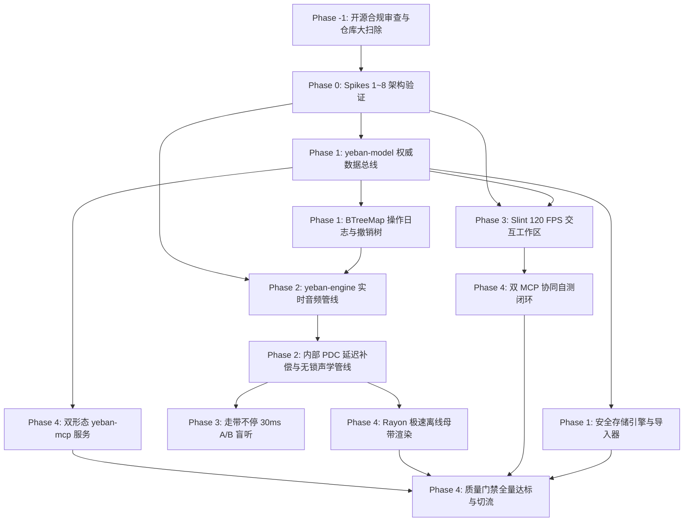

# 夜半 (Yeban) 工程重构实施路线图与落地规划 (Slint + Pure Rust 原生桌面版)

> **项目全称**：夜半 (Yeban) / Yeban DAW  
> **开源许可证**：GNU General Public License v3.0 (GPLv3) 带 CLAP 插件加载附加许可 (GPLv3 §7)  
> **规范版本**：`v3.0-rev6` (2026-10-04)  
> **Depends-on**：ARCHITECTURE v3.0-rev6, LEGAL.md, CONTRIBUTING.md  
> **修订记录 (Revision Log)**：  
> - `v3.0-rev6` (2026-10-04)：**系统闭环、合规前置与门禁体系全量落地 (依据全量专家评审)**。  
>   1. **增设 Phase -1 (开源合规前置审查与仓库大扫除)**：确立 GPLv3 + §7 CLAP 豁免、Slint 双授权声明、锁定 VST3 SDK 3.8.0+ MIT 路径、清理专有格式（NKI/EXS24/RVC）与历史大文件治理；  
>   2. **扩充 Phase 0 技术验证 (Spikes 1~8)**：增设 Spike 6（10 万音符虚拟化钢琴卷帘渲染基准）、Spike 7（双 MCP 活会话同步与 `.yeban.lock` 排他文件锁 PoC）、Spike 8（自定义 `Platform + SoftwareRenderer` 无头截图兜底 PoC）；  
>   3. **风险登记册扩容至 RSK-01 ~ RSK-15**：覆盖双 MCP 状态同步、Slint 无头兜底、ASIO 专有驱动审计、音频线程退役队列内存安全、Zip-Slip 攻击防御、Wayland 浮窗降级、视觉回归测试遮罩等全域风险；  
>   4. **质量门禁分级分类机制**：明确划分为“硬性发布门禁 (Must-Gates)”、“基准性能达标线 (Baseline Targets)”与“专项/自动化测试 (Specialized & Automated Tests)”，统一 100x 母带导出与 ≤0.2ms 撤销等单一指标源；  
>   5. **完全确立 100% 自主 AI Agent 研发范式**：移除所有人力人月工时评估，完全依托能力切片与自动化基准门禁推进。  
> - `v3.0-rev5` (2026-10-04)：GPLv3 开源合规发布保障、品牌重塑为“夜半 (Yeban)”与合规门禁升级。  
> - `v3.0-rev4` (2026-10-04)：UI 与引擎解耦、无头模式与双 MCP 自动化自测体系落地。  
> - `v3.0-rev3` (2026-10-04)：重大技术架构转型，全栈转型为 Slint GUI + Pure Rust 原生桌面音频工作站，确立 AI Agent 全自主驱动开发模式。  
> - `v3.0-rev2` (2026-10-04)：依据设计评审完成架构纠偏与指标收敛。  
> - `v3.0-rev1` (2026-10-04)：初始版本。

> **战略基调**：**零历史包袱，清道夫级纯血原生重构（Pure Rust Native Demolition & Rebuild）**。  
> **技术内核**：构建 **Slint 响应式矢量界面 + Rust 原生低延迟音频引擎**，彻底淘汰 V1/V2 双轨割裂结构，实现 960 PPQ 整数时钟、原生无锁 SPSC 声学管线、Slint 120 FPS 硬件加速交互界面与纯原生 AI Yeban Intent API v2 极速离线母带渲染。

---

## 目录
1. [重构实施总体里程碑 (Milestones Overview)](#1-重构实施总体里程碑-milestones-overview)
2. [代码资产分类处置清单 (Demolition & Asset Migration)](#2-代码资产分类处置清单-demolition--asset-migration)
3. [六阶段实施蓝图与详细技术攻坚](#3-六阶段实施蓝图与详细技术攻坚)
   - [Phase -1: 开源合规审查与仓库大扫除 (Open-Source Compliance)](#phase--1-开源合规审查与仓库大扫除-open-source-compliance)
   - [Phase 0: 原生引擎与 Slint 架构可行性验证 (Spikes 1~8)](#phase-0-原生引擎与-slint-架构可行性验证-spikes-18)
   - [Phase 1: 960 PPQ 数据模型、操作日志撤销树与存储引擎](#phase-1-960-ppq-数据模型操作日志撤销树与存储引擎)
   - [Phase 2: cpal 原生低时延音频管线与首个发声切片](#phase-2-cpal-原生低时延音频管线与首个发声切片)
   - [Phase 3: Slint 120 FPS 编曲工作区与 A/B 盲听切片](#phase-3-slint-120-fps-编曲工作区与-ab-盲听切片)
   - [Phase 4: Yeban Intent API v2、Rayon 离线母带、GPLv3 分发与门禁切流](#phase-4-yeban-intent-api-v2rayon-离线母带gplv3-分发与门禁切流)
4. [AI Agent 执行依赖拓扑与风险登记册 (Dependencies & Risk Register RSK-01 ~ RSK-15)](#4-ai-agent-执行依赖拓扑与风险登记册-dependencies--risk-register-rsk-01--rsk-15)
5. [质量门禁、基准测试与验收指标 (Quality Gates & Benchmarks)](#5-质量门禁基准测试与验收指标-quality-gates--benchmarks)
   - 5.1 [基准参考环境定义 (Reference Baselines)](#51-基准参考环境定义-reference-baselines)
   - 5.2 [核心质量验收指标矩阵 (Single Source of Truth)](#52-核心质量验收指标矩阵-single-source-of-truth)
   - 5.3 [门禁分级分类机制 (Must-Gates, Baseline Targets, Specialized Tests)](#53-门禁分级分类机制-must-gates-baseline-targets-specialized-tests)
6. [质量保障体系与自动化测试规范 (Quality Assurance & Automation)](#6-质量保障体系与自动化测试规范-quality-assurance--automation)
7. [未来演进里程碑与预留接口落地规范 (V3.0 ~ V4.0 Evolution Roadmap)](#7-未来演进里程碑与预留接口落地规范-v30--v40-evolution-roadmap)

---

## 1. 重构实施总体里程碑 (Milestones Overview)

本项目研发采用 **AI Agent 全自主驱动开发（Autonomous AI Agent Development）** 范式。废除传统软件工程的人力人月估算，全流程划分为 6 个循序渐进的**端到端能力切片（Capability Slices）**。每个里程碑均由 AI Agent 自动生成代码、运行单元测试、模糊测试与性能打点，唯有达到机械化质量门禁方可推进至下一阶段。

```
AI Agent 全自主驱动工程重构全周期 (Pure Rust Cargo Workspace)
================================================================================================
[Milestone -1] Phase -1: 开源合规审查与仓库大扫除 (Open-Source Compliance & Sanitization)
               └─ GPLv3 许可证 + CLAP §7 豁免 ➔ LEGAL.md 声明 ➔ VST3 3.8.0+ MIT ➔ 资产与依赖清洗
[Milestone 0]  Phase 0: 原生引擎与 Slint 架构可行性验证 (Spikes 1~8 Go / No-Go 准入)
               └─ cpal 驱动 ➔ 无锁 SPSC ➔ Slint 120 FPS ➔ 撤销树 ➔ 无头/双 MCP ➔ 卷帘压测 ➔ .yeban.lock
[Milestone 1]  Phase 1: 960 PPQ 数据模型、操作日志撤销树与存储引擎
               └─ yeban-model (ULID + BTreeMap) ➔ 领域操作日志 ➔ 本地 .yeban 容器 (Zip-Slip防御) ➔ 导入器
[Milestone 2]  Phase 2: cpal 原生低时延音频管线与首个发声切片
               └─ 实时声学线程调度 ➔ 预分配 Voice Pool ➔ SFZ v2 引擎 ➔ PDC 内部对齐 ➔ 零堆分配发声
[Milestone 3]  Phase 3: Slint 120 FPS 编曲工作区与 A/B 盲听切片
               └─ Slint 虚拟化卷帘与时间轴 ➔ Session/Arrangement 双视图 ➔ 提案分支切换 ➔ 30ms A/B 盲听
[Milestone 4]  Phase 4: Yeban Intent API v2、Rayon 离线母带、GPLv3 分发与门禁切流
               └─ 双 MCP 服务 (HTTP attach + stdio CLI) ➔ Rayon 极速母带 ➔ 实验性 ALS 导出 ➔ 生产切流
================================================================================================
```

---

## 2. 代码资产分类处置清单 (Demolition & Asset Migration)

### 2.1 彻底淘汰的历史 Web 与过渡包袱 (Retire on V3 Parity Gate)
全量淘汰原有 Web 架构相关代码，包括所有前端 React 组件、TypeScript 类型与转码补丁：

| 原仓库废弃路径 | 废弃原因分析 | 替代方案 (Pure Rust) | 处置策略 |
| :--- | :--- | :--- | :--- |
| `src/components/*` | React 18/19 DOM 组件，性能低下且存在浏览器渲染天花板 | 由 `crates/yeban-app` 下的 Slint 声明式组件全面替代 | 门禁达标后全量删除 |
| `src/audio/songFlatten.ts` | 双轨拼合工具，曾导致小节丢失 | `crates/yeban-model` 统一数据总线直读 | 门禁达标后全量删除 |
| `src/audio/compileArrangementToLanes.ts` | 暴力折叠音轨，损毁编曲表达 | `crates/yeban-model` 动态总线路由图 | 门禁达标后全量删除 |
| `src/types/*.ts` | TypeScript 类型定义，存在 `pitch`/`pitches` 等多重污染 | 由 `crates/yeban-model` 纯 Rust 结构体权威接管 | 门禁达标后全量删除 |
| `package.json`, `pnpm-workspace.yaml` | 前端 Node / pnpm 生态依赖 | 彻底移除，全工程转型为单一 Cargo Workspace | 转型初始直接移除 |
| `src/mcp/*` (老版) | 基于 Node/TS 的老版 MCP 工具集 | 由纯 Rust 编译的 Native CLI/Lib `crates/yeban-mcp` 接管 | Phase 4 验收后删除 |

### 2.2 移植重构至 Rust Crates 的核心资产 (Port to Pure Rust)
- 限制器算法 ➔ `crates/yeban-dsp/src/limiter.rs`（符合 ITU-R BS.1770-4 的真峰值多相插值砖墙限制器）
- 压缩器算法 ➔ `crates/yeban-dsp/src/compressor.rs`（带侧链输入的 SSL 总线压缩器模型）
- 通道条算法 ➔ `crates/yeban-dsp/src/channel_strip.rs`（EQ、滤波、动态旁通链）
- 鼓机电路建模 ➔ `crates/yeban-dsp/src/drums/`（808/909 模拟电路物理建模）
- 减法合成器 ➔ `crates/yeban-dsp/src/polysynth.rs`（双振荡器减法复音合成器）
- SFZ 引擎 ➔ `crates/yeban-sfz/`（零拷贝 SFZ v2 词法解析器与静态语音池）
- 乐理与流派库 ➔ `crates/yeban-theory/`（159 种世界音乐流派规则与和弦声部连接算法）
- 离线母带与格式导出 ➔ `crates/yeban-render/`（Rayon 极速渲染、RF64 写入器、实验性 Ableton ALS Gzip 导出器与 MIDI 0/1 序列化器）

---

## 3. 六阶段实施蓝图与详细技术攻坚

### Phase -1: 开源合规审查与仓库大扫除 (Open-Source Compliance)

#### 攻坚目标与交付物
1. **开源许可证与法律豁免前置配置**：
   - 根目录确立 `LICENSE`（GPLv3 完整法律文本 + GPLv3 §7 CLAP 插件动态加载附加许可例外）；
   - 编写 `LEGAL.md`，明确阐明 Ableton/Steinberg/FL Studio 商标非附属声明、Slint GPLv3/商业双轨授权属性及第三方 Fork 合规责任；
   - 建立 `CONTRIBUTING.md`（DCO 1.1 开发者签名规范）与 `SECURITY.md`（漏洞披露机制）。
2. **依赖库协议审计与精细化白名单 (`deny.toml`)**：
   - 配置 `cargo-deny`，明确锁定许可范围：MIT, Apache-2.0, GPL-3.0, MPL-2.0, BSD-2-Clause, BSD-3-Clause；
   - 明确锁定 VST3 依赖版本为 3.8.0+（官方已切换为 MIT 许可），防范遗留 GPL/专有协议风险；
   - 声明专有 ASIO SDK 隔离策略（用户自行下载，禁止随源码包直接分发）；
   - 移除所有未授权专有格式解析代码（NKI, EXS24, RVC 等私有模型），仅保留开放的 SFZ v2 与标准 PCM WAV/FLAC。
3. **样本资产指纹核验与 Git 仓库大扫除**：
   - 编制 `assets/samples/ATTRIBUTION.md`，核验 323 款原声乐器音色素材（CC0 / CC-BY / MIT）的来源与署名；
   - 检查并清理 Git 历史记录中的大于 10MB 的非代码大文件，确保工程克隆体积轻巧且纯净。

---

### Phase 0: 原生引擎与 Slint 架构可行性验证 (Spikes 1~8)

#### 攻坚目标与 Go / No-Go 准入标准
1. **Spike 1: `cpal` 原生多平台音频流稳定性与延迟验证**
   - *目标*：验证在 Linux (ALSA/PipeWire)、macOS (CoreAudio) 与 Windows (WASAPI/ASIO) 下以 64 ~ 128 采样点缓冲稳定运行的能力。
   - *Go 准入*：连续回放 30 分钟无音频欠载（Underrun / XRun），硬件往返时延 ≤ 5.0ms。
2. **Spike 2: 纯 Rust 无锁 SPSC 环形队列实时通信与退役回收队列**
   - *目标*：主线程（Producer）向实时音频回调线程（Consumer）高频发送控制事件，音频线程向主线程通过退役队列释放旧快照。
   - *Go 准入*：100,000 事件/秒吞吐下零死锁、零堆内存分配（Zero Malloc），单事件传递耗时 < 0.05ms，音频线程零 drop。
3. **Spike 3: Slint 基础窗口硬件加速渲染集成**
   - *目标*：搭建 Slint 最小宿主，测试其在 OpenGL / Skia / FemtoVG 渲染后端下的帧率与内存开销。
   - *Go 准入*：基础窗口平滑运行于 120 FPS，常驻内存占用 < 25 MB。
4. **Spike 4: 领域操作日志（Ops Log）与 BTreeMap 确定性状态原型**
   - *目标*：验证基于 ULID 的 BTreeMap 结构与可逆操作在连续 10,000 步撤销重做下的确定性。
   - *Go 准入*：状态恢复准确率 100%，单步执行耗时 < 0.2ms，序列化结果二进制严格全同。
5. **Spike 5: Slint 无头软件渲染与内嵌 MCP 远程内省验证**
   - *目标*：验证在无 X11/Wayland 桌面环境下以 `SLINT_BACKEND=headless` 启动，并借助 `--features slint/mcp` 验证 AI Agent 通过 HTTP JSON-RPC 查询 UI 树与截屏。
   - *Go 准入*：无显示器环境下成功启动，MCP 端口响应 HTTP JSON-RPC 耗时 ≤ 15ms，截图导出时间 ≤ 50ms。
6. **Spike 6: 虚拟化钢琴卷帘渲染基准与多视口压力测试**
   - *目标*：使用 Slint 自定义渲染/视口裁剪渲染 100,000 个密集音符，测试高频水平与垂直缩放滚动。
   - *Go 准入*：视口平滑移动，维持稳定 120 FPS（单帧渲染耗时 ≤ 8.3ms），无内存泄漏。
7. **Spike 7: 双 MCP 活会话挂载与 `.yeban.lock` 排他文件锁 PoC**
   - *目标*：验证进程内内嵌 Streamable HTTP MCP 服务（带本地 Token 鉴权）与独立 stdio CLI 互斥访问工程文件。
   - *Go 准入*：外部 Agent 成功 attach 运行中 DAW 并驱动 UI 刷新；并发打开同一工程立即触发 `PROJECT_LOCKED` 拦截。
8. **Spike 8: 定制 Platform 软件无头渲染兜底 PoC**
   - *目标*：验证在官方 `slint/mcp` 或 `headless-software` 出现 API 变动时，自研 `slint::platform::Platform` + `SoftwareRenderer` 方案输出无头 PNG 帧缓冲的能力。
   - *Go 准入*：纯纯内存无窗口运行，成功生成像素级一致的 1920x1080 PNG 界面渲染图。

---

### Phase 1: 960 PPQ 数据模型、操作日志撤销树与存储引擎

#### 目标与交付物
1. **建立权威数据总线 (`crates/yeban-model`)**：
   - 确立 `YebanProjectV3` 顶层文档，统一采用 960 PPQ 整数 Tick 时钟；
   - 实体强制采用有序 **`EntityId(Ulid)`** 标识，集合全面使用 `BTreeMap` 键控，消除哈希随机序；
   - 彻底解耦 `ProjectDocument`（持久化文档）、`SessionRuntimeState`（挥发性运行时状态）与 `LocalMachineConfig`（本机路径与凭据指针）。
2. **唯一声学路由真理源 (`RoutingGraph`)**：
   - 消除路由数据冗余：所有物理音轨、总线、发送与侧链拓扑统一由 `RoutingGraph` 表达；
   - `folder_id` 仅用于界面层音轨树状折叠，严禁承载音频信号传递语义。
3. **落地操作日志与非线性撤销树**：
   - 实现包含 `OpOrigin` 来源跟踪的强类型领域操作（`Op::AddNote`、`Op::ConnectRouting`、`Op::SetParam` 等），每个操作内聚反向回退逻辑；
   - 构建匿名分叉撤销树（Undo Tree）与命名分支（`MusicalBranch`），撤销状态下进行新编辑自动派生历史分支，历史永不丢失；
   - 每 256 次提交自动归档全量快照，快照间以紧凑操作日志存储。
4. **安全存储引擎与 V1/V2 数据迁移器**：
   - 落地标准 `.yeban` 本地 ZIP 归档容器与内容寻址池（CAS）；
   - **安全强化**：严格实现 Zip-Slip 路径规范化校验与解压炸弹（Decompression Bomb）体积/比率上限拦截；
   - 交付 `crates/yeban-model/src/migration/` 模块，将历史工程无损升格为合法 V3 AST。

---

### Phase 2: cpal 原生低时延音频管线与首个发声切片

#### 目标与交付物
1. **原生多线程音频调度核心 (`crates/yeban-engine`)**：
   - 绑定操作系统高优先级实时线程调度策略（Real-Time Priority）；
   - 实现双缓冲引擎快照（Engine Snapshot）原子指针交换：非实时线程构建不可变调度拓扑，实时音频线程在渲染量子边界无锁切换；
   - 旧快照推入退役回收队列（`rtrb::Producer<Arc<EngineSnapshot>>`），交由主线程安全回收，实现实时音频线程绝对零堆分配、零 dealloc；
   - 强制统一 FTZ（Flush-to-Zero）与 DAZ（Denormals-are-Zero）浮点模式，杜绝非正规浮点数引发 CPU 骤升。
2. **内部插件延迟补偿总架构 (Internal PDC Architecture)**：
   - 基于 `RoutingGraph` 拓扑排序计算各并联通路的累积物理时延；
   - 为提前到流的短路径音轨自动插入样本环形延迟缓冲（Delay Buffer），实现全总线微秒级绝对同相累加。
3. **静态预分配声部池与 SFZ 引擎 (`crates/yeban-sfz`)**：
   - 落地 `crates/yeban-sfz` 零拷贝解析器与预分配语音池（Voice Allocation Pool），实时处理中彻底禁绝堆内存分配；
   - 实现 5.0ms 升余弦声学自愈平滑淡出，消除语音偷取（Voice Stealing）瞬态爆音；
   - 加载内置 323 款原声乐器与 PolySynth，实现单轨音符触发低时延稳定发声。
4. **批量无锁环形队列与计量解耦**：
   - 主线程与音频线程间批量数据交换强制遵循 `rtrb` 批量 API（`bulk_push` / `bulk_pop` 结合栈分配 `[f32; 128]`）；
   - VU / 峰值电平计量独立走专门的高容量 SPSC 队列，UI 主线程以 60Hz 频率批量抽干（Drain）更新，禁止阻塞音频线程。

---

### Phase 3: Slint 120 FPS 编曲工作区与 A/B 盲听切片

#### 目标与交付物
1. **Slint 声明式现代化桌面界面 (`crates/yeban-app`)**：
   - 基于 Slint 语法构建视网膜高清自适应工作区（顶部走带条、左侧资产库、中间编曲区、底部多标签控制台）；
   - 编写高性能虚拟化视口组件，驱动钢琴卷帘与时间轴在 100,000+ 音符下恒定维持 **120 FPS**；
   - 完整支持选择、铅笔、剪刀、力度柱调节、橡皮擦与音符即时试听反馈；
   - Linux Wayland 平台下集成 `xdg-positioner` 悬浮子表面降级适配。
2. **走带不停即时 A/B 盲听切换**：
   - 快捷键 `[` / `]` 在当前主线与 AI 提案分支之间无缝盲听切换；
   - 切换时刻自动对齐至下一音乐拍，采用 30ms 等功率（sin/cos）交叉淡化，音乐连续不卡顿。
3. **Session 与 Arrangement 双视图同构**：
   - 支持 `Tab` 键零延迟无缝切换卡片矩阵与线性时间轴，支持场景（Scene）一键齐发与量化触发。

---

### Phase 4: Yeban Intent API v2、Rayon 离线母带、GPLv3 分发与门禁切流

#### 目标与交付物
1. **双形态意图服务体系 (`crates/yeban-mcp`)**：
   - **形态 A (运行态挂载)**：`yeban-app` 进程内嵌入 Streamable HTTP JSON-RPC 监听（绑定 `127.0.0.1`，高熵随机会话 Token 鉴权），AI Agent attach 活会话实时交互；
   - **形态 B (离线批处理)**：编译生成独立 Native CLI 二进制，通过 stdio 交互，利用 `.yeban.lock` 排他锁独占工程；
   - 完整交付核心工具集（`yeban_open_project`, `yeban_save_project`, `yeban_close_project`, `yeban_query_project` 分页稀疏视图, `yeban_propose_section`, `yeban_edit_notes`, `yeban_set_macro`, `yeban_render_master`, `yeban_merge_proposal`, `yeban_reject_proposal`），支持 `dryRun` 与 `idempotencyKey`。
2. **Rayon 多核并行极速离线母带渲染 (`crates/yeban-render`)**：
   - 依据 `RoutingGraph` 依赖拓扑多核并行渲染各音轨，主总线严格按 `EntityId` 字典序执行**单线程串行归约求和**，消除浮点加法非结合律漂移；
   - 自研广播级 RF64 / BW64 写入器，支持 BEXT 元数据与 TPDF 高精抖动；
   - 32 轨合成参考工程 A 母带渲染速度达成 **≥ 100× 真实时间**。
3. **实验性 Ableton Live Set (`.als`) 导出器 (`experimental-als-export`)**：
   - 基于 `flate2` 生成 Gzip 压缩 XML，严格按映射损失对照表降级，不可等价映射的内置合成器自动烘焙为分轨音频（Audio Freeze）导出。
4. **双 MCP 服务器协同自测闭环**：
   - 在 CI 环境运行无头验证流水线，AI Agent 注入编曲意图并拉取 UI 元素树 JSON / Framebuffer PNG 截图，比对断言形成自测试闭环。
5. **GPLv3 源码分发包构建与生产切流**：
   - 交付符合 GPLv3 严格要求的离线源码包构建脚本（包含全部 `.slint` 声明式 UI 源文件、`Cargo.lock` 依赖锁定与 `cargo vendor` 离线缓存）；
   - 全面通过硬性发布门禁（Must-Gates），彻底删除 V1/V2 历史 Web 代码包袱，交付生产就绪版本。

---

## 4. AI Agent 执行依赖拓扑与风险登记册 (Dependencies & Risk Register RSK-01 ~ RSK-15)

### 4.1 任务依赖关系拓扑 (Dependency Graph)



### 4.2 核心技术风险登记册 (Technical Risk Register RSK-01 ~ RSK-15)

| 风险编号 | 风险描述与潜在影响 | 概率 | 影响 | 自动化缓解对策与技术方案 | 触发报警条件 |
| :--- | :--- | :---: | :---: | :--- | :--- |
| **RSK-01** | 不同平台音频后端（Windows WASAPI/ASIO、Linux PipeWire/ALSA、macOS CoreAudio）表现不一 | 中 | 高 | Phase 0 设立覆盖三平台的自动化音频回环基准测试与系统原生延迟实测 | 任意平台发生音频欠载（Underrun） |
| **RSK-02** | Slint 声明式组件在 100,000+ 音符极端编曲下发生重绘丢帧 | 低 | 高 | 针对钢琴卷帘设计基于虚拟化视口裁剪（AABB 碰撞检测）与自定义绘图缓存 | 视口滚动帧耗时 > 8.3ms (低于 120 FPS) |
| **RSK-03** | 跨平台多线程渲染导致浮点确定性漂移 | 中 | 中 | 统一采用纯 Rust `libm`，禁用编译器 FMA 融合，强制主总线按 `EntityId` 字典序串行归约 | 二进制 WAV 样本差分校验不通过 |
| **RSK-04** | Ableton Live `.als` 内部私有格式变化导致导出工程在部分版本报错 | 低 | 中 | 锁定导出目标为 Live 11/12 兼容子集；建立映射损失对照表；复杂合成器自动回退为音频冻结（Audio Freeze） | 导出 XML 校验未通过语法解析 |
| **RSK-05** | 开源依赖许可证合规风险 (如 VST3 / GPL 历史包袱与插件加载争议) | 低 | 高 | 根目录明确 GPLv3 + §7 CLAP 加载附加许可；锁定 VST3 SDK 3.8.0+ MIT 路径；`deny.toml` 精细化常态化 CI 拦截 | 引入受限协议依赖或 `cargo-deny` 报警 |
| **RSK-06** | 双 MCP 拓扑下独立进程与 GUI 活会话状态脱节或并发读写破坏工程 | 高 | 高 | 确立双形态：桌面内嵌 HTTP 挂载服务（带随机 Token 鉴权），独立 CLI 独占工程；强制 `.yeban.lock` 排他文件锁机制 | 出现双写冲突或状态未同步 |
| **RSK-07** | Slint 上游无头/内省 API 变更破坏自动化 CI/CD 管线 | 中 | 中 | 确立三层工程兜底：优先使用标准 headless 后端，次级采用 `i-slint-backend-testing`，底层自研 Platform 软件光栅化输出 | 无头测试构建报错或截图失败 |
| **RSK-08** | ASIO 专有 SDK 源码污染开源仓库 | 低 | 高 | 严禁 ASIO 专有 SDK 纳入代码库；Windows 默认首选低时延 WASAPI 独占模式；ASIO 支持作为可选动态加载模块 | 仓库检测到 Steinberg 专有头文件 |
| **RSK-09** | 音频线程因旧快照 Drop 触发隐式内存释放导致实时爆音 | 高 | 高 | 引入 `rtrb` 退役回收队列，音频线程将旧快照推回主线程释放，音频线程绝对零 dealloc | 实时音频线程检测到内存释放操作 |
| **RSK-10** | `.yeban` ZIP 归档导入遭受 Zip-Slip 路径穿越或解压炸弹攻击 | 中 | 高 | 解包时严格调用 `canonicalize()` 防范路径穿越；设定单文件 2GB 上限与 100:1 膨胀比率上限 | 探测到包含 `..` 相对路径或解包超限 |
| **RSK-11** | Linux Wayland 环境下弹窗和菜单无法设置绝对屏幕坐标 | 高 | 中 | 基于 `xdg-positioner` 与 Slint/winit subsurface 机制相对父窗口定位，不支持时降级为内部平铺悬浮窗 | Wayland 弹窗定位发生协议错误 |
| **RSK-12** | AI 编曲模型权重或训练数据版权污染开源协议 | 低 | 高 | 严格隔离算法逻辑与外置模型；内核仅集成确定性符号乐理规则库（`yeban-theory`）；神经音频模型以可选独立包分发 | 发现未授权商用权重或数据集 |
| **RSK-13** | 无头视觉回归测试因动态元素（电平表、走带指针）发生误报抖动 | 高 | 中 | 截图比对前对 VU 电平表、走带光标与时间码区域应用动态遮罩（Masking），主要断言 UI 控件树与静态布局 | 相同代码在不同机器视觉测试报红 |
| **RSK-14** | 323 款原声乐器采样音色素材再分发侵权风险 | 中 | 高 | 建立 `assets/samples/ATTRIBUTION.md` 逐条核验资产指纹，仅限 CC0 / CC-BY / MIT 资产，CI 校验全匹配 | 采样素材指纹与开源许可不符 |
| **RSK-15** | 复杂拓扑内部 PDC 延迟补偿引发内存突增与相位计算环路 | 中 | 中 | 在构建 `RoutingGraph` 时执行严格的有向无环图（DAG）环路检测；对静态延迟分配预置容量环形缓冲 | 检测到路由环路或延迟缓冲区溢出 |

---

## 5. 质量门禁、基准测试与验收指标 (Quality Gates & Benchmarks)

> **铁律声明**：本节为夜半 (Yeban) 全系统性能指标与工程质量门禁的**唯一真实权威数据源**。

### 5.1 基准参考环境定义 (Reference Baselines)
- **参考工程 A (基准合成工程)**：32 轨独立音频/乐器轨，包含 16 个 PolySynth 减法合成器、8 轨 TR-808/909 模拟鼓机，每轨挂载 4-Band EQ 与压缩器，总线挂载真峰值限制器，全曲时长 3 分钟（180 秒）。
- **参考工程 B (大型管弦原声工程)**：32 轨原声乐器轨，加载 16 款 SFZ 多速度分层原声乐器音色库，全曲时长 3 分钟（180 秒）。
- **基准测试硬件**：Apple M2 Pro (12-Core CPU, 16GB RAM) / AMD Ryzen 7 7840HS (8-Core / 16-Thread, 32GB RAM, NVMe SSD)。

### 5.2 核心质量验收指标矩阵 (Single Source of Truth)

| 评估维度 | 指标项目 | 测量方法与测试规程 | V3 原生桌面目标基准 | 关联门禁阶段 |
| :--- | :--- | :--- | :--- | :---: |
| **应用冷启动** | 桌面应用冷启动就绪 | 统计从执行二进制到 Slint 界面可交互、音频驱动就绪耗时 | **≤ 100 毫秒** | Phase 0 |
| **常驻内存基线** | 空工程空闲内存占用 | 操作系统内存工作集（Working Set）统计 | **≤ 35 MB** | Phase 0 |
| **MCP 响应时延** | 意图服务冷启动时间 | 测量进程从启动到成功响应 `initialize` JSON-RPC 的耗时 | **≤ 20 毫秒** | Phase 4 |
| **工程加载耗时** | 32 轨参考工程 A 加载就绪 | 测量从发起打开到首帧音频可立即发声的耗时 | **≤ 300 毫秒** | Phase 1 |
| **离线母带渲染** | 参考工程 A (32 轨合成) | `yeban-render` 多线程并行导出 24-bit 48kHz WAV | **≥ 100× 真实时间** (180s 工程 ≤ 1.8s) | Phase 4 |
| **离线母带渲染** | 参考工程 B (32 轨 SFZ 管弦) | `yeban-render` 结合 NVMe 磁盘读取并行导出母带 | **≥ 30× 真实时间** (180s 工程 ≤ 6.0s) | Phase 4 |
| **单步撤销时延** | 模型层逆操作应用耗时 | 测量 `Op` 逆向应用至状态树的 p99 耗时 | **≤ 0.2 毫秒** | Phase 1 |
| **单步撤销响应** | UI 界面与音频管线同步生效 | 测量 Cmd+Z 触发至 Slint 重绘与声学管线生效耗时 | **UI ≤ 1 帧; 音频 ≤ 下一个音频渲染周期** | Phase 3 |
| **音频硬件时延** | 硬件声卡往返处理延迟 | 以 64 采样点缓冲运行于 cpal 驱动下，通过底层平台原生系统 API 实测回路延迟：macOS CoreAudio 查询 `kAudioDevicePropertyLatency` 与 `kAudioStreamPropertyLatency`；Windows WASAPI 查询 `IAudioClient::GetStreamLatency`；Linux PipeWire/JACK 借助硬件回环测试（`cpal::StreamInstant` 仅记录缓冲区时间戳，不反映真实物理硬件流水线时延） | **≤ 5.0 毫秒** | Phase 2 |
| **界面渲染帧率** | 10 万音符高频滚动与缩放 | Slint 硬件加速视口连续缩放与滚动测试 | **稳定 120 FPS** (零丢帧，帧耗时 ≤ 8.3ms) | Phase 3 |
| **分支穿梭时延** | 模型状态切换至就绪 | 切换至任意历史分支并完成状态树重新绑定耗时 | **≤ 1.0 毫秒** | Phase 3 |
| **A/B 盲听过渡** | 主线与 AI 提案分支无缝切换 | 播放中切换分支，测量对齐下拍与等功率交叉淡化 | **下一拍对齐，30ms 交叉，无可闻爆音** | Phase 3 |
| **提交物理增量** | 单次人工微编辑提交开销 | 统计单次微操作产生的持久化操作日志中位数 | **中位数 ≤ 500 字节** | Phase 1 |
| **声学断点平滑** | 循环点与切片边界跳跃 | 使用测试集分析过渡点 ±1ms 内一阶微分跳变 | **差分峰值 ≤ -60 dBFS 等效能量阈值** | Phase 2 |
| **离线声学确定性** | 同平台渲染二进制一致性 | 相同工程与随机种子下同一架构平台导出的 PCM WAV 二进制 | **100.000% 位级一致 (Bit-Exact L1)** | Phase 4 |
| **跨架构确定性** | 跨 CPU 架构渲染一致性 | x86_64 与 AArch64 导出相同工程的最大绝对样本差分 | **峰值差分 < 1e-6 (-120 dBFS, L2)** | Phase 4 |
| **AI 交互效率** | 单次段落生成 Token 开销 | 统计生成 16 小节段落的完整 MCP 工具往返 Token 数 | **中位数 ≤ 600 Tokens** | Phase 4 |

---

### 5.3 门禁分级分类机制 (Must-Gates, Baseline Targets, Specialized Tests)

为了保证 AI Agent 自主推进时的严密性与落地性，所有质量门禁划分为三级分类机制：

#### 一、硬性发布门禁 (Must-Gates) —— 阻断发布与合并，一票否决
1. **音频线程零安全违规 (Zero Glitch / Zero Alloc)**：实时音频回调函数内严禁出现任何堆内存分配（`malloc`）、堆释放（`free`/`drop`）、文件/网络 I/O 或互斥锁争用，CI 运行时通过内存分配 Hook 进行严格断言；
2. **同平台离线母带声学确定性 (Bit-Exact L1 Parity)**：在锁定工具链与基准指令集下，相同种子渲染的 WAV 文件 SHA-256 哈希必须 100% 全同；
3. **开源许可合规零告警 (100% License Audit Clean)**：`cargo-deny` 扫描 100% 通过，严禁引入未授权专有依赖，发布源码包必须完整包含所有 `.slint` 声明式源文件、确定性 `Cargo.lock` 与 `cargo vendor` 离线依赖；
4. **归档容器路径安全 (Zip-Slip & Bomb Defense)**：`.yeban` 解包逻辑必须 100% 拦截带有 `..` 的路径与超过限制的解压炸弹；
5. **并发排他文件锁安全 (`.yeban.lock`)**：工程打开时必须成功获取排他锁，并发读写立即抛出 `PROJECT_LOCKED`。

#### 二、基准性能达标线 (Baseline Targets) —— 性能退化报警与回归防护
1. **离线母带渲染吞吐**：参考工程 A 必须达标 **≥ 100× 真实时间**，管弦参考工程 B 达标 **≥ 30× 真实时间**；
2. **轻量内存开销**：应用空闲常驻内存工作集严格维持在 **≤ 35 MB** 以内；
3. **高刷新交互帧率**：10 万音符视口滚动维持在 **稳定 120 FPS**（单帧耗时 ≤ 8.3ms）；
4. **单步撤销极致响应**：模型层单步逆操作消耗维持在 **≤ 0.2ms** 以内。

#### 三、专项/手工/CI自动化测试 (Specialized & Automated Tests) —— 持续验证与专项覆盖
1. **`proptest` 状态树随机操作逆向幂等性测试**：随机生成 10,000 步操作序列并逆向回退，断言状态严格守恒；
2. **`cargo-fuzz` 音色与工程解析模糊测试**：针对 SFZ 词法解析器与 `.yeban` JSON 反序列化进行千万次随机变异输入注入，零崩溃；
3. **跨架构对账测试 (L2 Parity)**：在 GitHub Actions x86_64 与 macOS AArch64 runner 上对跑渲染工程，断言残差峰值 < 1e-6 (-120 dBFS)；
4. **无头视觉回归测试**：动态屏蔽电平表与走带指针后，比对 UI 元素树 JSON 与关键页面 Framebuffer 截图。

---

## 6. 质量保障体系与自动化测试规范 (Quality Assurance & Automation)

AI Agent 必须执行八重自动化质量保障防线：

1. **基于 `proptest` 的状态树属性测试**：
   - 针对 `crates/yeban-model` 中的所有操作日志执行属性测试：验证任意随机操作序列在任意顺序应用 `apply` 与 `inverse` 后状态 100% 幂等恢复。
2. **基于 `cargo-fuzz` 的格式解析模糊测试**：
   - 针对 SFZ 词法解析器实施基于 LLVM libFuzzer 的持续模糊测试，确保面对损坏或畸变的音色文本时零崩溃。
3. **确定性声学回归 CI (Determinism CI Pipeline)**：
   - 每次代码提交自动构建并渲染基准乐句，执行二进制 SHA-256 校验与相位抵消分析（残差 ≤ -120 dBFS）。
4. **全平台 Bare-metal 性能回归基准**：
   - 在固定硬件频率的自动化 Runner 上定期运行渲染吞吐与 Slint 视口帧率打点，若指标衰退超过 5% 立即阻断主分支合入。
5. **开源合规审计自动化 (`cargo-deny`)**：
   - 集成 `cargo-deny` 自动化扫描全依赖树，配置 MIT / Apache-2.0 / GPL-3.0 / MPL-2.0 许可证白名单；针对 `crates/yeban-vst` 拆分独立 Cargo features（`vst3` 与 `clap`），并在 `deny.toml` 中精细化配置排除规则，确保宿主与内核合规。
6. **基于 `i-slint-backend-testing` 的无窗口交互单元测试**：
   - 使用 Slint 官方测试后端，在内存模拟窗口系统与事件循环中自动化分发点击、拖拽与按键事件，断言响应式属性与模型同步，零物理窗口依赖。
7. **双 MCP 协同自动化 CI/CD 管线与无头视觉回归测试**：
   - 在 CI 节点上运行无头全功能测试，AI Agent 联动双 MCP 注入复杂工程并抓取 Framebuffer 截图；比对前动态遮罩电平表与时间码区域，像素偏差容差 < 0.1%，自动阻断 UI 元素重叠、错位与文字截断。
8. **GPLv3 源码分发包完备性与样本资产审计**：
   - CI 自动运行 `cargo vendor` 验证纯离线构建；核验发布包内完整包含所有 `.slint` 声明式源文件、`Cargo.lock` 确定性依赖锁定文件与 `LICENSE` (含 CLAP 例外条款)；自动运行脚本对 323 款原声乐器进行资产指纹对比，确保与 `assets/samples/ATTRIBUTION.md` 逐条吻合，零未授权专有样本混入。

---

## 7. 未来演进里程碑与预留接口落地规范 (V3.0 ~ V4.0 Evolution Roadmap)

```
+----------------------------------------------------------------------------------------------------+
|                         夜半 (Yeban) 原生演进全周期路线图 (V3.0 ➔ V3.1 ➔ V3.2 ➔ V3.5 ➔ V4.0)          |
+----------------------------------------------------------------------------------------------------+
| [V3.0 工业基石与纯血原生重构]                                                                        |
| - Slint 现代化原生桌面 GUI (120 FPS 响应，<35MB 极轻量常驻内存)                                       |
| - cpal 极低时延声卡驱动与无锁 SPSC 声学调度管线，集成退役回收队列与内部 PDC 拓扑                       |
| - 统一 960 PPQ 数据总线与 ULID BTreeMap 结构，RoutingGraph 单一声学权威，操作日志非线性撤销树         |
| - 内置 323 款 SFZ 原声乐器引擎 + 纯 Rust 建模合成器 (PolySynth, GS-1, 808/909)                        |
| - 双形态 Yeban Intent API v2 (桌面内嵌 HTTP attach + 独立 CLI) 与走带不停 30ms 等功率 A/B 盲听        |
| - 实验性 Ableton ALS 导出 (带映射损失对照表与音频冻结兜底)，V1/V2 一次性导入器                         |
| - GPLv3 完整开源发布，附带 CLAP 插件加载豁免条款与 assets/samples/ATTRIBUTION.md 完备声明             |
|                                                                                                    |
|                                         │                                                          |
|                                         ▼                                                          |
| [V3.1 专业桌面外接总线与高级版本合流]                                                                |
| - 落地三向合并冲突解析 UI、按音轨 Cherry-pick (带依赖闭包校验) 与完整视觉 Diff                         |
| - 音轨通用外部软件与服务集成总线 (`crates/yeban-services`)                                            |
| - 外部专业音频编辑器双向热重载 (iZotope RX / Melodyne)                                               |
| - 外部模拟效果器回路插入与 MLS 一键 Ping 脉冲自动延迟校准 (PDC 自动延迟补偿)                           |
|                                                                                                    |
|                                         │                                                          |
|                                         ▼                                                          |
| [V3.2 开放音源与轻量格式扩展]                                                                        |
| - 接入 SoundFont 2 (SF2) / SF3 经典通用 GM 音色库解析器                                              |
| - 接入 Decent Sampler (.dspreset) 现代开源音色库解析器 (直接支持 Pianobook 社区海量免费资产)           |
| - 外置非加密 Kontakt (.nki) 与 EXS24 音色区位映射 (Keyzones / Velocity Layers) 转换工具               |
|                                                                                                    |
|                                         │                                                          |
|                                         ▼                                                          |
| [V3.5 闭环声学自动驾驶与本地多 Agent 实时协作]                                                        |
| - 闭环自动驾驶母带：基于标准化 AcousticProfileReport 形成自诊断反馈调节回路                           |
| - 语义声学四维滚轮 (Air, Punch, Warmth, Nostalgia) 宏控联动                                         |
| - 实时 AI 建议伴随层 (Suggestion Overlay，按 Shift+Enter 瞬时转正)                                   |
| - 基于 `yrs` (Rust Yjs CRDT) 升级为局域网多人 + 多 Agent 实时无冲突协同编曲                          |
|                                                                                                    |
|                                         │                                                          |
|                                         ▼                                                          |
| [V4.0 商业 VST3/CLAP 崩溃隔离宿主与神经音频革命]                                                     |
| - 商业插件跨进程独立崩溃隔离宿主 (`crates/yeban-plugin-host`，非操作系统级安全沙箱)，基于 `clack` / POSIX shm 实现崩溃完全隔离|
| - 商业插件原生 OS 视窗呼出 (Win32 HWND / macOS NSWindow / Linux X11)                                 |
| - 本地神经歌声合成 (SVS)：本地打字即唱，支持真实发音、滑音与微表情包络推理                            |
| - 利用 Rust `nih-plug` 将 `yeban-dsp` 反向打包为 VST3 / CLAP 插件对外输出 (`crates/yeban-vst`)       |
+----------------------------------------------------------------------------------------------------+
```