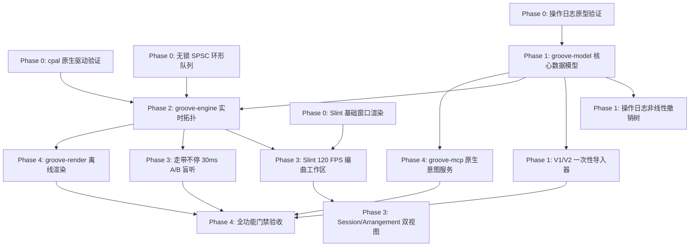

# Groove Lab Next-Gen (V3) 工程重构实施路线图与落地规划 (Slint + Pure Rust 原生桌面版)

> **修订记录 (Revision Log)**：  
> - `v3.0-rev4` (2026-10-04)：**UI 与引擎解耦、无头模式与双 MCP 自动化自测体系落地**。将纯 Rust 引擎与 Slint GUI 的物理级解耦纳入实施路线图；Phase 0 新增 Spike 5（Slint 无头软件渲染与内嵌 MCP 远程内省验证）；Phase 4 强化双 MCP 协同落地（`groove-mcp` 业务意图 + Slint 内嵌 UI 测试 MCP）；QA 质量保障体系新增无头 CI/CD 截图视觉回归测试与 `i-slint-backend-testing` 事件模拟。  
> - `v3.0-rev3` (2026-10-04)：**重大技术架构转型**。彻底放弃 Web/Wasm/AudioWorklet/TypeScript/React 路线，全栈转型为 **Slint GUI + Pure Rust 原生桌面音频工作站**；**彻底移除所有人工人力工时评估**，确立 **AI Agent 全自主驱动开发** 模式，以能力切片与自动化基准门禁为推进核心。  
> - `v3.0-rev2` (2026-10-04)：依据设计评审完成架构纠偏与指标收敛。  
> - `v3.0-rev1` (2026-10-04)：初始版本。

> **战略基调**：**零历史包袱，清道夫级纯血原生重构（Pure Rust Native Demolition & Rebuild）**。  
> **技术内核**：构建 **Slint 响应式矢量界面 + Rust 原生低延迟音频引擎**，彻底淘汰 V1/V2 双轨割裂结构，实现 960 PPQ 整数时钟、原生无锁 SPSC 声学管线、Slint 120 FPS 硬件加速交互界面与纯原生 AI Groove Intent API v2 极速离线母带渲染。

---

## 目录
1. [重构实施总体里程碑 (Milestones Overview)](#1-重构实施总体里程碑-milestones-overview)
2. [代码资产分类处置清单 (Demolition & Asset Migration)](#2-代码资产分类处置清单-demolition--asset-migration)
3. [五阶段实施蓝图与详细技术攻坚](#3-五阶段实施蓝图与详细技术攻坚)
   - [Phase 0: 原生引擎与 Slint 架构可行性验证 (Spike Validation)](#phase-0-原生引擎与-slint-架构可行性验证-spike-validation)
   - [Phase 1: 960 PPQ 数据模型、操作日志撤销树与存储引擎](#phase-1-960-ppq-数据模型操作日志撤销树与存储引擎)
   - [Phase 2: cpal 原生低时延音频管线与首个发声切片](#phase-2-cpal-原生低时延音频管线与首个发声切片)
   - [Phase 3: Slint 120 FPS 编曲工作区与 A/B 盲听切片](#phase-3-slint-120-fps-编曲工作区与-ab-盲听切片)
   - [Phase 4: Groove Intent API v2、Rayon 离线母带与对齐切流](#phase-4-groove-intent-api-v2rayon-离线母带与对齐切流)
4. [AI Agent 执行依赖拓扑与风险登记册 (Dependencies & Risk Register)](#4-ai-agent-执行依赖拓扑与风险登记册-dependencies--risk-register)
5. [质量门禁、基准测试与验收指标 (Quality Gates & Benchmarks)](#5-质量门禁基准测试与验收指标-quality-gates--benchmarks)
6. [质量保障体系与自动化测试规范 (Quality Assurance & Automation)](#6-质量保障体系与自动化测试规范-quality-assurance--automation)
7. [未来演进里程碑与预留接口落地规范 (V3.0 ~ V4.0 Evolution Roadmap)](#7-未来演进里程碑与预留接口落地规范-v30--v40-evolution-roadmap)

---

## 1. 重构实施总体里程碑 (Milestones Overview)

本项目研发采用 **AI Agent 全自主驱动开发（Autonomous AI Agent Development）** 范式。废除传统软件工程的人力人月估算，全流程划分为 5 个循序渐进的**端到端能力切片（Capability Slices）**。每个里程碑均由 AI Agent 自动生成代码、运行单元测试、模糊测试与性能打点，唯有达到机械化质量门禁方可推进至下一阶段。

```
AI Agent 全自主驱动工程重构全周期 (Pure Rust Cargo Workspace)
================================================================================================
[Milestone 0] Phase 0: 原生引擎与 Slint 架构可行性验证 (Go / No-Go 准入)
              └─ cpal 声卡直驱 ➔ 无锁 SPSC 环形缓冲 ➔ Slint 窗口渲染 ➔ 撤销树原型 ➔ 无头/双 MCP 验证
[Milestone 1] Phase 1: 960 PPQ 数据模型、操作日志撤销树与存储引擎
              └─ groove-model (ULID + id-Map) ➔ 操作日志撤销树 ➔ 本地 .groove 容器 ➔ V1/V2 导入器
[Milestone 2] Phase 2: cpal 原生低时延音频管线与首个发声切片
              └─ 实时声学线程调度 ➔ 预分配 Voice Pool ➔ SFZ v2 引擎 ➔ 纯 Rust 滤波/合成 ➔ 零 GC 发声
[Milestone 3] Phase 3: Slint 120 FPS 编曲工作区与 A/B 盲听切片
              └─ Slint 虚拟化卷帘与时间轴 ➔ Session/Arrangement 双视图 ➔ 提案分支切换 ➔ 30ms A/B 盲听
[Milestone 4] Phase 4: Groove Intent API v2、Rayon 离线母带与双 MCP 闭环
              └─ groove-mcp 原生服务 ➔ Slint 内嵌 MCP 验收 ➔ Rayon 极速母带 ➔ ALS 导出 ➔ 旧版退役
================================================================================================
```

---

## 2. 代码资产分类处置清单 (Demolition & Asset Migration)

### 2.1 彻底淘汰的历史 Web 与过渡包袱 (Retire on V3 Parity Gate)
全量淘汰原有 Web 架构相关代码，包括所有前端 React 组件、TypeScript 类型与转码补丁：

| 原仓库废弃路径 | 废弃原因分析 | 替代方案 (Pure Rust) | 处置策略 |
| :--- | :--- | :--- | :--- |
| `src/components/*` | React 18/19 DOM 组件，性能低下且存在浏览器渲染天花板 | 由 `crates/groove-app` 下的 Slint 声明式组件全面替代 | 门禁达标后全量删除 |
| `src/audio/songFlatten.ts` | 双轨拼合工具，曾导致小节丢失 | `crates/groove-model` 统一数据总线直读 | 门禁达标后全量删除 |
| `src/audio/compileArrangementToLanes.ts` | 暴力折叠音轨，损毁编曲表达 | `crates/groove-model` 动态总线路由图 | 门禁达标后全量删除 |
| `src/types/*.ts` | TypeScript 类型定义，存在 `pitch`/`pitches` 等多重污染 | 由 `crates/groove-model` 纯 Rust 结构体权威接管 | 门禁达标后全量删除 |
| `package.json`, `pnpm-workspace.yaml` | 前端 Node / pnpm 生态依赖 | 彻底移除，全工程转型为单一 Cargo Workspace | 转型初始直接移除 |
| `src/mcp/*` (老版) | 基于 Node/TS 的老版 MCP 工具集 | 由纯 Rust 编译的 Native CLI `crates/groove-mcp` 接管 | Phase 4 验收后删除 |

### 2.2 移植重构至 Rust Crates 的核心资产 (Port to Pure Rust)
- 限制器算法 ➔ `crates/groove-dsp/src/limiter.rs`（符合 ITU-R BS.1770-4 的真峰值多相插值砖墙限制器）
- 压缩器算法 ➔ `crates/groove-dsp/src/compressor.rs`（带侧链输入的 SSL 总线压缩器模型）
- 通道条算法 ➔ `crates/groove-dsp/src/channel_strip.rs`（EQ、滤波、动态旁通链）
- 鼓机电路建模 ➔ `crates/groove-dsp/src/drums/`（808/909 模拟电路物理建模）
- 减法合成器 ➔ `crates/groove-dsp/src/polysynth.rs`（双振荡器减法复音合成器）
- SFZ 引擎 ➔ `crates/groove-sfz/`（零拷贝 SFZ v2 词法解析器与静态语音池）
- 乐理与流派库 ➔ `crates/groove-theory/`（159 种世界音乐流派规则与和弦声部连接算法）
- 导出模块 ➔ `crates/groove-render/`（Ableton ALS Gzip 导出器与 MIDI 0/1 序列化器）

---

## 3. 五阶段实施蓝图与详细技术攻坚

### Phase 0: 原生引擎与 Slint 架构可行性验证 (Spike Validation)

#### 攻坚目标与 Go / No-Go 准入标准
1. **Spike 1: `cpal` 原生多平台音频流稳定性与延迟验证**
   - *目标*：验证在 Linux (ALSA/PipeWire)、macOS (CoreAudio) 与 Windows (WASAPI/ASIO) 下以 64 ~ 128 采样点缓冲稳定运行的能力。
   - *Go 准入*：连续回放 30 分钟无音频欠载（Underrun / XRun），硬件往返时延 ≤ 5.0ms。
2. **Spike 2: 纯 Rust 无锁 SPSC 环形队列实时通信**
   - *目标*：主线程（Producer）向实时音频回调线程（Consumer）高频发送 MIDI 与控制参数。
   - *Go 准入*：100,000 事件/秒吞吐下零死锁、零堆内存分配（Zero Malloc），单事件传递耗时 < 0.05ms。
3. **Spike 3: Slint 基础窗口硬件加速渲染集成**
   - *目标*：搭建 Slint 最小宿主，测试其在 OpenGL / FemtoVG 渲染后端下的帧率与内存开销。
   - *Go 准入*：基础窗口平滑运行于 120 FPS，常驻内存占用 < 25 MB。
4. **Spike 4: 领域操作日志（Ops Log）与撤销树原型**
   - *目标*：验证基于 ULID 的 Map 结构与可逆操作在连续 10,000 步撤销重做下的确定性。
   - *Go 准入*：状态恢复准确率 100%，单步执行耗时 < 0.5ms。
5. **Spike 5: Slint 无头软件渲染与内嵌 MCP 远程内省验证**
   - *目标*：验证在无 X11/Wayland 桌面环境下以 `SLINT_BACKEND=headless-software` 启动，并借助 `--features slint/mcp` 与 `SLINT_MCP_PORT=9315` 开启内嵌 MCP 服务器；验证 AI Agent 通过 HTTP JSON-RPC 成功查询 UI 控件树与输出无头截屏。
   - *Go 准入*：无真实物理显示器环境下成功启动，MCP 端口响应 HTTP JSON-RPC 请求耗时 ≤ 15ms，无头 Framebuffer 截图导出时间 ≤ 50ms，常驻内存占用 < 35 MB。

---

### Phase 1: 960 PPQ 数据模型、操作日志撤销树与存储引擎

#### 目标与交付物
1. **建立权威数据总线 (`crates/groove-model`)**：
   - 确立 `GrooveProjectV3` 顶层文档，统一采用 960 PPQ 整数 Tick 时钟；
   - 实体强制采用有序 **ULID** 标识，集合使用 ULID 键控 Map，顺序以 fractional index 维护；
   - 彻底解耦 `ProjectDocument`（持久化文档）、`SessionRuntimeState`（挥发性运行时状态）与 `LocalMachineConfig`（本机路径与凭据指针）。
2. **落地操作日志与非线性撤销树**：
   - 实现强类型领域操作（`Op::AddNote`、`Op::MoveNote`、`Op::SetParam` 等），每个操作内聚反向回退逻辑；
   - 构建匿名分叉撤销树（Undo Tree）与命名分支（`MusicalBranch`），撤销状态下进行新编辑自动派生历史分支，历史永不丢失；
   - 每 256 次提交自动归档全量快照，快照间以紧凑操作日志存储。
3. **本地文件持久化与 V1/V2 数据迁移器**：
   - 落地标准 `.groove` 本地 ZIP 归档容器与内容寻址池（CAS）；
   - 交付 `crates/groove-model/src/migration/` 模块，将历史工程无损升格为合法 V3 AST。

---

### Phase 2: cpal 原生低时延音频管线与首个发声切片

#### 目标与交付物
1. **原生多线程音频调度核心 (`crates/groove-engine`)**：
   - 绑定操作系统高优先级实时线程调度策略（`thread_priority` / Real-Time Priority）；
   - 实现双缓冲引擎快照（Engine Snapshot）原子指针交换：非实时线程构建不可变调度拓扑，实时音频线程在渲染量子边界无锁切换。
2. **静态预分配声部池与 SFZ 引擎**：
   - 落地 `crates/groove-sfz` 零拷贝解析器与预分配语音池（Voice Allocation Pool），实时处理中彻底禁绝堆内存分配；
   - 加载内置 323 款原声乐器与 PolySynth，实现单轨音符触发低时延稳定发声。
3. **声学过渡平滑机制**：
   - 在循环点与切片边界强制应用 64 采样点升余弦微窗，彻底消除波形突变跳变。

---

### Phase 3: Slint 120 FPS 编曲工作区与 A/B 盲听切片

#### 目标与交付物
1. **Slint 声明式现代化桌面界面 (`crates/groove-app`)**：
   - 基于 Slint 语法构建视网膜高清自适应工作区（顶部走带条、左侧资产库、中间编曲区、底部多标签控制台）；
   - 编写高性能自定义绘图组件，驱动钢琴卷帘与时间轴在大规模音符（100,000+）下恒定维持 **120 FPS**；
   - 完整支持选择、铅笔、剪刀、力度柱调节、橡皮擦与音符即时试听反馈。
2. **走带不停即时 A/B 盲听切换**：
   - 快捷键 `[` / `]` 在当前主线与 AI 提案分支之间无缝盲听切换；
   - 切换时刻自动对齐至下一音乐拍，采用 30ms 等功率（sin/cos）交叉淡化，音乐连续不卡顿。
3. **Session 与 Arrangement 双视图同构**：
   - 支持 `Tab` 键零延迟无缝切换卡片矩阵与线性时间轴，支持场景（Scene）一键齐发与量化触发。

---

### Phase 4: Groove Intent API v2、Rayon 离线母带与对齐切流

#### 目标与交付物
1. **原生独立二进制服务 (`crates/groove-mcp`)**：
   - 纯 Rust 编译生成的 Native CLI/Server，基于标准 stdio 响应 JSON-RPC；
   - 暴露乐理与曲式编排意图 API（`groove_propose_section`、`groove_apply_progression` 等），单次段落生成消耗 ≤ 600 Tokens；
   - AI 生成强制隔离在 `ai/proposal-*` 分支发起提交，主分支由制作人完全掌控。
2. **Rayon 多核并行极速离线母带渲染 (`crates/groove-render`)**：
   - 利用工作窃取并行渲染各音轨，总线按音轨排序固定顺序串行归约，输出 24-bit / 32-bit Float 广播级 WAV；
   - 32 轨参考工程母带渲染速度达成 **≥ 100× 真实时间**。
3. **双 MCP 服务器协同自测闭环 (`groove-mcp` + `slint/mcp`)**：
   - 启动无头验证环境：`SLINT_BACKEND=headless-software SLINT_MCP_PORT=9315 cargo run -p groove-app --features slint/mcp`；
   - AI Agent 通过 `groove-mcp` 注入编曲意图与音符操作，随后通过 Slint 内嵌 MCP 抓取 UI 元素树并导出无头 Framebuffer 截图；
   - 自动化比对视觉布局与断言交互状态，达成无物理屏幕环境下的全自主 AI 验收闭环。
4. **确定性与功能门禁达标切流**：
   - 运行自动化对比套件，通过 V3 全量质量门禁，正式移除废弃代码，交付生产就绪版本。

---

## 4. AI Agent 执行依赖拓扑与风险登记册 (Dependencies & Risk Register)

### 4.1 任务依赖关系拓扑 (Dependency Graph)



### 4.2 核心技术风险登记册 (Technical Risk Register)

| 风险项编号 | 风险描述与潜在影响 | 发生概率 | 影响程度 | 自动化缓解对策与技术方案 | 触发报警条件 |
| :--- | :--- | :---: | :---: | :--- | :--- |
| **RSK-01** | 不同平台音频后端（如 Windows ASIO vs Linux PipeWire）表现不一 | 中 | 高 | Phase 0 设立覆盖 Linux、macOS 与 Windows CI 矩阵的自动化音频回环基准测试 | 任意系统出现音频欠载（Underrun） |
| **RSK-02** | Slint 声明式组件在大规模音符（100,000+）下发生重绘卡顿 | 低 | 高 | 针对钢琴卷帘设计基于 Slint `Image` 共享帧缓冲或自定义 OpenGL 视口裁剪渲染器 | 帧耗时超过 8.3ms (低于 120 FPS) |
| **RSK-03** | 跨平台多线程渲染导致浮点确定性漂移 | 中 | 中 | 统一采用纯 Rust `libm`，禁用 FMA 编译收缩，强制执行音轨固定顺序求和归约 | 二进制 WAV 样本 Diff 校验不通过 |
| **RSK-04** | Ableton Live `.als` 内部私有格式变化导致导出工程在部分版本打不开 | 低 | 中 | 锁定导出目标为 Live 11/12 兼容子集；建立基于官方 Live 解压加载的自动化验证套件 | 导出 XML 校验未通过语法解析 |
| **RSK-05** | 开源依赖许可证合规风险 (如 VST3 / GPL 历史包袱) | 低 | 高 | 核心引擎采用 MIT/Apache-2.0 纯 Rust 库；CI 集成 `cargo-deny` 自动化排查 | 引入受限传染性协议依赖 |

---

## 5. 质量门禁、基准测试与验收指标 (Quality Gates & Benchmarks)

> **铁律声明**：本节为 Groove V3 全系统性能指标与工程质量门禁的**唯一真实权威数据源**。

### 5.1 基准参考环境定义 (Reference Baselines)
- **参考工程 A (基准合成工程)**：32 轨独立音频/乐器轨，包含 16 个 PolySynth 减法合成器、8 轨 TR-808/909 模拟鼓机，每轨挂载 4-Band EQ 与压缩器，总线挂载真峰值限制器，全曲时长 3 分钟（180 秒）。
- **参考工程 B (大型管弦原声工程)**：32 轨原声乐器轨，加载 16 款 SFZ 多速度分层原声乐器音色库，全曲时长 3 分钟（180 秒）。
- **基准测试硬件**：Apple M2 Pro (12-Core CPU, 16GB RAM) / AMD Ryzen 7 7840HS (8-Core / 16-Thread, 32GB RAM, NVMe SSD)。

### 5.2 核心质量验收指标矩阵 (Single Source of Truth)

| 评估维度 | 指标项目 | 测量方法与测试规程 | V3 原生桌面目标基准 | 关联门禁阶段 |
| :--- | :--- | :--- | :--- | :---: |
| **应用冷启动** | 桌面应用冷启动就绪 | 统计从执行二进制到 Slint 界面可交互、音频驱动就绪耗时 | **≤ 100 毫秒** | Phase 0 |
| **常驻内存基线** | 空工程空闲内存占用 | 操作系统内存工作集（Working Set）统计 | **≤ 35 MB** | Phase 0 |
| **MCP 响应时延** | 意图服务冷启动时间 | 测量进程从启动到成功响应 `initialize` JSON-RPC 的耗时 | **≤ 20 毫秒** | Phase 4 |
| **工程加载耗时** | 32 轨参考工程 A 加载就绪 | 测量从发起打开到首帧音频可立即发声的耗时 | **≤ 300 毫秒** | Phase 1 |
| **离线母带渲染** | 参考工程 A (32 轨合成) | `groove-render` 多线程并行导出 24-bit 48kHz WAV | **≥ 100× 真实时间** (180s 工程 ≤ 1.8s) | Phase 4 |
| **离线母带渲染** | 参考工程 B (32 轨 SFZ 管弦) | `groove-render` 结合 NVMe 磁盘读取并行导出母带 | **≥ 30× 真实时间** (180s 工程 ≤ 6.0s) | Phase 4 |
| **单步撤销时延** | 模型层逆操作应用耗时 | 测量 `Op` 逆向应用至状态树的 p99 耗时 | **≤ 0.2 毫秒** | Phase 1 |
| **单步撤销响应** | UI 界面与音频管线同步生效 | 测量 Cmd+Z 触发至 Slint 重绘与声学管线生效耗时 | **UI ≤ 1 帧; 音频 ≤ 下一个音频渲染周期** | Phase 3 |
| **音频硬件时延** | 硬件声卡往返处理延迟 | 以 64 采样点缓冲运行于 cpal 驱动下实测回路延迟 | **≤ 5.0 毫秒** | Phase 2 |
| **界面渲染帧率** | 10 万音符高频滚动与缩放 | Slint 硬件加速视口连续缩放与滚动测试 | **稳定 120 FPS** (零丢帧，帧耗时 ≤ 8.3ms) | Phase 3 |
| **分支穿梭时延** | 模型状态切换至就绪 | 切换至任意历史分支并完成状态树重新绑定耗时 | **≤ 1.0 毫秒** | Phase 3 |
| **A/B 盲听过渡** | 主线与 AI 提案分支无缝切换 | 播放中切换分支，测量对齐下拍与等功率交叉淡化 | **下一拍对齐，30ms 交叉，无可闻爆音** | Phase 3 |
| **提交物理增量** | 单次人工微编辑提交开销 | 统计单次微操作产生的持久化操作日志中位数 | **中位数 ≤ 500 字节** | Phase 1 |
| **声学断点平滑** | 循环点与切片边界跳跃 | 使用测试集分析过渡点 ±1ms 内一阶微分跳变 | **差分峰值 ≤ -60 dBFS 等效能量阈值** | Phase 2 |
| **离线声学确定性** | 跨平台离线渲染二进制一致性 | 相同工程与随机种子下不同平台导出的 PCM WAV 二进制 | **100.000% 位级一致 (Bit-Exact)** | Phase 4 |
| **AI 交互效率** | 单次段落生成 Token 开销 | 统计生成 16 小节段落的完整 MCP 工具往返 Token 数 | **中位数 ≤ 600 Tokens** | Phase 4 |

---

## 6. 质量保障体系与自动化测试规范 (Quality Assurance & Automation)

AI Agent 必须执行七重自动化质量保障防线：

1. **基于 `proptest` 的状态树属性测试**：
   - 针对 `crates/groove-model` 中的所有操作日志执行属性测试：验证任意随机操作序列在任意顺序应用 `apply` 与 `inverse` 后状态 100% 幂等恢复。
2. **基于 `cargo-fuzz` 的格式解析模糊测试**：
   - 针对 SFZ 词法解析器实施基于 LLVM libFuzzer 的持续模糊测试，确保面对损坏或畸变的音色文本时零崩溃。
3. **确定性声学回归 CI (Determinism CI Pipeline)**：
   - 每次代码提交自动构建并渲染基准乐句，执行二进制 SHA-256 校验与相位抵消分析（残差 ≤ -100 dBFS）。
4. **全平台 Bare-metal 性能回归基准**：
   - 在固定硬件频率的自动化 Runner 上定期运行渲染吞吐与 Slint 视口帧率打点，若指标衰退超过 3% 立即阻断主分支合入。
5. **合规审计自动化**：
   - 集成 `cargo-deny` 自动化扫描依赖树，严禁在核心库中引入未经许可的 GPL 传染性依赖。
6. **基于 `i-slint-backend-testing` 的无窗口交互单元测试**：
   - 使用 Slint 官方测试后端，在内存模拟窗口系统与事件循环中自动化分发点击、拖拽与按键事件，断言响应式属性与模型同步，零物理窗口依赖。
7. **双 MCP 协同自动化 CI/CD 管线与无头视觉回归测试**：
   - 在 CI 节点上运行：`SLINT_BACKEND=headless-software SLINT_MCP_PORT=9315 cargo test --workspace --features slint/mcp`；
   - AI Agent 联动双 MCP 注入复杂工程并抓取 Framebuffer 截图，比对 Golden 图像，像素偏差容差 < 0.1%，自动阻断 UI 元素重叠、错位与文字截断。

---

## 7. 未来演进里程碑与预留接口落地规范 (V3.0 ~ V4.0 Evolution Roadmap)

```
+----------------------------------------------------------------------------------------------------+
|                         GROOVE LAB 原生演进全周期路线图 (V3.0 ➔ V3.1 ➔ V3.2 ➔ V3.5 ➔ V4.0)          |
+----------------------------------------------------------------------------------------------------+
| [V3.0 工业基石与纯血原生重构]                                                                        |
| - Slint 现代化原生桌面 GUI (120 FPS 响应，<35MB 极轻量常驻内存)                                       |
| - cpal 极低时延声卡驱动与无锁 SPSC 声学调度管线                                                      |
| - 统一 960 PPQ 数据总线与 ULID id-Map 结构，操作日志非线性撤销树                                      |
| - 内置 323 款 SFZ 原声乐器引擎 + 纯 Rust 建模合成器 (PolySynth, GS-1, 808/909)                        |
| - 原生 Groove Intent API v2 与走带不停 30ms 等功率 A/B 盲听                                         |
| - V1/V2 到 V3 一次性数据导入器，旧系统全量平滑退役切流                                                |
|                                                                                                    |
|                                         │                                                          |
|                                         ▼                                                          |
| [V3.1 专业桌面外接总线与高级版本合流]                                                                |
| - 落地三向合并冲突解析 UI、按音轨 Cherry-pick (带依赖闭包校验) 与完整视觉 Diff                         |
| - 音轨通用外部软件与服务集成总线 (`crates/groove-services`)                                           |
| - 外部专业音频编辑器双向热重载 (iZotope RX / Melodyne)                                               |
| - 外部模拟效果器回路插入与 MLS 一键 Ping 脉冲自动延迟校准 (PDC 自动延迟补偿)                           |
|                                                                                                    |
|                                         │                                                          |
|                                         ▼                                                          |
| [V3.2 开放音源与轻量格式扩展]                                                                        |
| - 接入 SoundFont 2 (SF2) / SF3 经典通用 GM 音色库解析器                                              |
| - 接入 Decent Sampler (.dspreset) 现代开源音色库解析器 (直接支持 Pianobook 社区海量免费资产)           |
| - 非加密 Kontakt (.nki) 与 EXS24 音色区位映射 (Keyzones / Velocity Layers) 转换器                     |
|                                                                                                    |
|                                         │                                                          |
|                                         ▼                                                          |
| [V3.5 闭环声学自动驾驶与本地多 Agent 实时协作]                                                        |
| - 闭环自动驾驶母带：基于标准化 AcousticProfileReport 形成自诊断反馈调节回路                           |
| - 语义声学四维滚轮 (Air, Punch, Warmth, Nostalgia) 宏控联动                                         |
| - 实时 AI 建议伴随层 (Suggestion Overlay，按 Shift+Enter 瞬时转正)                                   |
| - 基于 `yrs` (Rust Yjs CRDT) 升级为局域网多人 + 多 Agent 实时无冲突协同编曲                          |
|                                                                                                    |
|                                         │                                                          |
|                                         ▼                                                          |
| [V4.0 商业 VST3/CLAP 沙盒宿主与神经音频革命]                                                         |
| - 商业插件跨进程独立沙盒宿主 (`crates/groove-plugin-host`)，基于 `clack` / POSIX shm 实现崩溃完全隔离|
| - 商业插件原生 OS 视窗呼出 (Win32 HWND / macOS NSWindow / Linux X11)                                 |
| - 本地神经歌声合成 (SVS)：本地打字即唱，支持真实发音、滑音与微表情包络推理                            |
| - 利用 Rust `nih-plug` 将 `groove-dsp` 反向打包为 VST3 / CLAP 插件对外输出                           |
+----------------------------------------------------------------------------------------------------+
```\n