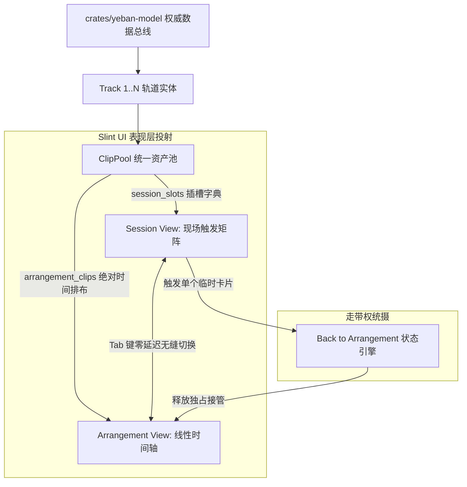

# 夜半 (Yeban) 专业桌面 DAW UI/UX 布局与交互重构设计规范 (Pure Rust + Slint 极速版)

> **项目信息**：夜半 (Yeban DAW) | 协议：GPLv3（附 CLAP 插件动态加载例外条款） | 仓库：`https://github.com/yeban/yeban`  
> **文档依赖**：`Depends-on: ARCHITECTURE v3.0-rev5, LEGAL.md`  
> **修订记录 (Revision Log)**：  
> - `v3.0-rev5` (2026-10-04)：**开源合规与技术纠偏升级**。正式更名为“夜半 (Yeban)”，确立整体以 GPLv3 许可证在 GitHub 开源；修复 LaTeX 坐标转换公式的转义符渲染兼容性；更新 Slint 无头启动参数为标准 `SLINT_BACKEND=headless`；阐明 Slint 内嵌 MCP 基于 HTTP JSON-RPC 与内部 Protobuf `IntrospectionState` / `ElementHandle` API 运作机制；将“对标”规范化为“设计参考 / 架构借鉴”；crate 名称统一为 `yeban-*`。  
> - `v3.0-rev4` (2026-10-04)：**新增 Slint 无头运行与 AI 视觉内省交互规范**。增设 §12 专门规范 Slint 软件光栅化无头模式（`SLINT_BACKEND=headless-software`）、内嵌 MCP 服务器远程内省协议（UI 控件树查询、事件模拟注入）以及基于无头 Framebuffer 截图的 AI 自动化视觉回归断言体系。  
> - `v3.0-rev3` (2026-10-04)：**重大技术架构转型**。彻底放弃 Web/HTML5 Canvas/DOM 方案，全线重构为 **Slint 原生桌面声明式矢量界面体系**；深度融合 Slint 响应式属性与高性能自定义渲染，交付恒定 120 FPS 视网膜高清响应；全面消除按键冲突；保留 FL Studio 式卷帘心流与色盲安全三向 Diff 审查体系。  
> - `v3.0-rev2` (2026-10-04)：依据设计评审完成快捷键冲突解耦与无障碍补全。  
> - `v3.0-rev1` (2026-10-04)：初始版本。

> **定位**：以 Ableton Live 12、Bitwig Studio 5 与 FL Studio 24 为工业级设计参考与架构借鉴的纯血现代化桌面音频工作站（DAW）。  
> **设计哲学**：零历史包袱、视听绝对一致（WYHIWYG）、Slint 硬件加速矢量渲染、AI Agent 与人类音乐家沉浸式协同。

---

## 目录
1. [Slint 原生桌面网格系统与窗口空间几何规范](#1-slint-原生桌面网格系统与窗口空间几何规范)
2. [双视图同构体系 (Session View & Arrangement View)](#2-双视图同构体系-session-view--arrangement-view)
3. [Slint 虚拟化钢琴卷帘交互规范 (Piano Roll UX)](#3-slint-虚拟化钢琴卷帘交互规范-piano-roll-ux)
4. [专业时间轴与波形/音频剪辑交互规范](#4-专业时间轴与波形音频剪辑交互规范)
5. [底部机架、调音台与设备链 (Device Rack & Mixer)](#5-底部机架调音台与设备链-device-rack--mixer)
6. [手势、指针捕获与视听反馈状态机 (Interaction State Machine)](#6-手势指针捕获与视听反馈状态机-interaction-state-machine)
7. [工业级全键盘快捷键与无障碍操作规范 (Keyboard & A11y)](#7-工业级全键盘快捷键与无障碍操作规范-keyboard--a11y)
8. [Slint 组件树架构与 Rust 状态绑定规范](#8-slint-组件树架构与-rust-状态绑定规范)
9. [面向未来人机共创的前端交互规范 (Future Extensible UI Interactions)](#9-面向未来人机共创的前端交互规范-future-extensible-ui-interactions)
10. [编曲时光机、AI 提案审查与视觉 Diff 交互规范 (Arrangement Time Machine & Musical PR)](#10-编曲时光机ai-提案审查与视觉-diff-交互规范-arrangement-time-machine--musical-pr)
11. [音轨外部软件与服务集成交互规范 (Track External Services UI/UX) [V3.1]](#11-音轨外部软件与服务集成交互规范-track-external-services-uiux-v31)
12. [Slint 无头模式运行与 AI 视觉内省交互规范 (Headless UI & MCP Introspection)](#12-slint-无头模式运行与-ai-视觉内省交互规范-headless-ui--mcp-introspection)

---

## 1. Slint 原生桌面网格系统与窗口空间几何规范

### 1.1 屏幕空间网格系统 (The Modular Slint Desktop Grid)

利用 Slint 的声明式布局（`GridLayout` 与 `VerticalLayout`）构建**零溢出、零多余嵌套、全视口自适应**的专业暗黑桌面界面体系：

```
+----------------------------------------------------------------------------------------------------+
| TOP CONTROL BAR (48px) - 走带 / BPM / [Branch: main ▼] / [Commit ↺ ↻] / [🟣 AI提案 (1)] / 视图切换 |
+----------+------------------------------------------------------------------------------+----------+
| LEFT     | MAIN WORKSPACE (动态伸缩，占比 55% - 65%)                                    | RIGHT    |
| BROWSER  | ---------------------------------------------------------------------------- | MASTER / |
| & ASSET  | [模式 A] SESSION VIEW: 垂直剪辑矩阵 (Clip Matrix) + 场景触发列 (Scene Launch)  | AI CO-   |
| LIBRARY  | [模式 B] ARRANGEMENT VIEW: 轨道包头 (Headers) + 绝对时间轴 (Timeline Tracks) | PILOT    |
| (240px)  |                                                                              | (280px)  |
| 乐器采样 |                                                                              | 意图生成 |
| 预置模板 |                                                                              | 声学诊断 |
| 折叠展开 |                                                                              | 侧边折叠 |
+----------+------------------------------------------------------------------------------+----------+
| SPLITTER BAR (4px) - 可自由拖拽调节上下工作区分割线 (Min: 220px, Max: 600px)                         |
+----------------------------------------------------------------------------------------------------+
| BOTTOM CONSOLE (动态伸缩，占比 35% - 45%) - [Tab 切换]                                               |
| [Tab 1: 虚拟化钢琴卷帘 (MIDI Piano Roll)]  [Tab 2: 调音台总控 (Mixer)]  [Tab 3: 设备效果链 (Devices)]   |
+----------------------------------------------------------------------------------------------------+
| STATUS & TOOLTIP BAR (24px) - 选区信息 / 实时和弦识别 / 快捷键提示 / 硬件声卡采样率与性能状态         |
+----------------------------------------------------------------------------------------------------+
```

### 1.2 视口几何约束与响应式折叠规则

1. **核心视口断点与布局规则**：
   - **高分宽屏显示器 (≥ 1920×1080, FHD / 2K / 4K)**：全展开模式，Left Browser (固定 240px)、Main Timeline (弹性填充)、Right AI Co-pilot (固定 280px)、Bottom Console 完整就绪；
   - **笔记本屏幕 (1366×768 ～ 1919×1079)**：Main Workspace 具备最高展示优先级。AI Co-pilot 自动折叠为右侧抽屉（快捷键 `Cmd/Ctrl + \` 呼出）；Left Browser 默认收起为 36px 图标导轨。
2. **保留模式（Retained Mode）与局部脏矩形渲染**：
   - 彻底摒弃全屏无谓重绘，Slint 仅在走带指针移动、VU 电平跳变或用户交互时局部重绘脏矩形区域，静态编辑时 CPU 占用率趋近于 0%；
   - 底层接入 FemtoVG / Skia / OpenGL 硬件渲染管线，视网膜屏幕（Retina）高分屏无缝点对点高清渲染。

---

## 2. 双视图同构体系 (Session View & Arrangement View)

在纯 Rust 原生架构下，**Session（卡片触发灵感视图）** 与 **Arrangement（线性编曲叙事视图）** 共享同一份内存 AST：



### 2.1 快捷切换与双屏联动机制
- **快捷键 `Tab`**：当用户焦点位于工作区时，毫秒级切换主工作区的展现形态；
- **原生多视窗支持**：支持直接弹出独立的 OS 原生子视窗（如将全通道调音台或第三方插件独立放置在副屏），多窗口在同一进程内共享数据引用，零跨进程 IPC 损耗；
- **Back to Arrangement (返回编曲按钮)**：在 Session 模式下触发 Clip 产生即兴 Jam 时，线性时间轴对应轨道挂起；顶部 Transport 浮现红色 `Back to Arrangement` 按钮，点击即可让播放权平滑回归时间轴。

### 2.2 Session View (卡片矩阵与场景触发)
- **垂直轨道列 (Vertical Track Columns)**：每条轨道纵向排列 Clip 插槽（Slots），点击空白槽双击即创建新 Clip；
- **Scene Launch 列**：最右侧为场景行（如 `Intro`, `Verse`, `Chorus`, `Drop`），点击一键齐发当前行所有轨道的 Clip；
- **量化触发 (Launch Quantization)**：支持完整量化选项（`Global`, `None`, `8 Bars`, `4 Bars`, `2 Bars`, `1 Bar`, `1/2 Beat`, `1/4 Beat`, `1/8 Beat`, `1/16 Beat`），在量化边界精准对齐发声。

---

## 3. Slint 虚拟化钢琴卷帘交互规范 (Piano Roll UX)

### 3.1 Slint 硬件加速视口裁剪架构

针对钢琴卷帘的大规模音符图元（100,000+），采用 **Slint 自定义绘图渲染组件结合 Rust 空间索引** 实现恒定 120 FPS 丝滑绘制：

```
[用户鼠标平移 / 缩放视口]
        │
        │ 1. 触发 Slint 视口属性变动: min_tick, max_tick, min_pitch, max_pitch
        ▼
[Rust 空间裁剪核心 (crates/yeban-app)]
        │
        │ 2. 调用 R-Tree locate_in_envelope_intersecting 检索相交音符
        │ 3. 极速提取可见图元 [x, y, w, h, velocity, color_idx, flags]
        ▼
[Slint FemtoVG / Skia / OpenGL 硬件绘制回调]
        │
        │ 4. 批量执行 GPU 矩形与圆角绘制，耗时 ≤ 2ms
        ▼
[屏幕 120 FPS 视网膜高清呈现]
```

### 3.2 坐标系双向转换方程 (Screen Coordinates ⟷ Musical Domain)

1. **音乐坐标 ➔ 屏幕像素**：
   $$\mathrm{pixelX} = (\mathrm{tick} - \mathrm{scrollX}) \times \mathrm{zoomX} + \mathrm{PianoKeyWidth}$$
   $$\mathrm{pixelY} = (\mathrm{MaxKey} - \mathrm{pitch}) \times \mathrm{zoomY} - \mathrm{scrollY}$$
2. **屏幕像素 ➔ 音乐坐标（吸附与量化）**：
   $$\mathrm{rawTick} = \frac{\mathrm{pixelX} - \mathrm{PianoKeyWidth}}{\mathrm{zoomX}} + \mathrm{scrollX}$$
   $$\mathrm{snappedTick} = \mathrm{round}\left(\frac{\mathrm{rawTick}}{\mathrm{gridStepTicks}}\right) \times \mathrm{gridStepTicks}$$
   $$\mathrm{pitch} = \mathrm{MaxKey} - \mathrm{floor}\left(\frac{\mathrm{pixelY} + \mathrm{scrollY}}{\mathrm{zoomY}}\right)$$

### 3.3 视听反馈引擎与多工具交互矩阵

| 工具模式 (按键) | 光标样式 | 左键单击 | 左键拖拽 | 双击 / 辅助键 |
| :--- | :---: | :--- | :--- | :--- |
| **选择工具 (Select / 1)** | `default` | 选中音符，发声 120ms 试听；点空白处清除选区 | 移动音符位置与音高（按住 Shift 微移，按住 Alt 复制） | 框选（Rubberband）；双击创建默认 1 拍音符 |
| **铅笔工具 (Pencil / 2)** | `crosshair` | 在吸附网格处画出音符并即时试听发声 | 保持音高，横向拖拽改变音符时值（Duration） | 右键单击直接擦除音符 |
| **剪刀工具 (Split / 3)** | `col-resize`| 沿网格竖线将穿过的音符切分为两个独立音符 | 沿时间轴连续划过（多轨切片） | - |
| **力度编辑 (Velocity / 4)**| `ns-resize` | 选中对应音符的底部力度柱 | 纵向拖拽力度线（0~127，颜色随力度冷暖渐变） | 双击恢复默认力度 100 |
| **橡皮擦 (Eraser / 5)** | `cell` | 单击删除光标下的音符 | 划动拖拽连续批量消除音符 | - |

### 3.4 融入 FL Studio 风格的高阶编曲辅助
1. **Ghost Notes (幽灵透视音轨，快捷键 `Alt+V`)**：在当前音轨背景以 25% 半透明灰度透视其他任意参考轨（如和弦轨）的音符轮廓；双击任意幽灵音符无缝切换编辑焦点。
2. **Quick Strum (吉他扫弦拟真器，快捷键 `Alt+S`)**：框选柱式和弦后按下，自动施加 5~25ms 的阶梯微时延与力度动态衰减曲线。
3. **Stamp Chords (和弦印章库，快捷键 `Alt+C`)**：内置九和弦、十一和弦、挂留和弦词典，单击一次精准印出专业级密集和声。
4. **Slide Notes (原生滑音音符)**：直接绑定 `MidiNote.slide` 字段；发声时不重新触发击弦，而是将正在发声的音符平滑变频滑动至目标音高。

---

## 4. 专业时间轴与波形/音频剪辑交互规范

### 4.1 多分辨率波形金字塔 (Waveform Mipmap)
- 后台专用线程利用 SIMD 并行计算 3 级峰值降采样（1:1 细节级、1:16 中等缩放级、1:256 全曲总览级）；
- 生成紧凑内存映射，Slint 缩放时间轴时直接命中对应级距，百兆音频瞬时波形呈现。

### 4.2 标尺与循环选区 (True Audio Loop Brace)
- **时间标尺 (Timeline Ruler)**：上方标注音乐小节（`1.1`, `2.1`），下方标注绝对物理时间（`00:00.000`）；
- **实时循环选区 (Loop Region)**：快捷键 `Cmd/Ctrl + L` 切换循环。循环点变动即刻通过无锁队列同步至音频引擎，底层以 64 点升余弦微窗消除爆音。

### 4.3 章节卡片层 (Song Form & Section Track)
- 常驻独立的 **Sections 泳道**。拖拽章节卡片可整段搬迁属于该章节的 Clip，全局速度标记与变拍号标记同步跟随整段位移。

---

## 5. 底部机架、调音台与设备链 (Device Rack & Mixer)

通过底部控制台 Tab 导轨（`Tab 1: 卷帘 | Tab 2: 调音台 | Tab 3: 设备链`）切换；快捷键 `Cmd/Ctrl + Alt + M` 或双击面板 Tab 标题可全屏最大化当前底部面板。

### 5.1 交互式 4 段参数均衡器 (Interactive 4-Band Parametric EQ)
- **实时频谱分析仪 (RTA Spectrum)**：背景以 60 FPS 绘制 20Hz~20kHz FFT 频谱曲线，支持可选的 +4.5dB/oct 粉红噪声听觉平衡斜率补偿；
- 支持在频响曲线上直接鼠标拖拽 4 个滤波器控制点，滚轮调节 Q 值。

### 5.2 调音台通道条 (Pro Channel Strip & Metering)
- **真峰值与 RMS 双层彩色 VU 电平表**：主母带总线提供标准的 **LUFS (Momentary / Short-term / Integrated)** 与响度范围（LRA）数值显示；
- **Solo 与 Solo Safe 语义规范**：
  - 点击 Solo 按钮：默认执行**独占 Solo（Exclusive Solo）**；
  - 按住 `Cmd/Ctrl + 点击`：执行**叠加 Solo（Additive Solo）**；
  - 右键标记 **Solo Safe（安全独奏监听）**：豁免静音（常用于 Aux Return 混响总线）。

### 5.3 商业插件卡片与原生视窗呼出 [V4.0]
- 在设备链插入 VST3 / CLAP 商业插件后，机架卡片顶部提供 **“打开官方原厂界面 ↗”** 按钮；
- 宿主进程直接调用 OS 原生视窗（Win32 HWND / macOS NSWindow / Linux X11）呈现官方界面；
- **沙盒防崩溃热重启**：第三方插件发生段错误时，界面弹出原地热重启提示，保障工程不闪退。

---

## 6. 手势、指针捕获与视听反馈状态机 (Interaction State Machine)

```mermaid
stateDiagram-v2
    [*] --> Idle: 光标进入工作区
    
    state Idle {
        [*] --> HoverNote: 光标停留在音符主体
        [*] --> HoverEdge: 光标停留在音符右边缘
        [*] --> HoverBlank: 光标停留在空白网格
    }
    
    HoverBlank --> MarqueeSelecting: 鼠标左键按下并移动 (距离 > 4px)
    MarqueeSelecting --> Idle: PointerUp / PointerCancel (更新选区)
    
    HoverBlank --> DrawingNote: [笔工具模式] 按下并在网格生成音符草稿
    DrawingNote --> AudioAudition: 触发 NoteOn 极速发声
    DrawingNote --> Idle: PointerUp (向核心提交 Op::AddNote)
    
    HoverNote --> MovingNotes: 按下并移动 (距离 > 4px, 捕获指针)
    MovingNotes --> AudioAudition: 跨越新音高时触发音高试听
    MovingNotes --> Idle: PointerUp (向核心提交 Op::MoveNote)
    MovingNotes --> Cancelled: 按下 Escape / PointerCancel
    Cancelled --> Idle: 放弃草稿，还原初始位置
```

### 6.1 指针捕获与草稿分离规范
- 鼠标拖拽过程（距离 > 4px）仅在 Slint 本地维护瞬态草稿与驱动实时发声，**绝不记录任何撤销记录**；
- 鼠标松开瞬间（`PointerUp`），系统比对初始值与最终值，严格仅向数据核心提交 **1 个原子 `Op`**，按一次 `Cmd+Z` 精准复位。

---

## 7. 工业级全键盘快捷键与无障碍操作规范 (Keyboard & A11y)

### 7.1 核心快捷键映射规范 (基于按键物理码匹配)

| 快捷键 (Mac / Win) | 功能分类 | 动作描述 | 冲突规避说明 |
| :--- | :--- | :--- | :--- |
| **Space** | 走带 Transport | 播放 / 暂停切换（暂停时播放头返回起始点） | 拦截全局默认下滚 |
| **Shift + Space** | 走带 Transport | 从当前光标停留处继续播放 | Pro Tools 惯例 |
| **Tab** | 视图切换 | Session 触发矩阵 与 Arrangement 时间轴切换 | 仅在工作区聚焦时响应 |
| **Cmd / Ctrl + Z** | 历史管理 | 撤销（Undo），基于领域操作日志逆向回滚 | 全行业标准 |
| **Cmd / Ctrl + Shift + Z**| 历史管理 | 重做（Redo） | 全行业标准 |
| **Cmd / Ctrl + Shift + H**| 时光机 | 呼出全屏可视化 DAG 编曲版本时光机图谱 | 原生专属创新 |
| **Cmd / Ctrl + D** | 片段 / 音符 | 选中内容智能原位复制（Duplicate） | Ableton 惯例 |
| **Delete / Backspace** | 编辑操作 | 删除选中的音符、选区或音轨 | 全行业标准 |
| **B** | 工具切换 | 快速切换选择箭头工具与铅笔工具 | Ableton 惯例 |
| **Cmd / Ctrl + Alt + B** | 侧边栏 | 展开 / 收起左侧资源抽屉 | 与单键 B 解耦 |
| **Z** | 缩放聚焦 | 将选区或选中的 Clip 撑满当前视口 | Logic Pro 惯例 |
| **Shift + Z** | 缩放聚焦 | 恢复全曲总览缩放比例 | Logic Pro 惯例 |
| **Cmd / Ctrl + Alt + M** | 布局控制 | 最大化 / 还原底部控制台 | 与单键 Z 解耦 |
| **1 / 2 / 3 / 4 / 5** | 卷帘工具 | 1 选择、2 铅笔、3 剪刀、4 力度、5 橡皮擦 | 逻辑数字键直通 |
| **Shift + Enter** | AI 辅助 | **原子采纳当前轨道浮现的 AI Suggestion Overlay** | 瞬时固化入轨 |
| **Esc** | 通用取消 | 放弃当前 AI 建议，或取消正在进行的拖拽手势 | 全行业标准 |
| **[ / ]** | 监听对比 | 在主线版本与 AI 提案分支之间无缝 A/B 盲听切换 | 原生专属创新 |

### 7.2 桌面无障碍与色盲友好规范 (Accessibility)
1. **全键盘音符编辑**：支持方向键移动选区焦点，按 `Shift + ↑/↓` 执行八度移调，按 `Space` 触发单音试听发声；
2. **色盲友好 Diff 差异表现**：差异审查严禁仅靠红绿色相，全面引入**纹理与几何形态多维编码**（新增为实心填充 + `+` 徽章，删除为 45° 斜线阴影 + 贯穿删除线，微调为黄色虚线框 + 位移箭头）。

---

## 8. Slint 组件树架构与 Rust 状态绑定规范

```
crates/yeban-app/ui/
├── app.slint                        # 主窗口容器 (全局网格与多标签导轨)
├── transport.slint                  # 走带控制条与时间码液晶屏
├── sidebar.slint                    # 左侧 323 款 SFZ 采样与合成器资源树
├── workspace/
│   ├── session_view.slint           # Session 触发矩阵与场景一键激发器
│   └── arrangement_view.slint       # 线性编曲时间轴与轨道包头
├── console/
│   ├── console_tabs.slint           # 底部控制台 Tab 导轨
│   ├── piano_roll.slint             # 虚拟化 MIDI 钢琴卷帘
│   ├── mixer_console.slint          # 多轨调音台与 VU 电平表
│   └── device_rack.slint            # 效果器链与 4 段 EQ 频响曲线
└── dialogs/
    ├── undo_tree_modal.slint        # 全屏可视化 DAG 时光机弹窗
    └── musical_pr_drawer.slint      # AI 编曲提案审核抽屉
```

- **数据绑定机制**：Rust 核心状态通过实现 Slint 的 `slint::Model` 接口（或封装为 `slint::VecModel`）直接暴露给 UI 模板，零数据深拷贝与无谓序列化。

---

## 9. 面向未来人机共创的前端交互规范 (Future Extensible UI Interactions)

### 9.1 AI 建议层交互规范 (Suggestion Overlay & Shift+Enter)
- **视觉特征**：AI 生成的旋律在卷帘与时间轴上呈现为 **45% 半透明、虚线霓虹紫描边** 的音符图形块，右上角标注置信度徽章（如 `Copilot 94%`）；
- **快捷键交互**：按下 **`Shift+Enter`** 原子采纳建议瞬时转为正式音符；按 `Esc` 放弃。

### 9.2 语义声学四维宏控滚轮 [V3.5]
- 通道条提供 Air（空气感）、Punch（打击感）、Warmth（模拟温暖度）、Nostalgia（复古）四个专业阻尼宏旋钮；拉动宏旋钮时，所有受控底层的 EQ 频点与压缩比率手柄浮现半透明幽灵联动轮廓。

---

## 10. 编曲时光机、AI 提案审查与视觉 Diff 交互规范 (Arrangement Time Machine & Musical PR)

### 10.1 走带不停的即时 A/B 盲听切换 (Zero-Drop Continuous A/B Audition)
- 在音乐播放中按下按键 **`[`**（切到当前主线）或 **`]`**（切到 AI 提案分支）；
- 音频引擎以 30ms 等功率曲线在下一音乐小节下拍对齐瞬切，音乐走带连续不卡顿，制作人可戴耳机反复盲听对比两套方案的实际听感。

### 10.2 视觉化差异表现规范 (Color-Blind Safe Visual Diff)

| 差异类别 | 色彩编码 | 几何形态与纹理编码 (无障碍保障) |
| :--- | :--- | :--- |
| **新增音符/片段** | 亮绿色 (`#22c55e`) | 纯实心填充 + 右上角标注清晰 **`+`** 加号徽章 |
| **删除音符/片段** | 柔和粉红 (`#ef4444`) | **45° 斜线阴影纹理填充 + 文字/音符贯穿删除线** |
| **微调音高/力度** | 琥珀黄色 (`#f59e0b`) | **虚线黄色加粗描边 + 箭头指示位移方向 (↑/↓)** |

---

## 11. 音轨外部软件与服务集成交互规范 (Track External Services UI/UX) [V3.1]

1. **外部专业音频编辑器双向热重载 (iZotope RX / Melodyne)**：
   - 快捷键 `Alt+E` 或右键“在外部编辑器中编辑”，系统导出带时间戳的 BWF 文件并启动外部软件；
   - 制作人在外部软件中按 `Cmd+S` 时，系统捕获保存，裁去保护区后以新 Take 泳道热重载回时间轴。
2. **模拟硬件回路与 Ping 延迟测距 (Hardware Insert & Ping ADC)**：
   - 在效果器链插入 `External Hardware Insert` 模块卡片，点击“Ping 测延迟”；
   - 系统发射 MLS 声学脉冲精准测算往返样本延迟，**内核自动超前延迟其他所有并行数字音轨（PDC 自动延迟补偿）**，确保干湿混合绝对零相位失真。

---

## 12. Slint 无头模式运行与 AI 视觉内省交互规范 (Headless UI & MCP Introspection)

### 12.1 无头模式启动与运行配置
为支撑 AI Agent 在 Linux 服务器、无显示器容器或 CI/CD 流水线中进行全自主测试与视觉验收，界面系统支持完整的无头（Headless）运行规范：

1. **构建与环境变量参数**：
   ```bash
   # 启用内嵌 MCP 特性与 Skia 软件渲染后端
   cargo build -p yeban-app --features "slint/mcp,slint/renderer-skia"
   
   # 无窗口启动并监听 MCP 端口
   SLINT_BACKEND=headless \
   SLINT_MCP_PORT=9315 \
   ./target/debug/yeban-app
   ```
2. **无物理窗口保障**：
   - `SLINT_BACKEND=headless`（支持 `headless-software` 软件光栅化模式，测试环境亦可借助 `i-slint-backend-testing`）激活无窗口渲染管线，无需 DISPLAY 环境变量，无需启动 Xvfb 虚拟 X11 即可正常完成全部 Slint 声明式组件的布局计算与像素绘制。

### 12.2 UI 元素树远程内省协议 (Widget Tree Introspection)
Slint 内嵌 MCP 服务器基于 HTTP 上的 JSON-RPC 暴露接口，底层依托 Slint 内部基于 Protobuf 的 `IntrospectionState` 与 `ElementHandle` API 体系运作。AI Agent 访问 `http://localhost:9315` 发送 JSON-RPC 请求，审查当前 Slint 界面的层级结构与渲染几何：

1. **控件树遍历与属性查询**：
   - 支持根据 `id`、类型（如 `PianoRollNote`、`MixerFader`、`TrackHeader`）检索对应元素的物理坐标 `(x, y, width, height)`、层级深度、可见性（`visible`）与使能状态（`enabled`）；
   - 支持读取当前绑定的响应式属性值（例如推子分贝值、选中的音符 ULID、当前激活的选项卡）。
2. **布局有效性断言**：
   - AI Agent 算法自动遍历所有子节点包围盒，检测是否存在异常重叠（如音符方块重叠）、文字截断（Text Overflow）、按钮尺寸小于最小可触控尺寸（44×44px）等缺陷。

### 12.3 交互事件模拟注入 (Simulated User Event Injection)
AI Agent 可借助 Slint 内嵌 MCP 发起精准的模拟用户交互，无需物理外设：

1. **鼠标指针事件**：
   - `slint_dispatch_pointer_down(x, y, button)`：在指定像素坐标触发鼠标按下；
   - `slint_dispatch_pointer_move(x, y)`：模拟鼠标拖拽，精确验证滑动选择、音符框选与旋钮旋转手势；
   - `slint_dispatch_pointer_up(x, y, button)`：模拟松手释放，触发状态提交。
2. **键盘按键事件**：
   - `slint_dispatch_key_press(key_code)`：分发 `Tab`（视图瞬切）、`Shift+Enter`（采纳 AI 提案）、`Esc`（放弃草稿）等全局与局部热键。

### 12.4 无头高保真截屏与像素级视觉回归测试 (Visual Regression Testing)
1. **帧缓冲截图转储**：
   - AI Agent 调用 Slint MCP 的 `slint_capture_screenshot` 接口，渲染引擎将当前内存 Framebuffer 编码为 PNG 二进制流并返回；
2. **像素级视觉断言流程**：
   - 提取最新截图与 Golden 基准图像进行结构相似性（SSIM）比对；
   - 阈值设定：要求全屏渲染差异像素占比 < 0.1%，若出现异常布局断层自动阻断流水线并保存差异差分热力图（Diff Heatmap），供 AI Agent 分析并自主修改 `.slint` 声明式样式。