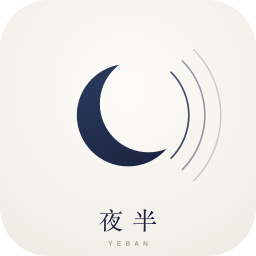

<p align="center">
  <picture>
    <source media="(prefers-color-scheme: dark)" srcset="assets/brand/png/yeban-dark-256.png">
    <source media="(prefers-color-scheme: light)" srcset="assets/brand/png/yeban-light-256.png">
    
  </picture>
</p>

<p align="center">
  <strong>English</strong> · <a href="README.zh-CN.md">简体中文</a>
  &nbsp;|&nbsp;
  <a href="https://yeban.wangda.today">Website</a> ·
  <a href="docs/README.md">Documentation index</a> ·
  <a href="docs/YEBAN_ARCHITECTURE_AND_SYSTEM_DESIGN.md">Architecture spec</a> ·
  <a href="docs/DEV_WORKFLOW.md">Development workflow</a> ·
  <a href="docs/CI_CD.md">CI/CD</a>
</p>

---

# 夜半 (Yeban) — a professional desktop DAW

> **Full name**: Yeban DAW · 夜半
> **Licence**: GNU General Public License v3.0 (GPLv3) with the GPLv3 §7 additional permission for loading proprietary CLAP plug-ins
> **Stack**: Slint declarative vector GUI + a pure-Rust low-latency real-time audio engine
> **Positioning**: a modern, high-determinism, native desktop digital audio workstation built for human–AI co-creation, taking REAPER 7, Bitwig Studio 5 and Ableton Live 12 as industrial references

| | |
| :--- | :--- |
| Website (bilingual, light/dark) | <https://yeban.wangda.today> |
| Contact | <yeban@wangda.today> |
| Repository | <https://github.com/gradetwo/yeban> |
| Status | Early development — Phase 0 (feasibility spikes). **Nothing is playable yet.** |

---

---

## Quick start

> **Requirements → build → run**, in that order. Everything below is copy-pasteable.

### Requirements

| | |
| :--- | :--- |
| **Rust** | **1.99.0** — pinned by [`rust-toolchain.toml`](rust-toolchain.toml); `rustup` installs it automatically. Components `rustfmt` + `clippy` are pinned too. |
| **OS** | macOS (Apple Silicon / Intel), Linux (X11 or Wayland), Windows. |
| **Linux build deps** | `pkg-config libfontconfig1-dev libfreetype-dev libxkbcommon-dev libwayland-dev libx11-dev libgl1-mesa-dev libasound2-dev` (Debian/Ubuntu names; needed to link Slint, winit and cpal). |
| **macOS build deps** | Xcode Command Line Tools: `xcode-select --install`. |
| **Display** | A real display is needed for the GUI window. `--headless` runs without one (that is what CI uses). |

### Build

```bash
git clone https://github.com/gradetwo/yeban.git
cd yeban
cargo build --release                     # builds the whole workspace (Slint + winit + cpal: a few minutes the first time)
cargo build --release -p yeban-app        # just the desktop GUI binary
```

### Run

```bash
cargo run --release -p yeban-app                     # open the desktop main window (needs a display)
cargo run --release -p yeban-app -- --headless       # no display needed: prints `headless ok` and exits 0
cargo run --release -p yeban-app -- --help           # every switch, its combination rules and exit codes
cargo run --release -p yeban-app -- --version        # the real version (read from Cargo.toml)
```

Everything below runs **without a display** and is safe on a headless machine:

```bash
cargo run --release -p yeban-app -- --save-as demo.yeban                      # write the built-in demo project as .yeban
cargo run --release -p yeban-app -- --open demo.yeban --headless              # open it and print what was read
cargo run --release -p yeban-app -- --open demo.yeban --save-as copy.yeban    # save-as: atomic, archives preserved
cargo run --release -p yeban-app -- --open demo.yeban --export-elements e.txt # semantic element list for scripts/AI
cargo run --release -p yeban-app -- --dump-elements                           # the same list on stdout
cargo run --release -p yeban-app -- --project-sample filled --save-as f.yeban  # pick a different built-in sample
cargo run --release -p yeban-app -- --print-shortcuts                         # keyboard-shortcut policy table
SLINT_BACKEND=headless cargo run --release -p yeban-app -- --headless          # the command line the spec names
```

The MCP (Intent API v2) server:

```bash
cargo run --release -p yeban-mcp                                                    # stdio transport
cargo run --release -p yeban-mcp --features mcp-http -- --enable-mcp-http           # loopback-only HTTP (127.0.0.1, dynamic port)
```

**What the CLI promises** (measured behaviour, not aspiration): a failed `--open` exits **3** with the container's own
reason and never degrades into an empty project; `--save-as` replaces the target **atomically** (temp file → `fsync` →
`rename`) and leaves the old file untouched on failure; with no `--open`, `--save-as` saves the **built-in demo project**
and says so in its output; unknown switches exit **2** with usage. Exit codes: `0` ok · `1` UI path · `2` usage ·
`3` open · `4` save · `5` export.

### Test

```bash
cargo test --workspace                                  # unit + integration criteria (≈1,100 of them)
cargo fmt --all --check
cargo clippy --workspace --all-targets -- -D warnings
```

> **Honest status.** The real-time engine **does produce audio now** (it synthesises the MIDI notes of a project
> deterministically — 102 398 / 102 400 non-zero samples for a three-note fixture, bit-identical across runs, and the
> zero-allocation real-time window still holds). What it does **not** do yet: no filter/timbre parameters, no bus
> limiter, no pan law, no transport, no sound-card path in those criteria — and the app still starts with a demo
> project. For exactly what is verified — and what is still `PENDING` — see
> [`docs/ledger/gate-status.md`](docs/ledger/gate-status.md).

### Working on the code

This repository is built by **many parallel work lines** (git worktree + one writer per file), and the **only**
verdict that counts is CI. Read [`docs/DEV_WORKFLOW.md`](docs/DEV_WORKFLOW.md) before your first commit; on a
laptop use the local guards instead of a full workspace build:

```bash
bash scripts/gates/run-gates.sh light        # fmt + 13 mechanical red-line guards + docs + licence inventory
bash scripts/dev/cargo-local.sh test -p yeban-model   # refuse --workspace on purpose (no heavy CPU locally)
```

## The four core mandates

1. **Open source under GPLv3.** The whole project is released under GPLv3 with the §7 additional permission that
   lets proprietary CLAP plug-ins load into Yeban. Forking and shipping closed source requires a commercial
   Slint licence from SixtyFPS GmbH.
2. **Native desktop, zero web.** Slint declarative vector UI on top of a pure-Rust real-time engine driving the
   sound card directly (CoreAudio / WASAPI / PipeWire). No Web, no Wasm, no AudioWorklet — therefore no
   JavaScript GC clicks and no browser sandbox latency tax.
3. **Built for autonomous AI agents.** The specifications are machine-executable contracts: requirement IDs,
   criteria that can fail, mechanical red lines, and an explicit list of legal files agents must never touch.
4. **Zero human-effort estimation.** No person-months, no person-days. Progress is measured in mechanically
   verifiable capability slices gated by eight families of automated quality gates.

---

## Engineering principles worth knowing before reading the code

| Principle | What it means here |
| :--- | :--- |
| **960 PPQ integer clock** | Every musical position is an integer tick. 960 = 2⁶·3·5 divides by 2/3/4/5/6/8/12/16, so binary and triplet grids are exact and positions never accumulate floating-point drift. |
| **Deterministic state** | Persistent entities live in `BTreeMap` only — never `HashMap`. Iteration order is identical across processes and restarts. Parallel bus summing reduces in a stable key order. |
| **Reversible by construction** | Every edit is a domain `Op` in a central log; undo is reverse replay. Editing after going back grows an anonymous branch, so discarded history is preserved. |
| **Real-time safety** | The audio callback allocates nothing, frees nothing, takes no locks and performs no blocking I/O. Communication is a lock-free SPSC ring buffer. |
| **Safe by default** | `#![forbid(unsafe_code)]` is mandatory in `yeban-model`, `yeban-theory`, `yeban-dsp`, `yeban-render`. `unsafe` elsewhere needs a `// SAFETY:` proof. |
| **Strict safe-by-default networking** | MCP and debug services are off in release builds, bind only to `127.0.0.1`, and authenticate every request. |
| **Measured, not remembered** | Readings land in [`docs/DEVELOPMENT_LEDGER.md`](docs/DEVELOPMENT_LEDGER.md) with method and timestamp. Unexplained numbers get re-derived wrongly. |

---

## Repository layout

```text
yeban/
├── Cargo.toml                  # workspace manifest — the single source of truth for dependency versions
├── Cargo.lock                  # committed: reproducible builds + GPLv3 source traceability
├── rust-toolchain.toml         # pinned toolchain (L1 acoustic determinism)
├── deny.toml                   # cargo-deny licence and dependency policy
├── AGENTS.md                   # the execution contract for AI agents (red lines + DoD)
├── crates/                     # product crates (one directory per crate, glob workspace members)
├── spikes/                     # Phase 0 feasibility spikes — one isolated crate each
├── assets/
│   ├── brand/                  # logo artwork: master yeban.svg → 10 variants + rendered PNGs
│   └── fonts/ models/ samples/ # asset registries (licence + SHA-256)
├── schemas/                    # JSON Schema machine contracts (project / ops / MCP tools / assets)
├── scripts/
│   ├── dev/                    # cargo wrapper, worktree lifecycle, CI verdict reader, change planner
│   ├── gates/                  # gate runner, schema validation, licence inventory
│   ├── guards/                 # 13 mechanical red-line guards
│   └── brand/                  # brand asset regeneration
├── docs/                       # see docs/README.md for the authority ranking
│   ├── YEBAN_*.md              # the four normative specifications
│   ├── DEV_WORKFLOW.md         # how work is done here
│   ├── CI_CD.md                # workflows, triggers, secrets, reading verdicts
│   ├── adr/                    # written rulings when specs conflict or are silent
│   ├── ledger/                 # reuse audits, provenance
│   └── DEVELOPMENT_LEDGER.md   # measurements, proven-to-fail criteria, pending list
└── .github/workflows/          # ci.yml (automatic) · gates-manual.yml (manual) · site-deploy.yml
```

### Crates

| Crate | Responsibility |
| :--- | :--- |
| `yeban-model` | **Authoritative state.** 960 PPQ data model, `EntityId` (ULID / Crockford Base32), `BTreeMap` AST, reversible `Op` log, commit DAG |
| `yeban-theory` | Music theory kernel: pitch/scale/chord, roman-numeral progression expansion, voice leading, genre rule library |
| `yeban-dsp` | Pure-math DSP: envelopes, ZDF ladder filter, wavetable oscillators, oversampling, delay/comb/reverb, shaping, parameter smoothing |
| `yeban-engine` | cpal device host, lock-free SPSC scheduling, internal PDC, snapshot retirement queue |
| `yeban-sfz` | Zero-copy SFZ v2 lexer and pre-allocated voice pool |
| `yeban-decode` | symphonia decoding + rubato resampling |
| `yeban-render` | Rayon offline mastering render, RF64/BW64 + MIDI export |
| `yeban-mcp` | Yeban Intent API v2 — library form (embedded) + standalone stdio binary |
| `yeban-app` | Slint GUI host (`ui/*.slint`, 11 components) |
| `yeban-ui-test-port` | Headless UI test port: Tier-1 software rasterisation, semantic control tree |
| `yeban-ui-mcp` | JSON-RPC UI automation and headless screenshot adapter |
| `yeban-services` | [v1.1.0] external editor integration, acoustic ping calibration |
| `yeban-plugin-host` | [v2.0.0] crash-isolated plug-in host (CLAP / VST3, POSIX shm) |
| `yeban-vst` | [v2.0.0] repackaging `yeban-dsp` as a VST3/CLAP plug-in |

> `crates/` and `spikes/` are **glob workspace members**: adding a crate never requires editing the root
> manifest, so parallel work lines never contend for the same file. The price is that every directory under
> them must be a valid crate — guard `G09` enforces that.

---

## Quality gates

Nothing is "green" unless a GitHub Actions run says so. Local green is a hint; an unread verdict is `pending`.

**Automatic** (`.github/workflows/ci.yml`, on push/PR, plus manual dispatch):

- `plan` — derives the affected crate set from the diff (including downstream dependents)
- `checks` — `cargo fmt --check`, 13 mechanical red-line guards, JSON Schema validity,
  dependency-licence inventory drift, cross-language contract reconciliation (Rust samples ↔ Python `jsonschema`)
- `rust` — matrix over affected crates: `clippy --all-targets --locked -D warnings` + `test`
- `lockfile` — `Cargo.lock` committed and consistent (`cargo metadata --locked`)
- `deny` — `cargo deny check` (licence allow-list, advisories, banned crates, registry policy)

**Manual** (`.github/workflows/gates-manual.yml`): gate inventory, `--all-features` compilation,
benchmarks, determinism reconciliation, pending-infrastructure list.

The mechanical guards (`scripts/guards/policy_check.py`) enforce, among others: no `HashMap`/`HashSet` in the
persistent AST; no GUI dependency in engine crates; no `0.0.0.0` bind; no dangerous default features;
no unregistered file over 10 MB; no ASIO SDK; workspace metadata inheritance; no wildcard versions.

Everything currently wired vs still `PENDING` (with the blocking reason for each) is listed in
[`docs/DEVELOPMENT_LEDGER.md`](docs/DEVELOPMENT_LEDGER.md) and rendered by the manual `inventory` gate.

---

## Development model

Development is decoupled and asynchronous on purpose:

- **One worktree per work line, one branch each.** Two lines never share a tree; one file has one writer.
  `scripts/dev/worktree.sh add <line>` sets it up; `scripts/dev/worktree.sh land <line>` merges it.
- **The local machine is an editing machine, not a build farm.** `scripts/dev/cargo-local.sh` refuses
  `--workspace`; heavy crates (Slint / cpal / symphonia) are compiled by CI only. The discipline is enforced
  by scripts, not by good intentions.
- **Verdicts are read back.** `scripts/dev/ci-verdict.sh` (via `gh`, or the public REST API) prints run,
  job and failed-step status; a verdict that has not been read is recorded as `pending`.

See [`docs/DEV_WORKFLOW.md`](docs/DEV_WORKFLOW.md) for the full per-change workflow and
[`docs/CI_CD.md`](docs/CI_CD.md) for workflow/secret details.

---

## Governance and legal

| File | Contents |
| :--- | :--- |
| [`LICENSE`](LICENSE) | GNU GPLv3 full text with the GPLv3 §7 CLAP plug-in exception |
| [`LEGAL.md`](LEGAL.md) | third-party trademark disclaimers, Slint dual-licensing, VST3 SDK MIT path, asset policy |
| [`TRADEMARK.md`](TRADEMARK.md) | "夜半 / Yeban" trademark usage guidelines |
| [`GOVERNANCE.md`](GOVERNANCE.md) | project governance and decision process |
| [`CONTRIBUTING.md`](CONTRIBUTING.md) | DCO 1.1, code style, GPLv3 source-distribution rules |
| [`SECURITY.md`](SECURITY.md) | vulnerability reporting, process isolation boundaries |
| [`THIRD_PARTY_LICENSES.md`](THIRD_PARTY_LICENSES.md) | dependency and asset audit, plus **source-level port attribution** |
| [`NOTICE.md`](NOTICE.md) · [`CODE_OF_CONDUCT.md`](CODE_OF_CONDUCT.md) | notices and community conduct |
| [`docs/ledger/dependency-licenses.md`](docs/ledger/dependency-licenses.md) | machine-generated licence inventory of the real dependency graph |

Agents must not modify `LICENSE`, `LEGAL.md`, `SECURITY.md`, `TRADEMARK.md`, `GOVERNANCE.md` or `NOTICE.md`
without explicit written instruction from the human owner (see `AGENTS.md` §2).

---

## Reuse from earlier work

Yeban has no backwards-compatibility obligations, but it does not reinvent what already exists. The largest
concrete reuse is ~8,000 lines of dependency-free, allocation-free, unit-tested MIT Rust DSP from an earlier
local project (`synth-core`), ported into `yeban-dsp` with per-file provenance recorded in
[`docs/ledger/dsp-core-provenance.md`](docs/ledger/dsp-core-provenance.md) and attributed in
[`THIRD_PARTY_LICENSES.md`](THIRD_PARTY_LICENSES.md) §3.

The full reuse audit — what to lift, what to learn from, what to discard, and the one genuine licence hazard
(a non-commercial sample manifest that must never be carried over) — is in
[`docs/ledger/legacy-reuse-audit.md`](docs/ledger/legacy-reuse-audit.md).

---

## Website

The project site lives on the **`website`** branch (an orphan branch, so the site is standalone and deployable
without any Rust toolchain). It is a fully static bilingual page with automatic light/dark theming, deployed to
Cloudflare Workers with `wrangler`:

```bash
git switch website
node scripts/check-site.mjs     # 10 static contract checks
node scripts/visual-check.mjs   # Chromium assertions + screenshots (needs Playwright)
wrangler deploy --dry-run       # validate wrangler.toml without credentials
```

---

<p align="center">
  <sub>夜半 (Yeban) — GPLv3 · <a href="https://yeban.wangda.today">yeban.wangda.today</a> · <a href="mailto:yeban@wangda.today">yeban@wangda.today</a></sub>
</p>
