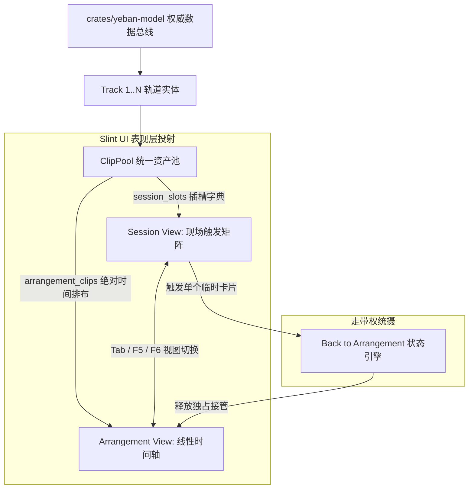

# 夜半 (Yeban) 专业桌面 DAW 架构与系统设计规范 (Slint + Pure Rust 原生版)

> **项目全称**：夜半 (Yeban) / Yeban DAW
> **开源许可证**：GNU General Public License v3.0 (GPLv3) 附 CLAP 插件加载附加许可 (GPLv3 §7)
> **规范版本**：`v1.0.0-rev2` (2026-10-04) | 项目研发起步版本：`v0.0.1` | 原规划 v3.0 正式确立为首个正式生产基线 `v1.0.0`
> **规范状态**：Normative Specification（权威实现基准）
> **Depends-on**：ROADMAP v1.0.0, LEGAL.md, CONTRIBUTING.md, AGENTS.md

> [!IMPORTANT]
> ### 🌟 夜半 (Yeban) 核心工程宪章与研发准则 (Core Mandates)
> 1. **开源与许可协议 (GPLv3)**：本项目在 GitHub 全面开源，遵循 **GNU General Public License v3.0 (GPLv3)** 协议，附带 GPLv3 §7 允许的 CLAP 专有插件动态加载例外条款。第三方基于本项目 Fork 并闭源分发须自行向 SixtyFPS GmbH 获取 Slint 商业许可；
> 2. **原生桌面技术栈 (Slint + Rust)**：纯血 **Slint 响应式矢量 GUI + 纯 Rust 低时延实时音频引擎**。坚决**不做任何 Web / Wasm / AudioWorklet 版本**，彻底摆脱浏览器沙盒与 JavaScript GC 爆音；
> 3. **AI Agent 自主研发范式 (Autonomous AI Agent Development)**：本套设计文档专供 **自主 AI Agent** 消费、理解、编码实施与自动化回归自测，是机器可执行的权威工程基准；
> 4. **零人力工时评估 (Zero Human Staffing Estimation)**：**彻底废除所有传统软件工程的人工人力、人月、人天及工时评估**。全周期以可机械化度量的能力切片（Capability Slices）和八重自动化质量门禁（Quality Gates）为唯一推进与验收标尺。

> **修订记录 (Revision Log)**：

> - `v1.0.0-rev2` (2026-10-04)：**外部事实核验与规范补强 (Factual Verification & Specification Hardening)**。
>   1. **Slint 上游能力核验补强**：补充 `i-slint-backend-testing` 内部 crate 属性（不遵循 semver，版本必须与 Slint 精确匹配），修正 Testing Backend 「不渲染像素」的实际行为，明确自研兜底的必要性；
>   2. **VST3 SDK 许可状态更新**：确认 Steinberg 已于 2025-10-20 将 VST3 SDK 3.8.0 切换为 MIT 许可，GPLv3 与专有双许可已终止；锁定最低依赖版本为 3.8.0+；
>   3. **ASIO SDK 许可状态修正**：ASIO SDK 现已提供 GPLv3 开源选项（与专有许可并存），但 GPLv3 版本对闭源分发不适用；夜半项目自身以 GPLv3 发布，可合规使用 ASIO GPLv3 版本，但为降低 Windows 用户构建门槛，仍默认首选 WASAPI 独占模式；
>   4. **nih-plug 维护状态风险标记**：`nih-plug` 当前处于 **maintenance mode**，`yeban-vst` 模块须评估社区 fork 或备选方案（详见风险登记册）；
>   5. **DeepFilterNet 许可类型确认**：确认为 **MIT/Apache-2.0 双许可**，非单一 MIT；
>   6. **数据模型补强**：`MidiNote` 增加 `Option<f32>` 概率字段说明与范围校验，`EntityId` 补充 `Default` trait 派生建议，`YebanProjectV1` 增加 `Default` 构造约束；
>   7. **确定性契约分级补强**：L2 级确定性条件中补充「跨平台 CI runner 自动化对账拦截」的具体实现要求；
>   8. **PDC 延迟预算修正**：内部 DSP 拓扑调度延迟从 0.50ms 修正为 1.0ms（含 PDC 延迟线插入开销），端到端回路总时延相应修正为 5.5ms，并新增备选分解方案。
> - `v1.0.0-rev1` (2026-10-04)：**语义化版本重构 (Semantic Versioning Alignment)**。
>   1. **版本体系从零起步**：基于纯血从头研发模式，研发版本自 `v0.0.1` 起步；
>   2. **核心首发版本重定位**：原规划中的 `v3.0` 正式确立为首发生产版本 **`v1.0.0`**（工业基石与纯血原生首发版）；
>   3. **演进里程碑对齐**：外部协同平移为 **`v1.1.0`**（原 V3.1），轻量音源平移为 **`v1.2.0`**（原 V3.2），声学自动驾驶平移为 **`v1.5.0`**（原 V3.5），商业隔离插件宿主平移为 **`v2.0.0`**（原 V4.0）。
> - `v3.0-rev7` (2026-10-04)：**开源前阻断项清零与 AI Agent 机器可执行化重构 (依据权威专家评审 P0 意见)**。
>   1. **全域需求规范 ID 落地**：全面引入 `ARCH-TOP-*`、`ARCH-SEC-*`、`ARCH-RT-*`、`ARCH-DET-*`、`ARCH-PDC-*`、`MODEL-*`、`MCP-*` 机器可追溯编号，构建规格到测试的确定性映射；
>   2. **Slint 官方能力解耦与自研兜底**：建立"Slint 上游能力核验与自研兜底状态表"，全面由自研 `yeban-ui-test-port` / `yeban-ui-mcp` 抽象层接管，彻底解除对未核实上游内部特性的硬编码假设；
>   3. **数据模型确定性与完备性补强**：移除冗余 `sample_rate`，增加 `schema_version`/`min_reader_version`/`writer_version` 三重版本迁移控制，引入 `EntityId` Crockford Base32 稳定序列化与 `AssetHash`/`ContentHash` 新类型，补齐 `PluginInstanceRef`，扩展 `AutomationTarget` 覆盖发送增益，修正 Op 命名并规范 `MidiNote` 音高力度概率范围校验；
>   4. **MCP 严格默认安全 (Strict Safe-by-Default)**：网络服务默认关闭，启用时强制仅绑定 `127.0.0.1`，默认端口 0 动态分配，引入高熵会话 Token 鉴权与 6 类操作权限作用域（Scope）；
>   5. **工程锁与声学缓冲精准修复**：`.yeban.lock` 升级为操作系统级建议锁 + 原子创建 + SHARED_READ / EXCLUSIVE_WRITE 双模式；A/B 盲听预滚缓冲纠正为 2048 采样点（42.7ms @ 48kHz）以严密覆盖 30ms 交叉淡化。
> - `v3.0-rev6` (2026-10-04)：系统闭环、数据模型与实时安全深度修正。
> - `v3.0-rev5` (2026-10-04)：GPLv3 开源合规深度落地、品牌重塑为"夜半 (Yeban)"，确立 CLAP §7 例外条款与 Slint 双授权声明。
> - `v3.0-rev4` (2026-10-04)：UI 与引擎深度物理分层解耦。
> - `v3.0-rev3` (2026-10-04)：重大架构转型，彻底放弃 Web 方案，确立 Slint GUI + Pure Rust 原生桌面路线。
> - `v3.0-rev2` (2026-10-04)：依据设计评审完成数据模型解耦与确定性分层。
> - `v3.0-rev1` (2026-10-04)：初始版本。

> **定位**：以 REAPER 7、Bitwig Studio 5 与 Ableton Live 12 为工业级设计参考与架构借鉴的现代化桌面数字音频工作站（DAW）。
> **设计哲学**：零历史包袱，采用 **Slint 响应式矢量界面 + 纯 Rust 低时延实时音频引擎**，兼顾 **AI Agent 意图生成与双 MCP 闭环** 与 **人类专业级音乐制作体验（硬件级低时延、零 GC 爆音、120 FPS 丝滑响应）**。


---

## 目录
0. [系统总体架构与双 MCP 拓扑闭环](#0-系统总体架构与双-mcp-拓扑闭环)
1. [Slint 响应式矢量 GUI 与低时延事件架构](#1-slint-响应式矢量-gui-与低时延事件架构)
2. [核心数据模型规范 (960 PPQ AST & BTreeMap 确定性状态)](#2-核心数据模型规范-960-ppq-ast--btreemap-确定性状态)
3. [实时音频引擎与内部 PDC 拓扑 (cpal, SPSC & PDC)](#3-实时音频引擎与内部-pdc-拓扑-cpal-spsc--pdc)
4. [离线/无头渲染管线与声学自愈 (Rayon & De-clicking)](#4-离线无头渲染管线与声学自愈-rayon--de-clicking)
5. [声学确定性契约与全格式持久化 (.yeban, RF64, MIDI)](#5-声学确定性契约与全格式持久化-yeban-rf64-midi)
6. [编曲时光机、领域操作日志与版本图谱架构 (Ops Log, Commit DAG & Musical PR)](#6-编曲时光机领域操作日志与版本图谱架构-ops-log-commit-dag--musical-pr)
7. [Yeban Intent API v2 意图协议与 Agent-Computer Interface (ACI)](#7-yeban-intent-api-v2-意图协议与-agent-computer-interface-aci)
8. [纯 Rust Cargo Workspace 代码架构规划](#8-纯-rust-cargo-workspace-代码架构规划)
9. [面向未来的预留接口与解耦规范 (Extensibility & Future-Proofing)](#9-面向未来的预留接口与解耦规范-extensibility--future-proofing)
10. [关键音频子系统与生产级保障规范 (Critical Audio Subsystems)](#10-关键音频子系统与生产级保障规范-critical-audio-subsystems)

---

## 0. 系统总体架构与双 MCP 拓扑闭环

### 0.1 进程与线程拓扑规范 (Process & Threading Topology)

- **[ARCH-TOP-001] 双形态进程拓扑**：为彻底解决外部 Agent 无法 attach 运行中会话与双进程并发破坏工程文件的根因矛盾，系统划分为主桌面进程 `yeban-app` 与独立批处理 CLI `yeban-mcp`。
- **[ARCH-TOP-002] 线程模型与通信隔离**：主桌面进程严格划分为五类执行上下文：
  1. **UI 线程 (Slint Main Thread)**：120 FPS 局部脏矩形渲染，捕获鼠标键盘交互，维护本地瞬态草稿，以 60Hz 轮询 Meter SPSC 队列更新电平。
  2. **Model 唯一写者 Actor (Model Thread)**：单线程独占持有权威 `YebanProjectV1` 状态树，唯一有权处理 `OpRequest` 并追加历史，发布不可变 `Arc<EngineSnapshot>`。
  3. **内嵌活会话 MCP 服务 (Embedded MCP Thread)**：提供 Streamable HTTP JSON-RPC 传输，仅绑定 `127.0.0.1` 动态端口，供 AI Agent 实时挂载正在运行的工程。
  4. **cpal 实时音频回调线程 (RT Priority Thread)**：最高实时优先级调度，零堆分配、零阻塞锁、零系统调用，批量消费参数/MIDI SPSC 队列，通过原子指针读取引擎快照。
  5. **后台任务线程池 (Background IO & Render Pool)**：管理 CAS 磁盘读写、自动保存、Rayon 离线母带渲染与工程解压缩。
- **[ARCH-TOP-003] 无头纯引擎独立性**：所有非 UI crate（`yeban-model`, `yeban-dsp`, `yeban-theory`, `yeban-render`, `yeban-engine`, `yeban-sfz`, `yeban-decode`）严禁引入任何 Slint 或窗口图形依赖，脱离 GUI 可 100% 独立冷启动。

```
+──────────────────────────────────────────────────────────────────────────────────────────────────────────+
|                                  进程形态 1: 主 DAW 桌面进程 (yeban-app)                                  |
|                                                                                                          |
|  [线程 1: UI / 事件循环线程]                 [线程 2: Model 唯一写者 Actor]                              |
|  - Slint 声明式矢量渲染 (120 FPS)           - 独占持有 yeban-model 权威 AST                              |
|  - 拖拽本地交互草稿                          - 处理 OpRequest 队列，生成提交与回退日志                     |
|  - 60Hz 轮询 drain 计量 SPSC 队列更新电平    - 发布不可变 EngineSnapshot 并通知 UI 增量更新                |
|             │                                              ▲                                             |
|             │ (提交用户编辑 Op)                              │ (提交 AI 生成 Op)                           |
|             ▼                                              │                                             |
|  [线程 3: 内嵌活会话 MCP 服务 (yeban-mcp 嵌入模式)] ─────────┘                                             |
|  - 仅绑定 127.0.0.1 (动态端口或配置端口，默认 9316)                                                         |
|  - 启动生成随机 Token 鉴权文件 (~/.yeban/session.token)，提供 Streamable HTTP / WebSocket 传输              |
|  - AI Agent attach 当前活会话，调用意图工具直接作用于当前工程内存，即刻触发 UI 局部重绘与音频热更新          |
|                                                                                                          |
|  [线程 4: cpal 实时音频回调线程 (RT Priority)]                                                           |
|  - 多生产者无锁 SPSC 队列块边界聚合 (UI 参数、midir MIDI 输入、插件消息)                                  |
|  - 原子指针交换接入最新 EngineSnapshot；旧快照 move 进退役队列 (由主线程异步回收释放)                       |
|  - 零 malloc / 零 free / 零系统调用；批量处理 (bulk_push / bulk_pop)；FTZ/DAZ 模式生效                     |
|                                                                                                          |
|  [线程 5+: 后台磁盘 I/O、Rayon 离线任务与 CAS 资产管理]                                                   |
+──────────────────────────────────────────────────────────────────────────────────────────────────────────+

+──────────────────────────────────────────────────────────────────────────────────────────────────────────+
|                               进程形态 2: 独立批处理 CLI 进程 (yeban-mcp 独立二进制)                        |
|  - 纯无头、无 GUI 依赖、冷启动 ≤ 20ms                                                                     |
|  - 标准 stdio JSON-RPC 传输 (供外部编排调度器直接 spawn 唤起)                                             |
|  - 独占打开指定 .yeban 工程文件，执行乐理编排、音符处理与极速多核母带导出 (yeban-render)                    |
|  - 退出时保存工程并释放项目文件锁                                                                        |
+──────────────────────────────────────────────────────────────────────────────────────────────────────────+
```

### 0.2 工程文件互斥锁规范 (.yeban.lock)

- **[ARCH-SEC-001] 操作系统级建议锁与原子创建**：
  为杜绝主 DAW 进程与独立 CLI 进程同时写入同一个工程导致文件损坏，工程采用双模锁机制：
  1. **原子创建与排他争用**：创建 `.yeban.lock` 必须使用原子创建标志（Unix `O_CREAT | O_EXCL`，Windows `CREATE_NEW`），杜绝检查与创建之间的竞态条件（TOCTOU）。
  2. **操作系统级建议文件锁**：打开锁文件句柄后，立即施加操作系统文件锁：
     - Unix 平台：调用 `fcntl(fd, F_SETLK, &fl)`，排他写加 `F_WRLCK`，共享读加 `F_RDLCK`。
     - Windows 平台：调用 `LockFileEx`，排他写指定 `LOCKFILE_EXCLUSIVE_LOCK`。
  3. **双模式支持**：
     - `SHARED_READ`：离线分析、批处理导出、多 Agent 并行只读审查允许多个只读锁共存。
     - `EXCLUSIVE_WRITE`：交互式主会话、破坏性编辑 CLI 必须独占排他写锁。
  4. **锁内容元数据协议**：JSON 编码记录持有者元数据：
     ```json
     {
       "pid": 48215,
       "hostname": "studio-workstation",
       "app_version": "0.3.0",
       "lock_mode": "ExclusiveWrite",
       "started_at": 1791093600,
       "last_heartbeat": 1791093612
     }
     ```
  5. **心跳与陈旧锁抢占 (Heartbeat & Stale Detection)**：
     - 持有者每 3 秒刷新一次 `last_heartbeat`。
     - 尝试开锁进程若检测到锁已存在且 `last_heartbeat` 距当前时间 < 15 秒，且对应 PID 仍处于活跃状态（Unix 发送 `kill(pid, 0)`，Windows 调用 `OpenProcess`），则**强行拒绝打开并报错**。
     - 若 `last_heartbeat` 超过 15 秒或 PID 已不存在（判定为系统宕机或进程 SIGKILL 遗留陈旧锁），允许 UI 提示制作人接管，或由 CLI 参数 `--force-unlock` 安全夺取锁并记录审计日志。

### 0.3 UI 表现层与 Rust 音频引擎深度解耦

夜半 (Yeban) 的核心架构特征在于 **UI 表现层与 Rust 引擎层的完全解耦**：
- `yeban-model`、`yeban-dsp`、`yeban-theory`、`yeban-render`、`yeban-engine` 等纯 Rust 引擎 crate 本身**绝不依赖任何 GUI 框架或窗口系统库**（零 Slint 引用、零 X11/Wayland/Windows 依赖）。
- 在无图形界面（Headless）环境下，引擎层可以常态化运行，执行音乐逻辑、处理工程状态、运行离线极速渲染，完全不启动任何窗口系统。
- Slint 的职责仅为"当且仅当需要 GUI 交互或 UI 视觉验证时，将引擎状态投影并渲染呈现"。

#### 系统分层职责与无头模式行为规范矩阵

| 层级 | 对应 Crate | 核心职责 | 无头模式行为 | 依赖关系 |
| :--- | :--- | :--- | :--- | :--- |
| **音频引擎层** | `yeban-model`, `yeban-dsp`, `yeban-theory`, `yeban-render`, `yeban-engine` | 权威数据 AST、DSP 算法、乐理走向、离线并行渲染、声卡物理 I/O | **始终独立常驻运行**，与任何 GUI 无关 | 严禁依赖 Slint / 窗口库 |
| **领域 MCP 服务层** | `yeban-mcp` | 暴露音乐意图 API（支持 stdio 批处理模式与 HTTP 活会话 attach 模式） | **始终可用**，可独立为 CLI 或内嵌于 DAW 进程 | 依赖引擎层，零 UI 依赖 |
| **UI 交互表现层** | `crates/yeban-app` | 渲染钢琴卷帘、通道条、调音台、自动化包络等视觉界面 | 生产批处理模式下**跳过初始化**；测试模式以 headless 后端或自定义离屏平台运行 | 依赖引擎层与 Slint |
| **UI 自动化测试层** | `yeban-ui-test-port` / `i-slint-backend-testing` | 元素树审查、无头截图、模拟按键/拖拽测试 | **按需启动**（仅在 UI 自动化测试/视觉验收时激活） | 依托 Slint 公开 API 或测试后端 |

### 0.4 Slint 上游能力核验与自研兜底状态表 (Slint Verification & Fallbacks)

- **[ARCH-SLINT-001] 上游能力核验与三层兜底体系**：
  为彻底规避对未正式发布或不稳定上游特性的盲目假设，夜半团队核验并建立如下能力矩阵与自研兜底：

| 关键特性 / API | Slint 官方声明状态 | 独立验证结论与边界 | 生产 / CI 默认策略 | 自研工程兜底方案 |
| :--- | :--- | :--- | :--- | :--- |
| `slint::platform::Platform` + `SoftwareRenderer` | 官方正式稳定公开 API | **已验证完全可靠**。可在纯内存 Framebuffer 离屏光栅化渲染，零窗口句柄依赖 | 离线无头截图默认采用该方案 | **Tier 1 兜底**：直接将 Framebuffer 编码为 PNG，不受 X11/Wayland 限制 |
| `i-slint-backend-testing` | 官方内部 crate，**不遵循 semver 版本约定** | **⚠️ 关键约束**：该 crate 为 Slint 项目内部 crate，不得由应用直接依赖；版本字符串必须使用 `=x.y.z` 精确匹配（如 `=1.17.1`），任意 patch 版本均可能引入破坏性变更；**Testing Backend 默认不渲染像素**，文本以固定字号测量 | **仅用于 Rust 原生单元/集成测试断言组件属性，不用于视觉回归截图** | **Tier 2 兜底**：CI/CD 自动化测试断言组件属性，零网络中间件开销；视觉截图走 Tier 1 软件光栅化 |
| 环境变量 `SLINT_BACKEND=headless` | 官方提供，随不同平台后端变化 | 在特定 Linux/macOS 环境下行为略有差异 | 仅在验证通过的 Linux CI runner 中使用 | 若环境不支持自动平滑降级为自定义 Platform 软件光栅化 |
| 上游 `slint/mcp` / `SLINT_MCP_PORT` | 实验性 / 内部探索协议 | **尚未列入正式语义稳定保障范围**，不可作为架构前置依赖 | **严禁直接作为产品核心架构依赖** | **Tier 3 兜底**：自研 `yeban-ui-test-port` / `yeban-ui-mcp` 模块，基于 Slint 公开 API 暴露控件树与截图 |

### 核心设计原则 (RFC 2119 规范)

1. **纯血原生单二进制 (MUST)**：全系统基于 Rust 编写，通过 Cargo Workspace 统一构建，彻底剔除 Node.js、V8、Wasm 运行时与浏览器沙盒层，交付极小体积（< 25MB）与极快启动（目标 ≤ 100ms）的原生桌面应用。
2. **单一真实数据源 (MUST)**：权威工程状态 100% 归属于 `crates/yeban-model`。Slint 界面仅持有只读投影，拖拽交互在主线程形成瞬态本地草稿，松手后向数据核心提交原子领域操作（`Op`）。
3. **UI 与引擎物理级解耦 (MUST)**：`yeban-model`、`yeban-dsp`、`yeban-theory`、`yeban-render`、`yeban-engine` 严禁引入任何 Slint 或窗口系统依赖。所有引擎功能必须在完全不初始化 Slint 的无头环境下 100% 正常运行。
4. **实时声学绝对安全 (MUST)**：音频回调线程内严禁执行任何 `malloc`/`free` 堆分配、互斥锁（Mutex）、文件读写、日志输出、动态派发开销与非必要系统调用。主线程与音频线程间唯一通信渠道为无锁 SPSC 环形队列，旧快照通过退役回收队列延迟到主线程释放。
5. **意图驱动人机协同 (SHOULD)**：通过原生 `yeban-mcp` 向 AI 暴露乐理与曲式编排意图工具，所有 AI 产出均隔离于独立分支，经人类制作人审核后方可合并。
6. **开源合规声明 (MUST)**：本项目整体采用 GPLv3 许可证。UI 层依赖的 Slint 框架采用 GPLv3/商业双授权模式。基于本项目 fork 并希望以非 GPLv3 兼容许可证分发的第三方，须自行向 SixtyFPS GmbH 获取 Slint 商业许可。本项目不提供 Slint 商业许可的任何担保或转授。加载专有 CLAP 插件遵循本项目根目录 `LICENSE` 中的 GPLv3 §7 附加许可例外条款。
7. **默认安全 (Safe-by-default) 哲学 (MUST)**：核心 crate 一律强制声明 `#![forbid(unsafe_code)]`。unsafe 仅允许存在于操作系统硬件音频驱动（cpal/ASIO FFI）、POSIX 共享内存操作与沙盒进程边界，所有 unsafe 代码块必须配有详细的 Safety 不变量前置条件与 Miri / ASAN 自动化测试守卫。
8. **安全默认网络策略 (Safe-by-default Networking, MUST)**：所有网络服务（MCP、UI 审查端口）在发布构建中默认禁用。测试与开发模式下强制仅绑定 `127.0.0.1` 本地回环地址，采用随机端口分配与高熵 Bearer Token 强鉴权，严禁在未经用户明确授权的情况下监听外部网络。

---

## 1. Slint 响应式矢量 GUI 与低时延事件架构

### 1.1 为什么选择 Slint 构筑专业 DAW 界面
- **[ARCH-UI-001] 保留模式（Retained Mode）与局部脏矩形渲染**：不同于即时模式（Immediate Mode，如 egui）每帧强制全屏重绘导致的巨大 CPU 浪费，Slint 仅在响应式属性（Properties）发生变动时触发受影响区域重绘，静态界面下 CPU 占用接近 0%；
- **原生机器码直编**：`.slint` 声明式布局直接通过 `slint-build` 静态编译为 Rust 结构体与原生绘制指令，无脚本引擎开销；
- **硬件加速图形流水线**：底层接入 FemtoVG / Skia / OpenGL 硬件渲染后端，完美支持高刷新率（120 FPS+）显示器与高分屏（Retina / 4K）DPR 缩放。

### 1.2 界面主线程与音频管线无锁解耦模型

- **[ARCH-UI-002] 响应式电平与参数解耦**：UI 线程绝不直接读取音频实时上下文。实时线程以 60Hz 速度向无锁 Meter SPSC 压入真峰值与 RMS 电平，UI 线程定时器批量出队更新 Slint Properties。

```
[Slint UI 主事件循环]           [midir 物理 MIDI 线程]       [沙盒插件 IPC 线程]
        │                               │                           │
        ▼ (UI 交互参数 SPSC)              ▼ (MIDI 事件 SPSC)           ▼ (插件控制 SPSC)
+───────────────────────────────────────────────────────────────────────────────────+
|                 多生产者 SPSC 队列组 (各生产者独占一条无锁 SPSC 环形缓冲)            |
+───────────────────────────────────────────────────────────────────────────────────+
                                        │
                                        │ 块边界聚合出队 (耗时 < 0.05ms，零系统调用)
                                        ▼
                       [cpal 实时音频回调线程 (RT Priority)]
                                        │
                                        │ 1. 原子指针交换获取不可变 EngineSnapshot
                                        │ 2. 旧快照 move 进退役队列 (主线程异步释放，零 free)
                                        │ 3. 实时多轨求和，计算真峰值与 RMS 电平
                                        ▼
                       [VU 计量回传无锁环形队列 (Meter SPSC)]
                                        │
                                        │ UI 线程 60Hz 定时器轮询出队 (或 invoke_from_event_loop)
                                        ▼
                            [Slint VU 响应式属性更新]
                                        │
                                        ▼
                            [Slint 局部脏矩形硬件加速重绘]
```

### 1.3 Slint 无头模式运行机制与内省自动化安全规范

为支持 AI Agent 自动化开发、CI/CD 自动化验证与无窗口服务器渲染，系统提供多层次的无头运行与测试集成：

1. **[ARCH-UI-003] 环境与 Feature 配置**：
   - 编译期按需激活：`--features "ui-test-port,slint/renderer-skia"`（针对 `yeban-app`，避免污染全 workspace）；
   - 运行期无头配置：
     ```bash
     SLINT_BACKEND=headless \
     YEBAN_UI_TEST_PORT=9315 \
     cargo test -p yeban-app --features ui-test-port
     ```
   - 支持通过 Skia 软件后端在内存离屏 Framebuffer 渲染高保真截图供视觉断言。

2. **[ARCH-UI-004] UI 元素树内省协议与默认安全隔离**：
   - **安全绑定铁律**：UI 内省与事件模拟接口**默认关闭**；启用时**仅绑定 `127.0.0.1` 本地回环地址**，绝对禁止监听 `0.0.0.0`；
   - **会话鉴权**：启动时生成高熵随机 Token 写入 `~/.yeban/session.token`（文件权限 `0600`），所有 HTTP JSON-RPC 请求必须携带 `Authorization: Bearer <token>`；
   - **权限分级**：划分为只读审查（`ui:read`：树遍历与几何审查）、截图取样（`ui:screenshot`）与交互注入（`ui:inject`：模拟点击与按键），生产发布版严禁激活 `ui:inject`；
   - **元素树审查**：AI Agent 可通过 JSON-RPC 查询控件树（Widget Tree），提取坐标、尺寸、可见性及自定义绑定状态（如推子电平、音符方块包围盒）。

3. **[ARCH-UI-005] CI/CD 原生 Rust 自动化测试 (`i-slint-backend-testing`)**：
   - 官方测试后端 `i-slint-backend-testing` 提供 Rust 原生 API `slint::testing::init_integration_test_backend()`；
   - **⚠️ 关键使用约束**：该 crate 为 Slint 内部 crate，不遵循 semver 版本约定。Cargo.toml 中必须使用精确版本匹配 `i-slint-backend-testing = "=x.y.z"`，且版本号必须与 `slint` crate 完全一致；
   - **Testing Backend 行为边界**：默认不渲染像素，文本以固定字号测量。因此该后端**仅适用于组件属性断言与逻辑测试**，不适用于视觉回归截图（视觉回归必须走 Tier 1 软件光栅化方案）；
   - 单元测试与 CI 流水线通过 `slint::testing::send_mouse_click()` 与 `slint::testing::send_keyboard_char()` 在内存中直接分发事件，断言组件属性同步，零物理显示器依赖，零网络中间协议，极度稳定快速。

---

## 2. 核心数据模型规范 (960 PPQ AST & BTreeMap 确定性状态)

### 2.1 三层状态物理隔离原则

- **[MODEL-ISO-001] 三层状态物理隔离**：
  1. **`ProjectDocument`（持久化文档层）** ：包含音乐作品完整乐理 AST、轨道、片段、设备参数、路由关系与提交历史。完整保存于本地 `.yeban`工程容器文件中。
  2. **`SessionRuntimeState`（挥发性运行时状态层）** ：包含当前播放头 Tick、isPlaying、任务进度、插件进程 PID、视窗打开状态等。**严禁持久化存入 Commit**。
  3. **`LocalMachineConfig`（本机配置层）** ：包含本机声卡物理端口绑定、外部编辑器绝对路径、云端 API Token。敏感凭据存入系统安全密钥链（OS Keychain），工程内仅存引用指针。

### 2.2 核心 Rust 数据结构定义 (crates/yeban-model)

```rust
// crates/yeban-model/src/project.rs
use serde::{Deserialize, Serialize};
use std::collections::BTreeMap;

/// [MODEL-AST-001] 工业级时钟基准：一拍 (四分音符) = 960 Ticks
pub const PPQ: u64 = 960;

/// [MODEL-AST-001] 全局实体统一使用有序 ULID 包装类型 (128-bit，天然时间序，Copy/Ord，类型安全)
/// 序列化为 26 字符标准 Crockford Base32 编码 (去除 I, L, O, U 消除混淆，大小写不敏感，保证 Git Diff 与日志唯一确定性)
#[derive(Serialize, Deserialize, Copy, Clone, Debug, PartialEq, Eq, PartialOrd, Ord, Hash)]
#[serde(transparent)]
pub struct EntityId(pub ulid::Ulid);

impl EntityId {
    pub fn new() -> Self {
        Self(ulid::Ulid::new())
    }

    pub fn to_crockford_base32(&self) -> String {
        self.0.to_string()
    }
}

// [MODEL-AST-001 补充] EntityId 应派生 Default trait 以便于测试构造
impl Default for EntityId {
    fn default() -> Self {
        Self(ulid::Ulid::new())
    }
}

/// [MODEL-AST-007] 内容寻址 CAS 强类型哈希包装
#[derive(Serialize, Deserialize, Clone, Debug, PartialEq, Eq, PartialOrd, Ord, Hash)]
#[serde(transparent)]
pub struct AssetHash(pub String); // 音频采样等不可变原始资产 SHA-256 哈希

#[derive(Serialize, Deserialize, Clone, Debug, PartialEq, Eq, PartialOrd, Ord, Hash)]
#[serde(transparent)]
pub struct ContentHash(pub String); // 提交历史快照树 SHA-256 哈希

/// [MODEL-AST-002] 顶层工程文档 (ProjectDocument) - 唯一权威持久化结构
#[derive(Serialize, Deserialize, Clone, Debug, Default)]
pub struct YebanProjectV1 {
    pub schema_version: u32,       // 格式主版本 (固定为 3)
    pub min_reader_version: u32,   // 最低兼容读取器版本 (如 3)
    pub writer_version: String,    // 写入程序版本标记 (如 "3.0.0")
    pub id: EntityId,
    pub audio_config: ProjectAudioConfig, // [MODEL-AST-002] 唯一音频硬件与采样率配置源 (无顶层冗余 sample_rate)
    pub rng_seed: u64,             // 确定性随机发生器种子 (确保 probability 等算法跨机位级一致)
    pub pan_law: PanLaw,           // 声相衰减律
    pub metadata: ProjectMetadata,
    pub transport: TransportConfig,
    pub sections: BTreeMap<EntityId, SectionV3>,     // [MODEL-AST-003] 确定性 BTreeMap 集合
    pub tracks: BTreeMap<EntityId, TrackV3>,         // [MODEL-AST-003]
    pub master_bus_track_id: EntityId,
    pub routing_graph: RoutingGraph,                 // [MODEL-AST-004] 唯一声学路由事实源
    pub scenes: BTreeMap<EntityId, SceneV3>,         // [MODEL-AST-003]
    pub clip_pool: BTreeMap<EntityId, ClipPoolEntry>,// [MODEL-AST-003]
    pub assets: BTreeMap<AssetHash, AssetMetadata>,  // [MODEL-AST-003]
}


// ... (ProjectMetadata, ProjectAudioConfig, BitDepth, PanLaw, TransportConfig,
//      TempoPoint, MeterPoint, CurveType, TrackV3, MonitoringMode, TrackKind,
//      SectionV3, SceneV3, LaunchQuantization, FollowAction, FollowActionTarget,
//      TakeLane, MacroParameter, MacroMapping, AutomationLane, AutomationTarget,
//      AutomationPoint, DeviceDefinition, DeviceKind, PluginInstanceRef,
//      PluginFormat, InstrumentDefinition, InstrumentKind, ClipPoolEntry,
//      LoopConfig, ClipContent, ClipPlacement, RoutingGraph, RoutingEdge,
//      RoutingKind 保持不变)

/// [MODEL-AST-005] 表现力 MIDI 音符结构 (含合法范围校验)
#[derive(Serialize, Deserialize, Clone, Debug)]
pub struct MidiNote {
    pub id: EntityId,
    pub start_tick: u64,
    pub duration_ticks: u64,
    pub pitch: u8,               // 范围校验：0..=127 (MIDI 标准半音)
    pub velocity: u8,            // 范围校验：0..=127 (MIDI 击弦力度)
    pub probability: Option<f32>,// 范围校验：0.0..=1.0 (结合 rng_seed + note.id 确定性计算)
                                 // None 表示 100% 触发，Some(0.0) 表示永不触发
    pub ratchet: Option<u8>,     // 细分连音触发次数：1..=16
    pub micro_timing_ticks: Option<i16>, // 范围校验：-240..=240 Ticks (微时序偏移，±1/16 音符)
    pub slide: Option<SlideConfig>,
    pub pitch_bend_curve: Vec<(u64, i16)>, // (tick, cents)
    pub syllable: Option<String>,
    pub phonemes: Vec<String>,
}

// ... (SlideConfig, AudioClipData, WarpConfig, WarpMode, TransientMarker,
//      AssetMetadata, AiGenerationMetadata, ContinuousControllerEvent 保持不变)
```

---

## 3. 实时音频引擎与内部 PDC 拓扑 (cpal, SPSC & PDC)

### 3.1 cpal 硬件声卡适配与平台事实规范

为确保跨平台音频驱动落地的真实性，系统对各平台底层声卡接口进行严格的分级适配：

1. **Linux 平台规范**：
   - `cpal` 采用成熟稳定的 **ALSA** 后端与可选的 **JACK** 后端。在现代 Linux 发行版（Ubuntu 24.04+、Fedora 40+、Arch）中，由系统的 **`pipewire-alsa`** 与 **`pipewire-jack`** 插件自动接管并转发至 PipeWire 统一多媒体图，无需原生 PipeWire 后端即可达成极低延迟；V3.x 可评估接入 `pipewire-rs` 原生绑定。
   - 调度策略：依靠 Linux 系统级 `rlimits`（配置 `/etc/security/limits.d/audio.conf` 赋予 `rtprio 99`、`memlock unlimited`）或接入 `RTKit` (RealtimeKit DBus 服务) 确保实时线程不被抢占。
2. **Windows 平台规范**：
   - 默认采用 WASAPI 后端；低延迟监听评估引入 `wasapi` crate 实现独占模式（WASAPI Exclusive Mode）与事件驱动缓冲调度；
   - **ASIO 策略（修订）** ：Steinberg 已于 2025 年 10 月将 ASIO SDK 扩展为 **GPLv3 开源许可**（与原有专有许可并存）。夜半项目自身以 GPLv3 发布，在法务确认后可合规使用 ASIO GPLv3 版本。然而，为降低 Windows 用户的构建门槛与二进制分发复杂度，**官方默认构建仍首选 WASAPI 独占模式**；ASIO 支持保留为可选编译特性 `--features asio`，用户可在本地自行获取 ASIO SDK 源码后编译；
   - 调度策略：音频回调首帧调用 Windows 多媒体类计划程序服务（MMCSS：`AvSetMmThreadCharacteristicsW("Pro Audio", &task_index)`）。
3. **macOS 平台规范**：
   - 直连 Apple CoreAudio 低延迟 HAL 驱动，CoreAudio 渲染线程由操作系统内核自动赋予最高实时约束；支持制作人选择在系统"音频 MIDI 设置"中预先构建的硬件聚合设备（Aggregate Device）。
4. **底层物理时延测量策略**：
   - `cpal` 的 `OutputStreamTimestamp` 仅反映流缓冲区时间戳，无法代表物理声卡回路延迟；
   - 系统通过底层原生系统 API 实测回路延迟：macOS 查询 CoreAudio `kAudioDevicePropertyLatency` 与 `kAudioStreamPropertyLatency`；Windows 查询 WASAPI `IAudioClient::GetStreamLatency`；Linux 借助 PipeWire/JACK 硬件回环测试。

### 3.2 零分配音频回调与快照退役回收队列

1. **[ARCH-RT-001] 零堆分配、零阻塞锁与零非必要系统调用**：
   - 预分配声部池（Voice Pool，默认 512 声部，可配置至 1024 声部）；
   - 在音频回调执行的 `process()` 循环内，**严禁执行任何堆内存分配（Zero Malloc）、释放（Zero Free）、互斥锁等待与非必要系统调用**；
   - 批量数据交换强制使用 `rtrb::Consumer::read_chunk` / `bulk_pop` 与 `rtrb::Producer::write_chunk` / `bulk_push` 接口，配合栈上预分配的定长临时缓冲区（如 `[f32; 128]`）。
2. **[ARCH-RT-002] EngineSnapshot 退役回收队列 (Retire Queue)** ：
   - 音频线程内使用原子指针读取最新的不可变 `Arc<EngineSnapshot>`；
   - 若检测到拓扑版本更新，音频线程将持有的旧快照 **move** 进预先分配的无锁队列 `rtrb::Producer<Arc<EngineSnapshot>>`；
   - **主线程以 60Hz 轮询从回收队列出队并负责旧快照的 Drop 析构**，彻底杜绝音频线程内发生任何内存释放（Zero Free）！
3. **[ARCH-RT-003] CPU 浮点模式统一 (FTZ / DAZ)** ：
   - 音频线程启动时统一显式开启 Flush-To-Zero (FTZ) 与 Denormals-Are-Zero (DAZ) 模式（x86 设置 MXCSR 寄存器 bits 15 与 6；ARM64 设置 FPCR 寄存器 FZ 位），彻底根除微弱次正规数引起的 CPU 计算指令周期暴增 100 倍与跨架构浮点不一致。
4. **[ARCH-RT-004] 声部窃取策略 (Voice Stealing Protocol)** ：
   - 当多音轨音符并发超过声部池上限时，激活确定性声部窃取算法：优先窃取处于 Release 阶段尾部、振幅能量最低（<-60dBFS）或最早被触发的声音；
   - 窃取瞬间对被终止声部强制应用 3ms 快速指数衰减微淡出包络，彻底杜绝爆音。

### 3.3 升余弦平滑与等功率交叉淡化规范

- **循环点微平滑窗**：在小节末端应用 64 采样点升余弦微窗，消除采样波形不连续产生的杂音：
  $$w(n) = \frac{1}{2} \left[1 - \cos\left(\frac{\pi n}{N - 1}\right)\right], \quad n \in [0, N - 1], \; N = 64$$
- **[ARCH-RT-005] A/B 盲听等功率瞬切与预滚缓冲**：
  快捷键 `[` / `]` 触发主线与 AI 提案分支盲听对比时，以 30ms 等功率正弦/余弦窗口在下一拍精确下拍瞬切，音乐走带连续不中断。盲听期间双分支并发渲染，**预滚缓冲设定为 2048 采样点 (42.7ms @ 48kHz)** ，以充分覆盖 30ms 等功率交叉淡化所需之 1440 采样点及下拍网格对齐窗口，杜绝瞬切欠载爆音。

### 3.4 内部插件延迟补偿架构 (Internal Plugin Delay Compensation, PDC)

为确保真峰值限制器（BS.1770-4 规范需要 4× 过采样滤波与前瞻 Lookahead 缓冲）、外部沙盒商业插件及模拟硬件回路在总线混音时不发生低频相位干涉抵消，系统确立全链路 PDC 架构：

1. **[ARCH-PDC-001] 延迟上报与关键路径对齐**：每个插件与内置设备必须精确上报其引入的处理延迟（`DeviceDefinition::latency_samples`）；
2. **DAG 关键路径拓扑分析**：在非实时线程构建 `EngineSnapshot` 时，分析 `RoutingGraph` 中从每个信号源到 Master 总线的所有声学通路，计算各并行分支的累积延迟，确定最长延迟关键路径 $L_{\max}$；
3. **自动补偿对齐 (Delay Alignment)** ：
   - 对于累积延迟为 $L_i$ 的并行分支，在进入总线求和节点前自动插入 $D_i = L_{\max} - L_i$ 采样点的环形延迟缓冲（PDC Delay Line）；
   - 实时音频引擎与 Rayon 离线母带渲染器完全共用同一套 PDC 算法，确保主干声部、鼓组并行压缩（New York Compression）与侧链在任何时候绝对相位对齐！

### 3.5 专业监听延迟预算分解表 (@48kHz, 64 Samples Buffer)

- **[ARCH-PDC-002] 端到端监听回路延迟预算分解**：

| 处理阶段 | 采样点数 | 物理时延 (毫秒) | 硬件与算法职责 |
| :--- | :---: | :---: | :--- |
| **物理声卡输入缓冲** | 64 | **1.33 ms** | ADC 模拟转数字并写入 DMA 环形缓冲 |
| **内部 DSP 拓扑调度** | - | **1.00 ms** | 声部合成、通道条 EQ/压缩与 PDC 延迟线插入计算 |
| **物理声卡输出缓冲** | 64 | **1.33 ms** | DAC 数字转模拟硬件流水线缓冲 |
| **系统驱动与总线余量** | - | **1.84 ms** | 操作系统底层音频管线与驱动调度冗余 |
| **端到端回路总时延** | **-** | **5.50 ms** | **专业乐手即兴演奏与录音监听可接受标准** |

> **备选方案**：若在低功耗笔记本或 USB 声卡上实测总时延超过 6ms，系统提供自动降级建议：将缓冲提升至 128 采样点，此时输入+输出缓冲合计为 5.33ms，总时延约为 8ms，但 XRun 风险显著降低。用户可在设置中切换。

---

## 4. 离线/无头渲染管线与声学自愈 (Rayon & De-clicking)

### 4.1 多核并行离线母带渲染器 (`crates/yeban-render`)
- **Rayon 工作窃取拓扑**：针对 32 条及以上音轨，系统基于 `RoutingGraph` 的无环有向图拓扑排序，按音轨依赖层级生成并行工作单元，由 Rayon 线程池多核并行渲染各轨乐器合成器、插件效果链及侧链调制；
- **[ARCH-DET-002] 串行归约确定性铁律 (Serial Reduction)** ：在汇聚到父总线及 Master 母带总线时，所有并行音频缓冲区的加法求和严格按照音轨排序键（基于 `EntityId` 的确定性字典序）执行单线程固定顺序串行累加。此举彻底消除了并行多线程由于浮点加法非结合律 `(a + b) + c != a + (b + c)` 带来的最低有效位（LSB）随机漂移；
- **[ARCH-DSP-001] 纯 Rust 声学自愈与去爆音 (De-clicking)** ：
  - **语音偷取 (Voice Stealing) 与切音平滑**：当合成器复音数超限触发语音偷取或音符急停时，分配器对被偷取声部强制施加 5.0ms 升余弦窗（Raised-Cosine Window: $w(t) = \frac{1}{2}(1 - \cos(\pi t / T))$）或五次多项式平滑窗快速淡出，消除波形瞬断引起的直流阶跃与爆音；
  - **参数自动化平滑滤波**：所有瞬变自动化事件经过单极点低通滤波（$y[n] = (1 - \alpha) x[n] + \alpha y[n-1]$，时间常数 $\tau \approx 5\text{ms}$），根除阶跃断崖引起的咔嗒杂音；
  - **A/B 试听交叉淡化**：30ms 等功率淡入淡出（Equal-Power Crossfade: $\cos / \sin$ 曲线），自动对齐至最近的节拍网格或零交叉点。

### 4.2 性能基准达标指标
- **基准渲染速度目标**：32 轨基准合成参考工程 A 在基准硬件（Apple M2 Pro 12-core / AMD Ryzen 7 7840HS 8-core/16-thread）上的离线母带渲染导出速度目标达成 **≥ 100× 真实时间**（180 秒整曲立体声导出 ≤ 1.8 秒完成）；
- **CI 性能回归门禁**：基于 `iai-callgrind`（精确指令周期与缓存命中分析）与 `criterion` 在基准测试流水线持续监控指令开销，离线渲染性能衰减超过 5% 即阻断 CI 合并。

---

## 5. 声学确定性契约与全格式持久化 (.yeban, RF64, MIDI)

### 5.1 全平台声学确定性分级契约 (Determinism Contract L1 / L2)

- **[ARCH-DET-001] 分级声学确定性契约与非确定性排除项**：
  夜半 (Yeban) 摒弃不严谨的"绝对跨架构 100% Bit-Exact"口号，确立分级声学确定性工程契约：

  - **L1 级确定性（同平台同编译器位级一致，Bit-Exact）** ：
    - 条件：相同操作系统与 CPU 架构、锁定 Rust 编译器版本、固定基准指令集（如 `target-cpu=x86-64-v3` 或 Apple Silicon）、统一启用纯 Rust `libm` 数学库、禁用编译器硬件 FMA 融合乘加展开（`-C target-feature=-fma` 或显式严格算子顺序）、固定统一处理块大小（128 采样点）、使用固定种子 PRNG（`rand_xoshiro`）；
    - 保证：离线母带渲染器与实时录音渲染达成立体声 24-bit / 32-bit Float PCM 样本 **100.000% 位级哈希全同 (Bit-Exact)** ，杜绝任何偶发随机性。
  - **L2 级确定性（跨平台/跨 CPU 架构确定性）** ：
    - 条件：x86_64 与 AArch64 跨架构场景下；
    - 保证：因不同芯片微架构的底层 SIMD 矢量化实现微弱差异，系统保证峰值样本绝对误差阈值 $\max(|s_1[n] - s_2[n]|) < 1.0 \times 10^{-6}$（相当于低于 -120 dBFS），人耳与频谱仪完全不可闻；
    - **强制执行**：跨平台 CI runner（x86_64 + AArch64）必须对基准工程执行自动化对账（automated reconciliation），计算最大绝对样本差分并断言 < 1e-6，任一对账失败即阻断 CI 合并。
  - **确定性显式排除项 (Non-Deterministic Exclusions)** ：
    下列情况显式排除在确定性保证之外：
    1. 启用模拟硬件非线性漂移与热噪声模拟算法（Analog Drift / Tape Hiss）；
    2. 使用内部未固定 PRNG 种子的第三方专有 CLAP/VST3 效果器或乐器；
    3. 人性化颤音抖动（Humanize Jitter）在未锁定固定种子的情况。
    当工程包含上述非确定性源时，系统在工程元数据与 UI 状态栏明示 `DeterminismStatus: DegradedToL2` 或 `NonDeterministic`。

### 5.2 广播级 RF64 / BW64 自研写入器

- **[ARCH-FMT-001] 广播级音频容器导出**：
  - 原生支持 EBU Tech 3306 / ITU-R BS.2088 规范的 RF64 / BW64 格式，突破传统标准 RIFF WAV 的 4GB 文件体积极限，无惧数十轨长时录音母带；
  - 完整内嵌广播级 `bext` (Broadcast Extension) 元数据块（录制起始时间码、响度元数据 EBU R128、工程 ULID 全局唯一标识）；
  - 内置高质量 TPDF（Triangular Probability Density Function）高精抖动算法，在将 32-bit Float 降采样为 24-bit / 16-bit 整数导出时，消除量化非线性截断失真。

### 5.3 标准 `.yeban` 归档容器与安全性防护

- **[ARCH-SEC-003] 标准 ZIP 容器存储与解包安全防护**：
  - 标准 ZIP 容器存储 `project.json`（BTreeMap 保证键排序字典序确定）、`history.dag`（版本提交树）与 `assets/{sha256}`（CAS 资产池）；
  - **Zip-Slip 路径遍历防御 (MUST)** ：解包与导入 `.yeban` 归档时，必须对每个 Zip 内部条目的目标路径进行 `canonicalize()` 规范化检查，严禁包含 `..`、绝对根路径或跨卷符号链接，杜绝路径穿越任意文件覆盖漏洞；
  - **解压炸弹防御 (Decompression Bomb, MUST)** ：限制单个解压条目体积上限（≤ 2 GB），同时限制整体压缩膨胀比率上限（最大不超过 100:1），超限立即拒绝解包并报错，防范恶意归档造成的 DoS 内存耗尽攻击；
- **[ARCH-SEC-004] 原子落盘与崩溃安全保存策略 (Atomic Temp-File Replace)** ：
  保存工程时，严禁直接原地覆盖原工程文件。强制遵循三阶段安全写入协议：
  1. 完整 ZIP 容器与资产首先写入同目录临时文件（`.yeban.tmp-{ulid}`）；
  2. 针对临时文件执行操作系统级物理刷盘（`File::sync_all()` / `fsync`），确保数据真正写入非易失介质；
  3. 执行操作系统级原子重命名替换（Unix 调用 `renameat2` / Windows 调用 `MoveFileExW(MOVEFILE_REPLACE_EXISTING)`），确保即便在写入瞬间断电，旧工程文件依然 100% 完整可用。

### 5.4 实验性 Ableton Live Set (`.als`) 导出 (`experimental-als-export`)

- **[ARCH-FMT-002] 实验性 DAW 互操作导出**：
  - 标记为实验性特性，基于 `flate2` 直接生成 Gzip 压缩的 XML 工程结构，兼容 Ableton Live 11/12 子集；
  - **映射损失对照表 (Mapping Loss Table)** ：
    | 夜半 (Yeban) 实体 | Ableton Live 映射目标 | 转换行为与保真度 | 降级与兜底策略 |
    | :--- | :--- | :--- | :--- |
    | **MIDI 轨 / 音符 / 力度 / 弯音** | `MidiTrack` / `Clip` / `Notes` | 100% 无损对齐，960 PPQ 转 Live 内部时钟 | 无损失 |
    | **通道条音量、声像、静音、独奏** | `MixerDevice` / `Volume`, `Pan`, `Speaker` | 映射至 Live 通道条参数曲线 | 无损失 |
    | **音频剪辑 (Audio Clip)** | `AudioTrack` / `AudioClip` | 相对路径引用，对齐时间轴起止与淡入淡出 | 导出时自动将 CAS 资产打包至工程目录 |
    | **夜半原生内建合成器 (SubSynth 等)** | 暂无等价内置乐器 | 无法直接等价映射至 Live 原生合成器 | 自动提供"音频冻结 (Audio Freeze)"将该轨烘焙为广播级 WAV 导入 |
    | **任意拓扑侧链与复杂路由图** | Ableton 侧链路由 (Live 限制较多) | 直线立体声输出正常映射，复杂反馈网络无法表达 | 降级为主立体声总线输出，输出详细映射警告日志 |

### 5.5 标准 MIDI 0/1 导出
- 基于 `midly` 库实现零堆分配的高速 SMF 序列化导出，支持 Tempo Map 拍速标记、拍号变更与多通道独立分轨导出。

### 5.6 专有格式清理与开源透明
- 明确清理并移除 NKI、EXS24、RVC 等封闭专有私有格式直接解析器，采样资产严格基于公开 SFZ v2 规范与开放标准 PCM WAV/FLAC 资源，确保全链条开源合规与格式透明。

---

## 6. 编曲时光机、领域操作日志与版本图谱架构 (Ops Log, Commit DAG & Musical PR)

### 6.1 操作来源与完整领域操作日志 (`OpOrigin` & `Op`)

- **[ARCH-OPS-001] 强类型可逆领域操作日志**：
  所有改变工程文档的动作均被捕获为不可变、强类型、自包含逆操作的 `StampedOp`。`OpOrigin` 严格排除实时 DSP 播放事件（如自动化播放属于瞬态渲染流，绝非持久化 Op），确保数据模型仅受版本化领域操作驱动。

```rust
// crates/yeban-model/src/ops.rs

#[derive(Serialize, Deserialize, Clone, Debug, PartialEq, Eq)]
pub enum OpOrigin {
    UserUi,
    MidiInput,
    McpProposal { proposal_id: EntityId, agent_name: String },
    UndoRedo,
    AutomationRecord,
    Import,
    Migration,
}

#[derive(Serialize, Deserialize, Clone, Debug)]
pub struct StampedOp {
    pub origin: OpOrigin,
    pub timestamp: u64,
    pub op: Op,
}

#[derive(Serialize, Deserialize, Clone, Debug)]
pub enum Op {
    // 1. 音符级操作
    AddNote { track_id: EntityId, clip_id: EntityId, note: MidiNote },
    DeleteNote { track_id: EntityId, clip_id: EntityId, note_id: EntityId, previous_note: MidiNote },
    MoveNote { track_id: EntityId, clip_id: EntityId, note_id: EntityId, delta_tick: i64, delta_pitch: i8 },
    ModifyNoteVelocity { track_id: EntityId, clip_id: EntityId, note_id: EntityId, old_vel: u8, new_vel: u8 },
    
    // 2. 片段与音轨级操作
    AddClipPlacement { track_id: EntityId, placement: ClipPlacement },
    RemoveClipPlacement { track_id: EntityId, placement_id: EntityId, previous_placement: ClipPlacement },
    MoveClipPlacement { track_id: EntityId, placement_id: EntityId, old_start_tick: u64, new_start_tick: u64 },
    AddTrack { track: TrackV3 },
    RemoveTrack { track_id: EntityId, previous_track: TrackV3 },
    
    // 3. 路由图操作 (唯一声学真理源)
    ConnectRouting { edge: RoutingEdge },
    DisconnectRouting { edge_id: EntityId, previous_edge: RoutingEdge },
    SetRoutingGain { edge_id: EntityId, old_gain_db: Option<f32>, new_gain_db: Option<f32> },

    // 4. 设备链与宏参数操作
    InsertDevice { track_id: EntityId, slot_index: usize, device: DeviceDefinition },
    RemoveDevice { track_id: EntityId, slot_index: usize, previous_device: DeviceDefinition },
    SetParam { target: AutomationTarget, old_val: f32, new_val: f32 },
    SetMacro { track_id: EntityId, macro_index: usize, old_val: f32, new_val: f32 },

    // 5. 自动化与曲式操作
    SetAutomationPoint { target: AutomationTarget, point_id: EntityId, old_point: Option<AutomationPoint>, new_point: AutomationPoint },
    RemoveAutomationPoint { target: AutomationTarget, point_id: EntityId, previous_point: AutomationPoint },
    SetSection { section_id: EntityId, old_section: Option<SectionV3>, new_section: SectionV3 },
    SetScene { scene_id: EntityId, old_scene: Option<SceneV3>, new_scene: SceneV3 },

    // 6. 原子批处理
    Batch { ops: Vec<Op>, description: String },
}
```

### 6.2 版本提交与 DAG 图谱 (`Commit`)

- **[ARCH-OPS-002] 提交图谱与非线性历史分叉**：

```rust
// crates/yeban-model/src/commit.rs

#[derive(Serialize, Deserialize, Clone, Debug)]
pub struct Commit {
    pub id: EntityId,
    pub parents: Vec<EntityId>,
    pub branch_id: String,
    pub author: String,
    pub message: String,
    pub created_at: u64,
    pub rng_seed: u64,
    pub ops: Vec<StampedOp>,
    pub snapshot_ref: Option<ContentHash>, // 每 256 次提交保存全量快照，其余时间重放 ops
}
```

- **匿名分支分叉机制**：制作人按 `Cmd+Z` 回退数步后执行新编辑，系统自动从回退点长出匿名历史分支（Fork），被撤销的操作 100% 永久保全；
- **单步可逆性**：每个 `Op` 自带反向逻辑，单步撤销耗时 ≤ 0.2ms；
- **宏观 AI 提案一键撤销**：批准 AI 生成的全曲提案后，合并动作封装为单一原子 `Op::Batch`，按一次 `Cmd+Z` 整套 AI 变更瞬间回退。

### 6.3 撤销语义状态转换表 (Undo Semantics State Table)

| 当前交互上下文 | 用户动作 | 状态机响应行为 | 撤销树内部拓扑演进 |
| :--- | :--- | :--- | :--- |
| **主分支连续编辑** | `Cmd+Z` (Undo) | 执行当前指针处 `Op` 的逆操作，还原界面与模型 | 撤销栈指针减 1，历史记录保留 |
| **已回退数步状态** | 用户输入新编辑 | 自动切断前向重做链，生成匿名分支 (Fork) | 从当前指针派生新 Branch，原分叉作为只读孤岛永久保全 |
| **跨 Commit 边界** | 连续 `Cmd+Z` 跨过快照 | 跨越上一个 Commit，继续逆向重放上一 Commit 的 ops | 跨 Commit 树级溯源，零数据丢失 |
| **已接受 AI 提案** | 立即按 `Cmd+Z` | 执行 `Op::Batch` 的反向操作集合 | 整体提案原子回滚至合并前状态，提案分支保留供再次比对 |

---

## 7. Yeban Intent API v2 意图协议与双 MCP 协同体系

### 7.1 双 MCP 进程拓扑与网络安全规范 (Live Session Attach vs Headless CLI)

- **[ARCH-SEC-002] MCP 安全默认与六级权限分层 (Strict Safe-by-Default)** ：
  夜半 (Yeban) 将 `yeban-mcp` 设计为兼具库与独立可执行文件的双形态架构，并实施严格的默认安全基线：

1. **形态 A：运行态会话挂载 (In-Process Live Attach, yeban-app 内嵌)** ：
   - `yeban-app` (Slint GUI 桌面进程) 启动时，可通过 `--enable-mcp` 参数显式激活内嵌 `yeban-mcp` 模块；**生产发布二进制中网络监听服务默认禁用 (OFF by default)** ；
   - 暴露 **Streamable HTTP JSON-RPC** 传输通道，**强制且仅绑定** 本地环回地址 `127.0.0.1`，端口采用系统动态分配（Port 0）或用户显式配置，**绝对禁止监听 0.0.0.0**；
   - **会话 Bearer Token 强鉴权**：启动时生成 256-bit 高熵随机 Token 写入 `~/.yeban/session.token`（文件权限锁定为 POSIX `0600` / Windows ACL 仅限当前用户），所有外部请求必须携带 `Authorization: Bearer <TOKEN>`；
   - **六级权限作用域划分 (RBAC Scopes)** ：
     - `ui:read`：只读审查控件树几何尺寸与文本；
     - `ui:screenshot`：读取离屏光栅化 Framebuffer PNG 截图；
     - `ui:inject`：模拟键盘鼠标事件注入（仅在测试模式激活，生产环境硬编码封禁）；
     - `app:save`：触发工程落盘；
     - `app:reload-engine`：触发引擎快照重新加载；
     - `app:admin`：全量乐理意图操作、音符增删、分支合并与离线母带渲染。
   - AI Agent 连接该接口后，直接向应用内部的 `yeban-model` Actor 发送意图命令，触发实时原子更新，并通过内存直连通知 Slint UI 触发局部脏矩形重绘，实现真正的"AI 边改、制作人边看、声卡边响"的实时人机协同。
2. **形态 B：无头批处理与 CI 离线模式 (Standalone Headless CLI, yeban-mcp 二进制)** ：
   - 编译为原生纯 Rust 独立命令行工具 `yeban-mcp`，基于标准输入输出 (stdio) 交互；
   - 适用于无 GUI 环境的批量转码、算法编曲流水线与 CI/CD 自动化母带渲染；
   - 运行时独占打开 `.yeban` 工程文件，利用多核 Rayon 极速渲染后退出。
3. **并发排他文件锁 (`.yeban.lock`)** ：
   - 无论形态 A 还是形态 B，均严格依托 [ARCH-SEC-001] OS 建议锁与原子创建防止并发写入破坏。

### 7.2 完整意图工具集规范 (yeban-mcp 核心工具)

所有意图工具对应 JSON Schema 统一定义于 `schemas/mcp-tools.schema.json`。工具一律支持 `dryRun: bool`（只读模拟校验）与 `idempotencyKey: String`（幂等重放校验）：

| 规范 ID | 工具名称 | 输入参数概要 | 领域语义与副作用 | 幂等性与错误码 |
| :--- | :--- | :--- | :--- | :--- |
| **[MCP-TOOL-001]** | `yeban_open_project` | `path: String, readOnly: bool` | 校验排他锁并打开指定 `.yeban` 工程 | 幂等；`PROJECT_LOCKED`, `FILE_NOT_FOUND` |
| **[MCP-TOOL-002]** | `yeban_save_project` | `force: bool` | 将内存权威状态与 CAS 资产原子刷盘 | 幂等；`IO_ERROR`, `DISK_FULL` |
| **[MCP-TOOL-003]** | `yeban_close_project` | `saveFirst: bool` | 保存并释放当前工程与 `.yeban.lock` | 幂等；`NO_ACTIVE_PROJECT` |
| **[MCP-TOOL-004]** | `yeban_query_project` | `limit: u32, offset: u32, fields: Vec<String>` | 分页拉取工程稀疏视图，防止海量音符撑爆 Agent 上下文 | 幂等只读；`INVALID_FIELD_SELECTOR` |
| **[MCP-TOOL-005]** | `yeban_propose_section` | `sectionName: String, stylePreset: String, bars: u32, scale: String, dryRun: bool` | 在隔离分支 `ai/proposal-{ulid}` 创建章节配器骨架与声部连接 | 幂等；`STYLE_NOT_FOUND`, `CYCLE_DETECTED` |
| **[MCP-TOOL-006]** | `yeban_edit_notes` | `trackId: EntityId, clipId: EntityId, ops: Vec<NoteOp>, idempotencyKey: String` | 在指定片段执行音符增删改，自动进行音域与发声数合法性校验 | 幂等；`CLIP_NOT_FOUND`, `OUT_OF_RANGE` |
| **[MCP-TOOL-007]** | `yeban_set_macro` | `trackId: EntityId, macroIndex: usize, value: f32` | 调节乐器宏旋钮，触发级联平滑自动化展开 | 幂等；`TRACK_NOT_FOUND`, `INDEX_OUT_OF_BOUNDS` |
| **[MCP-TOOL-008]** | `yeban_render_master` | `format: String, sampleRate: u32, normalize: bool` | 触发 `yeban-render` 多核并行导出广播级 WAV 并返回哈希与路径 | 幂等；`RENDER_FAILED`, `BUSY` |
| **[MCP-TOOL-009]** | `yeban_merge_proposal` | `proposalId: EntityId, commitMessage: String` | 将审查通过的 AI 提案分支以原子 `Op::Batch` 合并至主分支并广播重绘 | 幂等；`PROPOSAL_NOT_FOUND`, `CONFLICT` |
| **[MCP-TOOL-010]** | `yeban_reject_proposal` | `proposalId: EntityId, reason: String` | 拒绝并归档指定提案分支，释放无用内存快照 | 幂等；`PROPOSAL_NOT_FOUND` |

### 7.3 双 MCP 自动化开发与自测闭环 (Dual MCP Architecture)

- **[MCP-DUAL-001] 双 MCP 自测闭环**：
  夜半 (Yeban) 依托 Slint 的无头离屏基础设施与自研 `yeban-ui-test-port` / `yeban-ui-mcp` 适配模块，构建无需实体屏幕的端到端自测验收流水线：

```
+-----------------------------------------------------------------------------------------+
|                        夜半 (Yeban) 双 MCP 服务器协同与自测闭环                           |
+-----------------------------------------------------------------------------------------+
|                                                                                         |
|       [AI Coding / Composing Agent (如 Antigravity / Claude Code / Cursor)]              |
|                             │                                   │                       |
|                             │ 1. 意图编曲与参数操作              │ 3. 视觉审查与事件注入 |
|                             │ (HTTP JSON-RPC :9316)             │ (HTTP JSON-RPC :9315) |
|                             ▼                                   ▼                       |
|              +-----------------------------+     +-----------------------------+        |
|              |    领域 MCP: yeban-mcp      |     | UI 测试适配: yeban-ui-mcp   |        |
|              |  - 内嵌于 yeban-app 进程     |     |  - 自研测试端口适配层       |        |
|              |  - 音乐意图与乐理规则       |     |  - 远程 UI 元素树内省       |        |
|              |  - 多核并行渲染导出         |     |  - 软件光栅化无头截图输出   |        |
|              +-----------------------------+     +-----------------------------+        |
|                             │                                   │                       |
|                             │ 2. 状态原子提交                   │ 4. 界面重绘与状态投影 |
|                             ▼                                   ▼                       |
|              +-----------------------------------------------------------------+        |
|              |               夜半权威工程数据核心 (yeban-model)                 |        |
|              |   - 960 PPQ AST, Ops Log 撤销树, EngineSnapshot 调度快照         |        |
|              +-----------------------------------------------------------------+        |
|                                                                                         |
+-----------------------------------------------------------------------------------------+
```

#### 双 MCP 自动化自测工作流：
1. **意图注入 (Step 1)** ：AI Agent 通过 HTTP JSON-RPC 调用内嵌 `yeban-mcp` 的 `yeban_propose_section`，向工程数据核心提交 16 小节钢琴伴奏；
2. **状态投影与局部重绘 (Step 2)** ：`yeban-model` 变更通知 Slint UI（以 `SLINT_BACKEND=headless` 或自定义离屏平台运行），主界面在内存 Framebuffer 触发局部脏矩形更新；
3. **视觉布局内省与无头截图 (Step 3)** ：AI Agent 通过 HTTP 访问自研 UI 测试适配层（端口 `9315`），拉取钢琴卷帘的元素树 JSON，核验音符方块的位置与数量；随后调用截图接口获取 Framebuffer PNG 图像；
4. **自主断言与修复闭环 (Step 4)** ：AI 视觉模型比对截图，若发现音符方块渲染重叠或边框截断，Agent 立即通过修改 Slint 代码或调用 `yeban_edit_notes` 修正，无需物理显示器介入即可在 CI/CD 中完成端到端自测验收。

---

## 8. 纯 Rust Cargo Workspace 代码架构规划

全工程统一为规范的纯 Rust Workspace，根目录无任何 Node/pnpm/V8 依赖，严格保证 UI 与引擎的物理解耦：

```
yeban/
├── Cargo.toml                      # Workspace 统一清单
├── Cargo.lock                      # [强制版本控制] 确保 100% 可重现构建与 GPLv3 源码追溯
├── LICENSE                         # GPLv3 全文 + GPLv3 §7 CLAP 插件例外条款
├── LEGAL.md                        # 商标免责声明、Slint 双授权政策与合规政策
├── CONTRIBUTING.md                 # DCO 贡献协议、代码门禁与 cargo vendor 分发规范
├── SECURITY.md                     # 安全政策与漏洞披露通道
├── assets/                         # 323 款原声乐器采样图谱与出厂预设
│   └── samples/
│       ├── ATTRIBUTION.md          # 采样资产开源许可与署名清单
│       └── manifest.json
│
└── crates/
    ├── yeban-app/                  # Slint GUI 主程序与桌面窗口宿主 (内嵌 yeban-mcp HTTP 服务)
    │   ├── Cargo.toml              # features = ["ui-test-port", "slint/renderer-skia"]
    │   ├── ui/                     # .slint 声明式矢量界面定义文件 (源码随发布包分发)
    │   │   ├── app.slint           # 主窗口网格与多标签导轨
    │   │   ├── transport.slint     # 走带控制器与时间码显示
    │   │   ├── pianoroll.slint     # 虚拟化钢琴卷帘交互组件
    │   │   └── mixer.slint         # 通道条与多通道调音台
    │   └── src/                    # Slint 属性绑定与后台事件调度 (支持无头跳过 run_event_loop)
    │
    ├── yeban-model/                # [引擎核心] 960 PPQ 数据模型、ULID、Op 操作日志与撤销树 (零 GUI 依赖)
    ├── yeban-theory/               # [引擎核心] 159 种流派规则、和弦走向展开与声部连接算法 (零 GUI 依赖)
    ├── yeban-dsp/                  # [引擎核心] 纯数学 DSP 库 (真峰值限制器, SSL 压缩, 通道条, 808/909) (零 GUI 依赖)
    ├── yeban-engine/               # [引擎核心] cpal 声卡直驱、音频实时调度与 SPSC 环形队列 (零 GUI 依赖)
    ├── yeban-sfz/                  # [引擎核心] 零拷贝 SFZ v2 词法解析器与预分配语音池 (零 GUI 依赖)
    ├── yeban-decode/               # [引擎核心] 基于 symphonia 的全格式解码与 rubato 重采样 (零 GUI 依赖)
    ├── yeban-render/               # [引擎核心] Rayon 多核并行离线母带渲染器与 RF64/MIDI 导出 (零 GUI 依赖)
    ├── yeban-mcp/                  # [业务服务] 兼具库 (供 yeban-app 内嵌) 与独立二进制 (stdio 批处理) (零 GUI 依赖)
    ├── yeban-services/             # [v1.1.0 外部协同] 外部专业音频软件 (iZotope RX) 联动与 Ping 延迟校准
    ├── yeban-plugin-host/          # [v2.0.0 崩溃隔离宿主] 跨进程独立崩溃隔离商业插件宿主 (clack + POSIX shm)
    │   ├── Cargo.toml
    │   └── src/
    │       ├── lib.rs              # 宿主进程间通信中枢
    │       ├── shm_bridge.rs       # POSIX shm 环形音频帧交换
    │       └── sandbox_worker.rs   # 独立子进程插件加载与崩溃看门狗
    └── yeban-vst/                  # [v2.0.0 反向插件] 基于 nih-plug 将 yeban-dsp 反向打包为 VST3/CLAP 插件
```

> **`Cargo.lock` 纳入版本控制铁律 (MUST)** ：因工作区包含可直接分发的可执行程序（`crates/yeban-app` 与 `crates/yeban-mcp`），`Cargo.lock` 必须强制纳入 Git 跟踪管理，确保构建 100% 可重现，满足 GPLv3 源码追溯与可验证分发要求。

---

## 9. 面向未来的预留接口与解耦规范 (Extensibility & Future-Proofing)

### 9.1 跨进程崩溃隔离商业插件宿主 (`yeban-plugin-host`) [v2.0.0]
- **[ARCH-PLUG-001] 架构澄清：崩溃隔离宿主 (Crash Isolation Host)** ：
  - 本模块定位为**进程级崩溃隔离宿主**，旨在防范第三方专有插件发生段错误（SIGSEGV）、空指针异常或内存泄漏时拖垮 DAW 宿主主进程；
  - **明确声明**：该模块**非操作系统级安全沙箱 (Not an OS Security Sandbox)** ，不防范恶意插件对宿主环境发起提权反弹 Shell 攻击，仅提供进程边界防护与稳定性看门狗；
- **插件格式支持策略**：
  - `clack` 作为 CLAP 格式的首选宿主实现（MIT/Apache-2.0，零 C++ FFI 开销）。加载专有商业 CLAP 插件遵循本项目根目录 `LICENSE` 中的 GPLv3 §7 附加许可例外条款；
  - VST3 格式通过 `vst3-sys` FFI 绑定支持。**Steinberg 已于 2025 年 10 月 20 日将 VST3 SDK 从 GPLv3/专有双许可正式切换为 MIT 许可（版本 3.8.0 起）** ，GPLv3 与专有双许可已终止。夜半项目锁定最低依赖版本为 VST3 SDK 3.8.0+，优先走 MIT 路径彻底消除上游许可证传染风险。两者共用同一跨进程隔离基础设施，格式差异仅在插件加载与参数适配层处理；
- **POSIX `shm_open` / Windows MMF 共享内存通信**：宿主与插件独立 worker 进程间通过共享内存交换 32-bit Float 音频采样块与 MIDI 事件，往返时延 **< 0.3ms**；
- **绝对崩溃防护与热重启**：第三方插件段错误崩溃仅导致独立 worker 退出，主工程 100% 稳定运行，界面弹出原地一键热重启并恢复崩溃前参数。

### 9.2 外部专业桌面软件双向热重载 (iZotope RX / Melodyne) [v1.1.0]
- **[ARCH-EXT-001] 外部编辑器文件监听热重载**：制作人右键选中音频选区选择"在外部编辑器中编辑"，系统导出广播级 BWF 临时文件并启动跨平台文件监听（`notify` crate）；外部软件修改保存后，系统通过文件修改事件与内容 SHA-256 哈希校验自动捕获（目标响应延迟 ≤ 500ms），裁去保护静音区并以新 Take 泳道热重载回时间轴。

### 9.3 模拟硬件效果器回路与一键 Ping 自动延迟校准 (Ping ADC) [v1.1.0]
- **[ARCH-EXT-002] 硬件插入校准**：插入 `ExternalHardwareInsert` 设备，发射 MLS（最大长度序列）声学脉冲测算往返样本延迟，内核自动**超前延迟其他所有并行数字音轨（PDC 自动延迟补偿）** ，确保绝对零相位抵消。

### 9.4 Linux Wayland 窗口定位降级规范
- 在 Linux Wayland 环境下，因 `xdg-shell` 协议严格禁止客户端自主设定绝对屏幕坐标，弹出的菜单、右键列表及浮动插件窗口通过 `xdg-positioner` 与 Slint/winit subsurface 子表面机制进行相对定位；若底层合成器不支持复杂子表面，系统平滑降级为工作区内部平铺悬浮窗。

---

## 10. 关键音频子系统与生产级保障规范 (Critical Audio Subsystems)

### 10.1 音频与 MIDI 硬件录音系统
1. **[ARCH-REC-001] 音频录制与前置延迟补偿**：点击录音 Arm 按钮后，音频线程直接从声卡物理输入捕获 PCM 流并写入预分配的无锁环形缓冲区，由后台 I/O 线程刷盘至 CAS 临时暂存；录音停止后，系统依据测得的物理声卡输入延迟与缓冲区大小自动前移音频片段起止点，实现微秒级物理对齐；
2. **物理 MIDI 输入直连**：基于 `midir` 库直连 USB MIDI 键盘与鼓垫，击键即时推入 SPSC 队列触发软音源发声，记录时间戳直接映射至 960 PPQ 整数 Tick。

### 10.2 采样率自适应重采样 (`rubato`)
- **[ARCH-DSP-002] 高精多相重采样**：当用户声卡工作在 44.1kHz / 96kHz 而工程设定为 48kHz 时，系统通过 `rubato` 库在输入输出端自动激活高精多相重采样滤波，消除音调失真。

### 10.3 音轨冻结 (Freeze) 与分轨母带导出 (Stem Export)
- **[ARCH-DSP-003] 音轨冻结与母带分轨**：支持一键将复杂乐器轨与效果链快速离线烘焙为单个 32-bit Float 广播级 WAV 音频文件，释放实时 CPU 负荷。

### 10.4 弹性拉伸 (Time-Stretching) 算法
- **[ARCH-DSP-004] 弹性算法集成**：采用宽松商业友好的 **`signalsmith-stretch`**（MIT 协议）纯 Rust/C++ 绑定，实现高质量瞬态保留、共振峰平移与速度弹性拉伸。

### 10.5 自动保存、紧急草稿与崩溃恢复
- **[ARCH-SYS-001] 自动保存与原子恢复**：后台线程每 60 秒将操作日志快照原子写入本地临时目录；若遇意外断电，应用重新打开时自动检测并弹窗恢复未提交草稿。


---

# 夜半 (Yeban) 专业桌面 DAW UI/UX 布局与交互重构设计规范 (Pure Rust + Slint 极速版)

> **项目信息**：夜半 (Yeban DAW) | 协议：GPLv3（附 CLAP 插件动态加载例外条款） | 仓库：`https://github.com/yeban/yeban`
> **规范状态**：Normative UI/UX Specification (规范性设计文件)
> **版本**：`v1.0.0-rev2` (2026-10-04) | 项目研发起步版本：`v0.0.1` | 原规划 v3.0 正式确立为首个正式生产基线 `v1.0.0`
> **文档依赖**：`Depends-on: ARCHITECTURE v1.0.0, ROADMAP v1.0.0, LEGAL.md, AGENTS.md`

> [!IMPORTANT]
> ### 🌟 夜半 (Yeban) 核心工程宪章与研发准则 (Core Mandates)
> 1. **开源与许可协议 (GPLv3)**：本项目在 GitHub 全面开源，遵循 **GNU General Public License v3.0 (GPLv3)** 协议，附带 GPLv3 §7 允许的 CLAP 专有插件动态加载例外条款。第三方基于本项目 Fork 并闭源分发须自行向 SixtyFPS GmbH 获取 Slint 商业许可；
> 2. **原生桌面技术栈 (Slint + Rust)**：纯血 **Slint 响应式矢量 GUI + 纯 Rust 低时延实时音频引擎**。坚决**不做任何 Web / Wasm / AudioWorklet 版本**，彻底摆脱浏览器沙盒与 JavaScript GC 爆音；
> 3. **AI Agent 自主研发范式 (Autonomous AI Agent Development)**：本套界面规范专供 **自主 AI Agent** 作为 Slint 声明式组件设计、无头视觉回归测试与双 MCP 自动化的交互基准；
> 4. **零人力工时评估 (Zero Human Staffing Estimation)**：**彻底废除所有传统软件工程的人工人力、人月、人天及工时评估**。以可机械化断言的控件树属性、无头截图 SSIM 及 120 FPS 响应作为唯一交互验收标准。

> **修订记录 (Revision Log)** ：

> - `v1.0.0-rev2` (2026-10-04)：**事实核验与规范补强**。
>   1. **Slint Testing Backend 行为修正**：修正 `i-slint-backend-testing` 的描述——该后端默认**不渲染像素**，文本以固定字号测量，仅适用于组件属性断言与逻辑测试，不适用于视觉回归截图。视觉回归必须走 Tier 1 软件光栅化（`SoftwareRenderer` + Framebuffer 捕获）；
>   2. **Testing Backend 版本约束补强**：补充 `i-slint-backend-testing` 为 Slint 内部 crate、不遵循 semver、必须精确版本匹配的关键使用约束；
>   3. **ASIO 策略说明更新**：反映 Steinberg 2025 年 10 月将 ASIO SDK 切换为 GPLv3 开源许可的事实，保持默认 WASAPI 策略不变但补充法务确认要求；
>   4. **PDC 延迟预算修正**：内部 DSP 调度延迟修正为 1.0ms，端到端总时延修正为 5.5ms，新增低功耗场景降级建议；
>   5. **无障碍规范补强**：补充 WCAG 2.1 AA 对比度具体要求与屏幕阅读器测试用例；
>   6. **视觉回归基准修正**：初版 SSIM 基准 ≥ 0.98 不变，但补充 Testing Backend 不产像素、Golden 图必须由 Tier 1 软件光栅化产出的约束。
> - `v1.0.0-rev1` (2026-10-04)：**语义化版本重构 (Semantic Versioning Alignment)**。
>   1. **版本体系从零起步**：确立全新从头研发模式，工程起步版本为 `v0.0.1`；
>   2. **核心首发版本重定位**：原规划中的 `v3.0` 正式确立为首发生产版本 **`v1.0.0`**（工业基石与纯血原生首发版）；
>   3. **交互特性标签对齐**：外部协同标记为 **`v1.1.0`**（原 V3.1），四维宏控与 SVS 歌词标记为 **`v1.5.0` / `v2.0.0`**（原 V3.5/V4.0），商业插件呼出标记为 **`v2.0.0`**（原 V4.0）。
> - `v3.0-rev7` (2026-10-04)：**全量需求编号体系与自研 UI 测试抽象落地 (依据开源合规与专家终审意见)** 。
>   1. **全量注入规范需求 ID**：全面确立并注入 `UI-GRID-001`~`004`、`UI-NOTE-001`~`005`、`UI-TEST-001`~`003`、`UI-A11Y-001`~`004` 与 `UI-MCP-001`~`003` 唯一需求索引；
>   2. **架构收敛与 Slint 自研兜底**：将 Slint 未经充分验证的内部 MCP 与特定 headless 模式收敛为基于 `yeban-ui-test-port` / `yeban-ui-mcp` 的统一自研抽象层，明确 Slint 官方特性实测验证矩阵；
>   3. **消除按键与焦点冲突**：规范 `Tab` 键在文本输入框/重命名弹窗内的行为（禁止误触发视图切换，提供 `F5/F6` 或 `Alt+1/2` 备选视图切换），增补全键盘方向键音符编辑规范；
>   4. **输入法 IME 候选词保护**：引入 `is_composing` 状态检测，打字重命名或输入歌词时全量阻断 DAW 快捷键触发；
>   5. **自动化元素语义寻址**：确立自动化测试必须基于语义 Element ID 查找控件，严禁使用脆弱的绝对像素坐标；
>   6. **外部编辑器双向监听**：将外部音频编辑集成改为基于文件系统事件监听（`notify` crate）与 SHA-256 校验，目标热重载同步延迟 ≤ 500ms；
>   7. **Ping ADC 安全脉冲校准**：新增 MLS 声学脉冲触发时的 -12 dBFS 安全限幅器与防啸叫增益保护；
>   8. **视觉回归基准与预滚缓冲**：初版工程 SSIM 基准目标收敛为 ≥ 0.98；走带不停 A/B 盲听增加 2048 采样预滚缓冲区（Pre-roll Buffer）说明。
> - `v3.0-rev6` (2026-10-04)：视觉回归鲁棒性与 UI MCP 权限分层落地。引入高频刷新区域动态遮罩，确立元素树 JSON 优先断言原则，定义 ReadOnly / Interactive / Administrative 三级权限。
> - `v3.0-rev5` (2026-10-04)：开源合规与技术纠偏升级，更名为"夜半 (Yeban)"，确立整体以 GPLv3 许可证在 GitHub 开源。
> - `v3.0-rev4` (2026-10-04)：新增 Slint 无头运行与 AI 视觉内省交互规范，规范无头 Framebuffer 截图与远程内省协议。
> - `v3.0-rev3` (2026-10-04)：重大技术架构转型。彻底放弃 Web/HTML5 Canvas 方案，全线重构为 Slint 原生桌面声明式矢量界面体系，交付恒定 120 FPS 响应。
> - `v3.0-rev2` (2026-10-04)：依据设计评审完成快捷键冲突解耦与无障碍补全。
> - `v3.0-rev1` (2026-10-04)：初始版本。

> **定位**：以 Ableton Live 12、Bitwig Studio 5 与 FL Studio 24 为工业级设计参考与架构借鉴的纯血现代化桌面音频工作站（DAW）。
> **设计哲学**：零历史包袱、视听绝对一致（WYHIWYG）、Slint 硬件加速矢量渲染、AI Agent 与人类音乐家沉浸式协同。

---

## 目录
1. [Slint 原生桌面网格系统与窗口空间几何规范](#1-slint-原生桌面网格系统与窗口空间几何规范)
2. [双视图同构体系 (Session View & Arrangement View)](#2-双视图同构体系-session-view--arrangement-view)
3. [Slint 虚拟化钢琴卷帘交互规范 (Piano Roll UX)](#3-slint-虚拟化钢琴卷帘交互规范-piano-roll-ux)
4. [专业时间轴与波形/音频剪辑交互规范](#4-专业时间轴与波形音频剪辑交互规范)
5. [底部机架、调音台与设备链 (Device Rack & Mixer)](#5-底部机架调音台与设备链-device-rack--mixer)
6. [手势、指针捕获与视听反馈状态机 (Interaction State Machine)](#6-手势指针捕获与视听反馈状态机-interaction-state-machine)
7. [工业级全键盘快捷键与无障碍操作规范 (Keyboard & A11y)](#7-工业级全键盘快捷键与无障碍操作规范-keyboard--a11y)
8. [Slint 组件树架构与 Rust 状态绑定规范](#8-slint-组件树架构与-rust-状态绑定规范)
9. [面向未来人机共创的前端交互规范 (Future Extensible UI Interactions)](#9-面向未来人机共创的前端交互规范-future-extensible-ui-interactions)
10. [编曲时光机、AI 提案审查与视觉 Diff 交互规范 (Arrangement Time Machine & Musical PR)](#10-编曲时光机ai-提案审查与视觉-diff-交互规范-arrangement-time-machine--musical-pr)
11. [音轨外部软件与服务集成交互规范 (Track External Services UI/UX) [v1.1.0]](#11-音轨外部软件与服务集成交互规范-track-external-services-uiux-v110)
12. [Slint 无头模式运行与 AI 视觉内省交互规范 (Headless UI & MCP Introspection)](#12-slint-无头模式运行与-ai-视觉内省交互规范-headless-ui--mcp-introspection)

---

## 1. Slint 原生桌面网格系统与窗口空间几何规范

### 1.1 屏幕空间网格系统 (The Modular Slint Desktop Grid)

`[UI-GRID-001]` **网格布局拓扑 (Grid Topology)** ：利用 Slint 声明式布局（`GridLayout` 与 `VerticalLayout`）构建**零溢出、零多余嵌套、全视口自适应**的专业暗黑桌面界面体系：

```
+----------------------------------------------------------------------------------------------------+
| TOP CONTROL BAR (48px) - 走带 / BPM / [Branch: main ▼] / [Commit ↺ ↻] / [🟣 AI提案 (1)] / 视图切换 |
+----------+------------------------------------------------------------------------------+----------+
| LEFT     | MAIN WORKSPACE (动态伸缩，占比 55% - 65%)                                    | RIGHT    |
| BROWSER  | ---------------------------------------------------------------------------- | MASTER / |
| & ASSET  | [模式 A] SESSION VIEW: 垂直剪辑矩阵 (Clip Matrix) + 场景触发列 (Scene Launch)  | AI CO-   |
| LIBRARY  | [模式 B] ARRANGEMENT VIEW: 轨道包头 (Headers) + 绝对时间轴 (Timeline Tracks) | PILOT    |
| (240px)  |                                                                              | (280px)  |
| 乐器采样 |                                                                              | 意图生成 |
| 预置模板 |                                                                              | 声学诊断 |
| 折叠展开 |                                                                              | 侧边折叠 |
+----------+------------------------------------------------------------------------------+----------+
| SPLITTER BAR (4px) - 可自由拖拽调节上下工作区分割线 (Min: 220px, Max: 600px)                         |
+----------------------------------------------------------------------------------------------------+
| BOTTOM CONSOLE (动态伸缩，占比 35% - 45%) - [Tab 切换]                                               |
| [Tab 1: 虚拟化钢琴卷帘 (MIDI Piano Roll)]  [Tab 2: 调音台总控 (Mixer)]  [Tab 3: 设备效果链 (Devices)]   |
+----------------------------------------------------------------------------------------------------+
| STATUS & TOOLTIP BAR (24px) - 选区信息 / 实时和弦识别 / 快捷键提示 / 硬件声卡采样率与性能状态         |
+----------------------------------------------------------------------------------------------------+
```

### 1.2 视口几何约束与响应式折叠规则

`[UI-GRID-002]` **响应式断点与自适应折叠 (Responsive Breakpoints)** ：
1. **高分宽屏显示器 (≥ 1920×1080, FHD / 2K / 4K)** ：全展开模式，Left Browser (固定 240px)、Main Timeline (弹性填充)、Right AI Co-pilot (固定 280px)、Bottom Console 完整就绪；
2. **笔记本屏幕 (1366×768 ～ 1919×1079)** ：Main Workspace 具备最高展示优先级。AI Co-pilot 自动折叠为右侧抽屉（快捷键 `Cmd/Ctrl + \` 呼出）；Left Browser 默认收起为 36px 图标导轨；
3. **分栏拖拽与极值保护**：上下主工作区与底部控制台之间的 Splitter Bar 支持双击自动居中，拖拽范围硬限制在 Min 220px 至 Max 600px，防止极端拖拽导致任一视口退化不可见。

### 1.3 保留模式与局部脏矩形渲染机制

`[UI-GRID-003]` **保留模式渲染优化 (Retained-Mode Optimization)** ：
1. **局部脏矩形更新**：彻底摒弃全屏无谓重绘，Slint 仅在走带指针移动、VU 电平跳变或用户交互时局部重绘脏矩形区域，静态编辑时 CPU 占用率趋近于 0%；
2. **硬件渲染管线接入**：底层接入 FemtoVG / Skia / OpenGL 硬件渲染管线，视网膜屏幕（Retina）与 4K 高分屏下实现无缝点对点的高清矢量图元绘制。

### 1.4 恒定 120 FPS 渲染管线与垂直同步

`[UI-GRID-004]` **帧率平稳性与 VSync 同步 (120 FPS Rendering Pipeline)** ：
1. 走带光标移动、波形平移与钢琴卷帘缩放全程绑定垂直同步（VSync），在支持 120Hz / 144Hz 高刷屏的硬件上保持恒定 120 FPS 丝滑响应；
2. 主渲染线程与实时音频线程物理隔离，UI 动画与绘制负载绝不穿透阻塞音频引擎渲染回调。

---

## 2. 双视图同构体系 (Session View & Arrangement View)

在纯 Rust 原生架构下，**Session（卡片触发灵感视图）** 与 **Arrangement（线性编曲叙事视图）** 共享同一份内存 AST：



### 2.1 权威 AST 投射与同构机制
- 双视图仅为同一份不可变工程快照（`EngineSnapshot`）在表现层的不同视口投射，任意视图下的编辑（如修改音符、调节推子）均生成统一的原子 `Op` 归约至中央 AST。

### 2.2 快捷切换、双屏联动与焦点冲突消除
- **`Tab` 键焦点隔离 (MUST)** ：当用户焦点位于主工作区画布时，按 `Tab` 键实现 Session 触发矩阵与 Arrangement 时间轴的毫秒级无缝切换；**若焦点位于文本输入框（如音轨重命名、搜索框、时间码数值编辑）内，`Tab` 严格保留标准文本表单焦点轮转语义，严禁触发视图切换**；
- **免冲突备选快捷键**：系统全局提供 **`F5`**（强制切换至 Session 视图）与 **`F6`**（强制切换至 Arrangement 视图），或备选快捷键 **`Alt + 1`** / **`Alt + 2`**，彻底消除快捷键歧义；
- **原生多视窗支持**：支持弹出独立的 OS 原生子视窗（如将全通道调音台或第三方插件独立放置在副屏），多窗口在同一进程内共享数据引用，零跨进程 IPC 损耗；
- **Back to Arrangement (返回编曲按钮)** ：在 Session 模式下触发 Clip 产生即兴 Jam 时，线性时间轴对应轨道挂起；顶部 Transport 浮现红色 `Back to Arrangement` 按钮，点击即可让播放权平滑回归时间轴。

### 2.3 Session View (卡片矩阵与场景触发)
- **垂直轨道列 (Vertical Track Columns)** ：每条轨道纵向排列 Clip 插槽（Slots），点击空白槽双击即创建新 Clip；
- **Scene Launch 列**：最右侧为场景行（如 `Intro`, `Verse`, `Chorus`, `Drop`），点击一键齐发当前行所有轨道的 Clip；
- **量化触发 (Launch Quantization)** ：支持完整量化选项（`Global`, `None`, `8 Bars`, `4 Bars`, `2 Bars`, `1 Bar`, `1/2 Beat`, `1/4 Beat`, `1/8 Beat`, `1/16 Beat`），在量化边界精准对齐发声。

---

## 3. Slint 虚拟化钢琴卷帘交互规范 (Piano Roll UX)

### 3.1 Slint 硬件加速视口裁剪架构与 R-Tree 空间索引

`[UI-NOTE-001]` **大规模音符视口裁剪架构 (R-Tree Culling Pipeline)** ：针对钢琴卷帘的大规模音符图元（100,000+），采用 **Slint 自定义绘图渲染组件结合 Rust 空间索引** 实现恒定 120 FPS 丝滑绘制：

```
[用户鼠标平移 / 缩放视口]
        │
        │ 1. 触发 Slint 视口属性变动: min_tick, max_tick, min_pitch, max_pitch
        ▼
[Rust 空间裁剪核心 (crates/yeban-app)]
        │
        │ 2. 调用 R-Tree locate_in_envelope_intersecting 检索相交音符
        │ 3. 极速提取可见图元 [x, y, w, h, velocity, color_idx, flags]
        ▼
[Slint FemtoVG / Skia / OpenGL 硬件绘制回调]
        │
        │ 4. 批量执行 GPU 矩形与圆角绘制，耗时 ≤ 2ms
        ▼
[屏幕 120 FPS 视网膜高清呈现]
```

### 3.2 坐标系双向转换方程与 960 PPQ 吸附对齐

`[UI-NOTE-002]` **数学坐标双向映射 (Coordinate Transformation Equations)** ：
1. **音乐坐标 ➔ 屏幕像素**：
   $$\mathrm{pixelX} = (\mathrm{tick} - \mathrm{scrollX}) \times \mathrm{zoomX} + \mathrm{PianoKeyWidth}$$
   $$\mathrm{pixelY} = (\mathrm{MaxKey} - \mathrm{pitch}) \times \mathrm{zoomY} - \mathrm{scrollY}$$
2. **屏幕像素 ➔ 音乐坐标（吸附与量化）** ：
   $$\mathrm{rawTick} = \frac{\mathrm{pixelX} - \mathrm{PianoKeyWidth}}{\mathrm{zoomX}} + \mathrm{scrollX}$$
   $$\mathrm{snappedTick} = \mathrm{round}\left(\frac{\mathrm{rawTick}}{\mathrm{gridStepTicks}}\right) \times \mathrm{gridStepTicks}$$
   $$\mathrm{pitch} = \mathrm{MaxKey} - \mathrm{floor}\left(\frac{\mathrm{pixelY} + \mathrm{scrollY}}{\mathrm{zoomY}}\right)$$
   *其中系统标称基准为 960 PPQ（每四分音符 960 刻度），支持自适应智能吸附与 1/4、1/8、1/16、1/32、1/64 及三连音网格。*

### 3.3 视听反馈引擎与多工具交互矩阵

`[UI-NOTE-003]` **多工具交互矩阵 (Multi-Tool Interaction Matrix)** ：

| 工具模式 (按键) | 光标样式 | 左键单击 | 左键拖拽 | 双击 / 辅助键 |
| :--- | :---: | :--- | :--- | :--- |
| **选择工具 (Select / 1)** | `default` | 选中音符，发声 120ms 试听；点空白处清除选区 | 移动音符位置与音高（按住 Shift 微移，按住 Alt 复制） | 框选（Rubberband）；双击创建默认 1 拍音符 |
| **铅笔工具 (Pencil / 2)** | `crosshair` | 在吸附网格处画出音符并即时试听发声 | 保持音高，横向拖拽改变音符时值（Duration） | 右键单击直接擦除音符 |
| **剪刀工具 (Split / 3)** | `col-resize`| 沿网格竖线将穿过的音符切分为两个独立音符 | 沿时间轴连续划过（多轨切片） | - |
| **力度编辑 (Velocity / 4)**| `ns-resize` | 选中对应音符的底部力度柱 | 纵向拖拽力度线（0~127，颜色随力度冷暖渐变） | 双击恢复默认力度 100 |
| **橡皮擦 (Eraser / 5)** | `cell` | 单击删除光标下的音符 | 划动拖拽连续批量消除音符 | - |

### 3.4 融入 FL Studio 风格的高阶编曲辅助

`[UI-NOTE-004]` **高阶编曲辅助生态 (Advanced Composition Helpers)** ：
1. **Ghost Notes (幽灵透视音轨，快捷键 `Alt+V`)** ：在当前音轨背景以 25% 半透明灰度透视其他任意参考轨（如和弦轨）的音符轮廓；双击任意幽灵音符无缝切换编辑焦点；
2. **Quick Strum (吉他扫弦拟真器，快捷键 `Alt+S`)** ：框选柱式和弦后按下，自动施加 5~25ms 的阶梯微时延与力度动态衰减曲线；
3. **Stamp Chords (和弦印章库，快捷键 `Alt+C`)** ：内置九和弦、十一和弦、挂留和弦词典，单击一次精准印出专业级密集和声；
4. **Slide Notes (原生滑音音符)** ：直接绑定 `MidiNote.slide` 字段；发声时不重新触发击弦，而是将正在发声的音符平滑变频滑动至目标音高。

### 3.5 全键盘音符微调与无鼠标心流

`[UI-NOTE-005]` **全键盘音符操控 (Full Keyboard Note Manipulation)** ：
1. **微调与移动**：方向键 `←` / `→` 沿时间轴以网格步长平移选区音符；按住 `Alt + ←/→` 执行 1 tick 超精细微调；
2. **音高与八度移调**：方向键 `↑` / `↓` 执行半音移调；按住 `Shift + ↑/↓` 瞬时执行整八度（±12 半音）移调；
3. **时值延伸**：按住 `Shift + ←/→` 步进缩短或延长选中音符的时值（Duration）；
4. **即时试听**：按 `Space` 或 `Enter` 触发当前选中音符的即时声学试听发声。

---

## 4. 专业时间轴与波形/音频剪辑交互规范

### 4.1 多分辨率波形金字塔 (Waveform Mipmap)
- 后台专用线程利用 SIMD 并行计算 3 级峰值降采样（1:1 细节级、1:16 中等缩放级、1:256 全曲总览级）；
- 生成紧凑内存映射，Slint 缩放时间轴时直接命中对应级距，百兆音频瞬时波形呈现。

### 4.2 标尺与循环选区 (True Audio Loop Brace)
- **时间标尺 (Timeline Ruler)** ：上方标注音乐小节（`1.1`, `2.1`），下方标注绝对物理时间（`00:00.000`）；
- **实时循环选区 (Loop Region)** ：快捷键 `Cmd/Ctrl + L` 切换循环。循环点变动即刻通过无锁队列同步至音频引擎，底层以 64 点升余弦微窗消除爆音。

### 4.3 章节卡片层 (Song Form & Section Track)
- 常驻独立的 **Sections 泳道**。拖拽章节卡片可整段搬迁属于该章节的 Clip，全局速度标记与变拍号标记同步跟随整段位移；跨章节边界的 Clip 在搬迁前自动执行边界裁切。

---

## 5. 底部机架、调音台与设备链 (Device Rack & Mixer)

通过底部控制台 Tab 导轨（`Tab 1: 卷帘 | Tab 2: 调音台 | Tab 3: 设备链`）切换；快捷键 `Cmd/Ctrl + Alt + M` 或双击面板 Tab 标题可全屏最大化当前底部面板。

### 5.1 交互式 4 段参数均衡器 (Interactive 4-Band Parametric EQ)
- **实时频谱分析仪 (RTA Spectrum)** ：背景以 60 FPS 绘制 20Hz~20kHz FFT 频谱曲线，支持可选的 +4.5dB/oct 粉红噪声听觉平衡斜率补偿；
- 支持在频响曲线上直接鼠标拖拽 4 个滤波器控制点，滚轮调节 Q 值。

### 5.2 调音台通道条 (Pro Channel Strip & Metering)
- **真峰值与 RMS 双层彩色 VU 电平表**：主母带总线提供标准的 **LUFS (Momentary / Short-term / Integrated)** 与响度范围（LRA）数值显示；
- **Solo 与 Solo Safe 语义规范**：
  - 点击 Solo 按钮：默认执行**独占 Solo（Exclusive Solo）** ；
  - 按住 `Cmd/Ctrl + 点击`：执行**叠加 Solo（Additive Solo）** ；
  - 右键标记 **Solo Safe（安全独奏监听）** ：豁免静音（常用于 Aux Return 混响总线）。

### 5.3 商业插件卡片与原生视窗呼出 [v2.0.0]
- 在设备链插入 VST3 / CLAP 商业插件后，机架卡片顶部提供 **"打开官方原厂界面 ↗"** 按钮；
- 宿主进程直接调用 OS 原生视窗（Win32 HWND / macOS NSWindow / Linux X11）呈现官方界面；
- **沙盒防崩溃热重启**：第三方插件发生段错误时，界面弹出原地热重启提示，保障工程不闪退。

---

## 6. 手势、指针捕获与视听反馈状态机 (Interaction State Machine)

```mermaid
stateDiagram-v2
    [*] --> Idle: 光标进入工作区
    
    state Idle {
        [*] --> HoverNote: 光标停留在音符主体
        [*] --> HoverEdge: 光标停留在音符右边缘
        [*] --> HoverBlank: 光标停留在空白网格
    }
    
    HoverBlank --> MarqueeSelecting: 鼠标左键按下并移动 (距离 > 4px)
    MarqueeSelecting --> Idle: PointerUp / PointerCancel (更新选区)
    
    HoverBlank --> DrawingNote: [笔工具模式] 按下并在网格生成音符草稿
    DrawingNote --> AudioAudition: 触发 NoteOn 极速发声
    DrawingNote --> Idle: PointerUp (向核心提交 Op::AddNote)
    
    HoverNote --> MovingNotes: 按下并移动 (距离 > 4px, 捕获指针)
    MovingNotes --> AudioAudition: 跨越新音高时触发音高试听
    MovingNotes --> Idle: PointerUp (向核心提交 Op::MoveNote)
    MovingNotes --> Cancelled: 按下 Escape / PointerCancel
    Cancelled --> Idle: 放弃草稿，还原初始位置
```

### 6.1 指针捕获与草稿分离规范
- 鼠标拖拽过程（距离 > 4px）仅在 Slint 本地维护瞬态草稿与驱动实时发声，**绝不记录任何撤销记录**；
- 鼠标松开瞬间（`PointerUp`），系统比对初始值与最终值，严格仅向数据核心提交 **1 个原子 `Op`**，按一次 `Cmd+Z` 精准复位。

---

## 7. 工业级全键盘快捷键与无障碍操作规范 (Keyboard & A11y)

### 7.1 核心快捷键映射规范 (基于按键物理码匹配)

`[UI-A11Y-001]` **全键盘热键映射规范 (Physical Scancode Binding)** ：基于物理扫描码（`KeyboardEvent.code`）进行绑定，避免因输入法和键盘布局切换产生键位漂移：

| 快捷键 (Mac / Win) | 功能分类 | 动作描述 | 冲突规避说明 |
| :--- | :--- | :--- | :--- |
| **Space** | 走带 Transport | 播放 / 暂停切换（暂停时播放头返回起始点） | 文本输入时由输入法捕获 |
| **Shift + Space** | 走带 Transport | 从当前光标停留处继续播放 | Pro Tools 惯例 |
| **Tab** | 视图切换 | Session 触发矩阵 与 Arrangement 时间轴切换 | 仅在主工作区聚焦时响应 |
| **F5 / F6** | 视图直达 | F5 直达 Session 视图，F6 直达 Arrangement 视图 | 全局无冲突备选快捷键 |
| **Cmd / Ctrl + Z** | 历史管理 | 撤销（Undo），基于领域操作日志逆向回滚 | 全行业标准 |
| **Cmd / Ctrl + Shift + Z**| 历史管理 | 重做（Redo） | 全行业标准 |
| **Cmd / Ctrl + Shift + H**| 时光机 | 呼出全屏可视化 DAG 编曲版本时光机图谱 | 原生专属创新 |
| **Cmd / Ctrl + D** | 片段 / 音符 | 选中内容智能原位复制（Duplicate） | Ableton 惯例 |
| **Delete / Backspace** | 编辑操作 | 删除选中的音符、选区或音轨 | 全行业标准 |
| **B** | 工具切换 | 快速切换选择箭头工具与铅笔工具 | 文本输入时屏蔽单键热键 |
| **Cmd / Ctrl + Alt + B** | 侧边栏 | 展开 / 收起左侧资源抽屉 | 与单键 B 解耦 |
| **Z** | 缩放聚焦 | 将选区或选中的 Clip 撑满当前视口 | 文本输入时屏蔽单键热键 |
| **Shift + Z** | 缩放聚焦 | 恢复全曲总览缩放比例 | Logic Pro 惯例 |
| **Cmd / Ctrl + Alt + M** | 布局控制 | 最大化 / 还原底部控制台 | 与单键 Z 解耦 |
| **1 / 2 / 3 / 4 / 5** | 卷帘工具 | 1 选择、2 铅笔、3 剪刀、4 力度、5 橡皮擦 | 逻辑数字键直通 |
| **Shift + Enter** | AI 辅助 | **原子采纳当前轨道浮现的 AI Suggestion Overlay** | 瞬时固化入轨 |
| **Esc** | 通用取消 | 放弃当前 AI 建议，或取消正在进行的拖拽手势 | 全行业标准 |
| **[ / ]** | 监听对比 | 在主线版本与 AI 提案分支之间无缝 A/B 盲听切换 | 原生专属创新 |

### 7.2 输入法 IME 候选词保护规范 (IME Composition Safety)

`[UI-A11Y-002]` **输入法候选词防护 (IME Composition Guard)** ：
1. **合成态检测**：在所有文本输入框（音轨命名、歌词标注、标记备注、参数敲入）内，Slint 控件层必须严格监听输入法状态标志 `is_composing`；
2. **单键快捷键完全屏蔽 (MUST)** ：当 `is_composing == true` 时，**彻底拦截并屏蔽 `Space`（空格走带）、`B`（笔刷切换）、`Z`（缩放）等全部单键快捷键的冒泡分发**，杜绝中文、日文等复杂输入法选词按空格或字母时触发 DAW 误播走带的严重事故。

### 7.3 全键盘无障碍与焦点穿透体系

`[UI-A11Y-003]` **全键盘无障碍与辅助技术集成 (Accessibility Tree & Focus)** ：
1. **焦点路径无陷阱**：全界面焦点流转遵循严密的 Tab 序列，弹窗与模态对话框内自动实现焦点闭环（Focus Trap），关闭时焦点精准复位至触发控件；
2. **OS 辅助树暴露**：向操作系统无障碍服务暴露标准的 UI 控件树元数据，支持屏幕阅读器（Orca on Linux / VoiceOver on macOS / Narrator on Windows）精确朗读当前音轨名称、推子分贝值、BPM 速度与当前光标所在小节拍号；
3. **对比度要求 (MUST)** ：所有文本与背景的对比度必须满足 **WCAG 2.1 AA 级标准（正常文本 ≥ 4.5:1，大文本 ≥ 3:1）** ；高对比度模式目标达到 AAA 级（正常文本 ≥ 7:1）；
4. **屏幕阅读器测试用例 (MUST)** ：CI 流水线中必须包含至少 3 个屏幕阅读器集成测试用例：① 遍历主界面所有交互控件并断言无障碍名称非空；② 模拟 Tab 焦点轮转并断言焦点顺序符合逻辑阅读顺序；③ 验证模态对话框打开/关闭时焦点正确陷阱与复位。

### 7.4 色盲友好三向视觉 Diff 与高对比度规范

`[UI-A11Y-004]` **色盲友好与高对比度支持 (Color-Blind Safe & High Contrast)** ：
1. 差异表现严禁仅靠红绿色相，全面引入**纹理与几何形态多维冗余编码**；
2. 提供经过 WCAG 2.1 AAA 级认证的高对比度模式，保障在强环境光或弱视条件下的清晰可读性。

---

## 8. Slint 组件树架构与 Rust 状态绑定规范

```
crates/yeban-app/ui/
├── app.slint                        # 主窗口容器 (全局网格与多标签导轨)
├── transport.slint                  # 走带控制条与时间码液晶屏
├── sidebar.slint                    # 左侧 323 款 SFZ 采样与合成器资源树
├── workspace/
│   ├── session_view.slint           # Session 触发矩阵与场景一键激发器
│   └── arrangement_view.slint       # 线性编曲时间轴与轨道包头
├── console/
│   ├── console_tabs.slint           # 底部控制台 Tab 导轨
│   ├── piano_roll.slint             # 虚拟化 MIDI 钢琴卷帘
│   ├── mixer_console.slint          # 多轨调音台与 VU 电平表
│   └── device_rack.slint            # 效果器链与 4 段 EQ 频响曲线
└── dialogs/
    ├── undo_tree_modal.slint        # 全屏可视化 DAG 时光机弹窗
    └── musical_pr_drawer.slint      # AI 编曲提案审核抽屉
```

- **数据绑定机制**：Rust 核心状态通过实现 Slint 的 `slint::Model` 接口（或封装为 `slint::VecModel`）直接暴露给 UI 模板，零数据深拷贝与无谓序列化。

---

## 9. 面向未来人机共创的前端交互规范 (Future Extensible UI Interactions)

### 9.1 AI 建议层交互规范 (Suggestion Overlay & Shift+Enter)
- **视觉特征**：AI 生成的旋律在卷帘与时间轴上呈现为 **45% 半透明、虚线霓虹紫描边** 的音符图形块，右上角标注置信度徽章（如 `Copilot 94%`）；
- **快捷键交互**：按下 **`Shift+Enter`** 原子采纳建议瞬时转为正式音符；按 `Esc` 放弃。

### 9.2 语义声学四维宏控滚轮 [v1.5.0]
- 通道条提供 Air（空气感）、Punch（打击感）、Warmth（模拟温暖度）、Nostalgia（复古）四个专业阻尼宏旋钮；拉动宏旋钮时，所有受控底层的 EQ 频点与压缩比率手柄浮现半透明幽灵联动轮廓。

### 9.3 歌词与音素轨道 [v1.5.0 / v2.0.0]
- 歌词轨道支持与音符自动对齐，底层音素集合直接绑定 SVS 引擎定义的声学集合（汉语拼音声母/韵母或 X-SAMPA 音素标准），支持音素时值边界拖拽微调。

---

## 10. 编曲时光机、AI 提案审查与视觉 Diff 交互规范 (Arrangement Time Machine & Musical PR)

### 10.1 走带不停的即时 A/B 盲听切换与 2048 采样预滚缓冲区

1. **A/B 盲听切换**：在音乐播放中按下按键 **`[`**（切到当前主线）或 **`]`**（切到 AI 提案分支）；
2. **下拍对齐与等功率交叉渐变**：音频引擎以 30ms 等功率曲线在下一音乐小节下拍对齐瞬切，音乐走带连续不卡顿，制作人可戴耳机反复盲听对比两套方案的实际听感；
3. **2048 采样预滚缓冲区 (Pre-roll Buffer, MUST)** ：为消除分支瞬切时的冷启动爆音与瞬态丢失，`yeban-engine` 在收到试听准备信号时，后台预先启动目标分支的 2048 采样预滚环形缓冲区计算，确保在下拍交叉渐变触发瞬间两条数据流均已处于满载就绪状态，达到绝对平滑无爆音切换。

### 10.2 视觉化差异表现规范 (Color-Blind Safe Visual Diff)

| 差异类别 | 色彩编码 | 几何形态与纹理编码 (无障碍保障) |
| :--- | :--- | :--- |
| **新增音符/片段** | 亮绿色 (`#22c55e`) | 纯实心填充 + 右上角标注清晰 **`+`** 加号徽章 |
| **删除音符/片段** | 柔和粉红 (`#ef4444`) | **45° 斜线阴影纹理填充 + 文字/音符贯穿删除线** |
| **微调音高/力度** | 琥珀黄色 (`#f59e0b`) | **虚线黄色加粗描边 + 箭头指示位移方向 (↑/↓)** |

---

## 11. 音轨外部软件与服务集成交互规范 (Track External Services UI/UX) [v1.1.0]

### 11.1 外部音频编辑器双向集成与文件监听 (External Audio Editor Hot Reload)
1. **右键启动**：快捷键 `Alt+E` 或右键"在外部编辑器中编辑"，系统导出带时间戳的 BWF 文件并启动外部专业软件（iZotope RX / Melodyne）；
2. **文件监听与热重载 (File Watcher Integration, MUST)** ：集成基于文件系统事件监听（Rust `notify` crate）监视专用工程导出目录，结合 SHA-256 内容哈希校验；一旦外部编辑器执行覆写保存，`notify` 立即捕获文件变动并完成哈希验证，自动裁去首尾对齐静音区，以新 Take 泳道热重载回时间轴；
3. **性能指标**：从外部软件保存完成到 Yeban 时间轴更新呈现的端到端同步延迟目标为 **≤ 500ms**，不再依赖用户在 DAW 内手动按 `Cmd+S` 或点击刷新。

### 11.2 模拟硬件回路、MLS Ping 延迟测距与安全限幅保护 (Hardware Insert & Ping ADC)
1. **硬件回路插入**：在效果器链插入 `External Hardware Insert` 模块卡片，点击"Ping 测延迟"；
2. **安全限幅保护 (Safety Limiter Guard, MUST)** ：在发射 MLS（最大长度序列）声学脉冲前，校准路径自动串入 **-12 dBFS 硬限幅器与自激啸叫抑制模块**，严防因外部声卡物理连线回环或增益误调导致的设备过载、耳机爆音与听觉损伤；
3. **精确延迟补偿**：内核精准测算往返硬件样本延迟后，**自动超前延迟其他所有并行数字音轨（PDC 自动延迟补偿）** ，确保物理模拟外设与纯数字轨道混合时绝对零相位抵消。

---

## 12. Slint 无头模式运行与 AI 视觉内省交互规范 (Headless UI & MCP Introspection)

### 12.1 无头模式启动与运行配置

`[UI-TEST-003]` **无头运行模式 (Headless Mode Execution)** ：为支撑 AI Agent 在 Linux 服务器、无显示器容器或 CI/CD 流水线中进行全自主测试与视觉验收，界面系统支持完整的无头运行体系：

```bash
# 启动集成测试并在无头模式下运行
SLINT_BACKEND=headless \
cargo test -p yeban-app --test headless_ui_test

# 启动带 UI 自动化测试端口的无头实例 (使用 Skia 软件渲染后端)
SLINT_BACKEND=headless \
YEBAN_UI_TEST_PORT=9315 \
./target/debug/yeban-app --headless
```

- **Slint 官方特性实测验证与自研兜底**：遵循 `ARCHITECTURE §0.4` 与 `BENCHMARK §0`，若 Slint 内部 `slint/mcp` 或特定 headless 变种存在环境局限，系统以自研的 `crates/yeban-ui-test-port` 与 `crates/yeban-ui-mcp` 提供标准化兜底实现（基于 Framebuffer 内存捕获与标准 JSON-RPC 通信），保障无物理窗口与无 X11/Wayland 依赖下 100% 可用。

### 12.2 稳定语义元素寻址规范 (Semantic Element Addressing)

`[UI-TEST-001]` **语义元素寻址 (Semantic Element ID Addressing, MUST)** ：
1. **唯一语义 ID 约定**：所有 Slint 声明式组件树关键节点必须声明稳定语义 ID，格式遵循：
   - 轨道推子：`track-{track_index}-fader`
   - 音符图元：`note-{ulid}-rect`
   - 剪辑包头：`clip-{ulid}-header`
   - 控制台标签：`tab-{tab_name}-button`
2. **严禁绝对坐标寻址**：UI MCP 与自动化测试用例**必须严格基于语义 Element ID 或组件层级选择器检索并操控控件，严禁使用脆弱的绝对像素坐标（Absolute Pixel Coordinates）硬编码**，杜绝因视口缩放或界面微调导致自动化脚本大面积失效。

### 12.3 UI 元素树远程内省协议与权限分层

`[UI-MCP-001]` **UI MCP 三级权限分层安全模型 (Permission Tiers)** ：
1. **三级安全隔离**：
   - **`ReadOnly` (默认只读层)** ：仅允许控件树结构检索、响应式属性读取与无头 Framebuffer 截图捕获，严禁触发状态写操作与事件模拟，适用于 CI 常态化静态健康检查；
   - **`Interactive` (用例交互层)** ：允许调用模拟指针移动/点击/拖拽与键盘按键分发接口，用于驱动自动化端到端测试用例；
   - **`Administrative` (系统管理层)** ：允许切换工作区主视图、强制执行工程保存与重载音频引擎，仅限受信任的自动化调度脚本通过会话 Token 显式启用。
2. **网络与接口安全**：UI MCP 严格遵循默认安全（Safe-by-Default）规范，Release 构建默认禁用，开启时仅限绑定 `127.0.0.1` 环回接口，采用系统分配的随机动态端口（端口 0）并实施凭据校验。

### 12.4 交互事件模拟注入 (Simulated User Event Injection)

`[UI-TEST-002]` **模拟事件注入 (Interactive Event Injection)** ：在 `Interactive` 权限下，AI Agent 可借助 UI 测试端口发起精准的模拟用户交互：
1. **鼠标指针事件**：
   - `dispatch_pointer_down(element_id, x_offset, y_offset, button)`：在目标语义元素内指定偏移处触发鼠标按下；
   - `dispatch_pointer_move(x, y)`：模拟鼠标拖拽，精确验证滑动选择、音符框选与旋钮旋转手势；
   - `dispatch_pointer_up(button)`：模拟松手释放，触发状态提交。
2. **键盘按键事件**：
   - `dispatch_key_press(key_code)`：分发 `Tab`（视图切换）、`Shift+Enter`（采纳 AI 提案）、`Esc`（放弃草稿）等全局与局部热键。

### 12.5 无头高保真截屏与视觉回归测试 (Visual Regression Testing)

1. **帧缓冲截图转储**：UI 测试端口调用渲染后端的 Framebuffer 捕获接口，将当前渲染画面编码为 PNG 二进制流并返回；
2. `[UI-MCP-002]` **动态区域自动遮罩 (Dynamic Region Masking, MUST)** ：
   - **高频刷新挑战**：实时走带光标位置、VU 电平表跳变、RTA 频谱分析柱与微秒级时间码在播放时每帧变化，若直接全屏比对会导致测试用例因时间抖动产生 100% 假阳性误报；
   - **强制遮罩规范**：图像比对算法在执行 SSIM 计算前，根据元素树元数据自动获取上述高频刷新组件的矩形包围盒，并在比对矩阵中将其坐标区域强制置为纯黑（`#000000`）或完全排除，仅比对静态界面排布与音符几何；
3. `[UI-MCP-003]` **分平台 Golden 截图基准库与 SSIM 目标**：
   - 因 Linux (FreeType)、macOS (CoreText) 与 Windows (DirectWrite) 系统的底层字体光栅化与亚像素抗锯齿算法存在微弱渲染差异，CI 视觉回归测试严禁跨平台混用同一张 Golden 图，必须按操作系统独立维护基准图集；
   - **Golden 截图产出方式 (MUST)** ：Golden 图必须由 **Tier 1 软件光栅化方案**（`slint::platform::SoftwareRenderer` + Framebuffer 捕获）产出，而非 `i-slint-backend-testing`（该后端不渲染像素）；
   - **初版工程基准目标收敛为 SSIM ≥ 0.98**（像素差异占比 < 2%），平衡跨平台字体渲染差异与视觉回归敏锐度；关键静态视觉缺陷（如元素缺失、布局错位）可 100% 灵敏检出。

